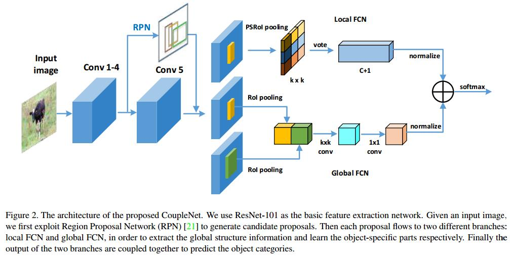

# CoupleNet: Coupling Global Structure with Local Parts for Object Detection
[arXiv](https://arxiv.org/abs/1708.02863)
[iccv](http://openaccess.thecvf.com/content_ICCV_2017/papers/Zhu_CoupleNet_Coupling_Global_ICCV_2017_paper.pdf)
[github](https://github.com/tshizys/CoupleNet)

## Introduction
1. Region-based systems have several advantages
   1. more stable and easier to converge: by exploiting a divide-and-conquer strategy
   2. without the complicated data augmentation and training skills: there is a certain structure to encode translation variance features for each proposal.
   > higher-layers contain more semantic meaning and less location information

## CoupleNet

1. Trunk: RPN
2. Local FCN
   1. 1x1 convolutional layer with $k^2(C + 1)$ channel
   2. $k$ means we divide the object into $k\times k$ local parts
3. Global FCN
   1. extend the context region by 2 times larger than the size of original proposal.
   > 语义信息有助于分类，但有效感受野远小于实际感受野，所以扩大context region。两个分支，一个针对原ROI，一个针对扩大的ROI

4. Coupling structure
   1. local和global的magnitude不一致，需要Normalization
      1. L2 normalization layer
      2. $1\times 1$ convolutional layer: learn scale
   2. How to couple
      1. elementwise sum: best
      2. element-wise product
      3. element-wise maximum
