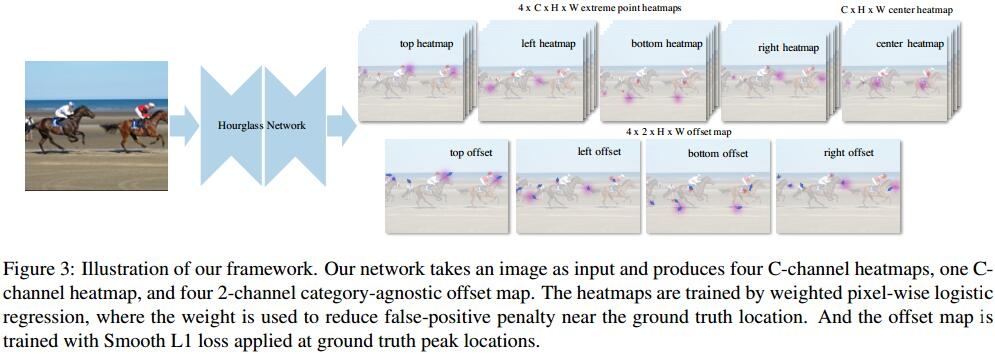

# Bottom-up Object Detection by Grouping Extreme and Center Points
[arXiv](https://arxiv.org/abs/1901.08043)
[git](https://github.com/xingyizhou/ExtremeNet)

## Introduction
1. 目前Object Detection的缺陷
   1. 目标不是axis-aligned的框，现有方法引入背景
   2. 只是枚举可能的框，没有真正理解正真的目标的视觉组成
   3. 矩形框并不能很好地描述目标，没有传达形状和姿态信息

## Method

1. 关键点检测
   1. 用HourglassNetwork [31]检测关键点
   2. 训练和loss同CornerNet [22]
   3. 输出：5xC的关键点预测热图和4x2的偏移图
2. Center Grouping
   1. 在Extremepoint heatmaps 提取四个角点，计算其中心
   2. 如果该中心在Center heatmap上有响应，则认为是一个有效检测
3. Ghost box suppression
类似于NMS
4. Edge aggregation
   1. 如果边缘是水平或者竖直的，上面的点都是Extreme points
   2. 给边缘一个弱响应
   3. 从局部最大开始，横向或者纵向扩增，直到局部最小
