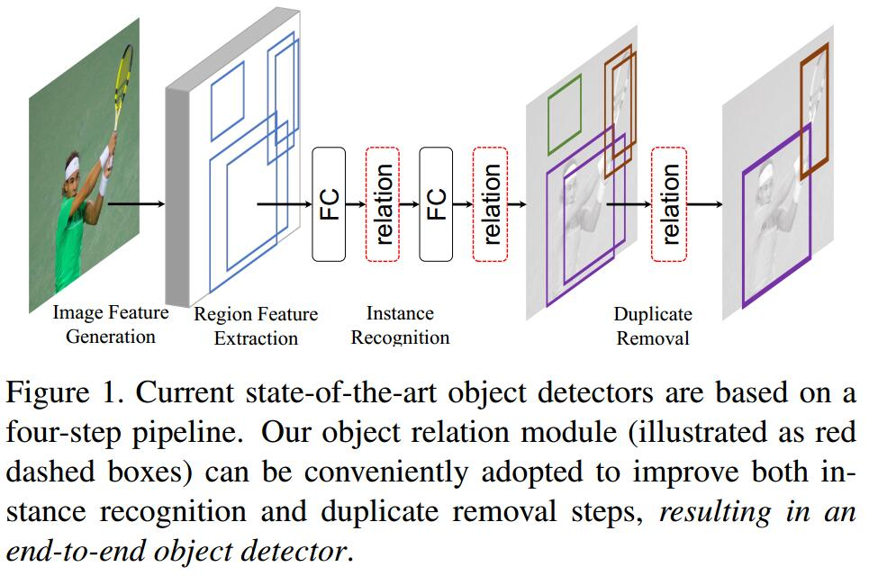
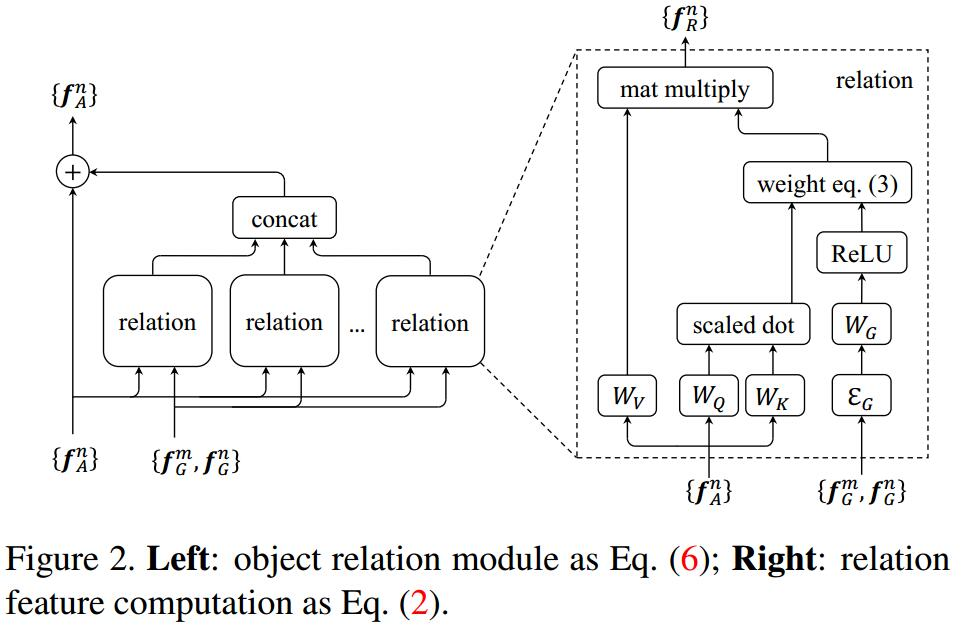
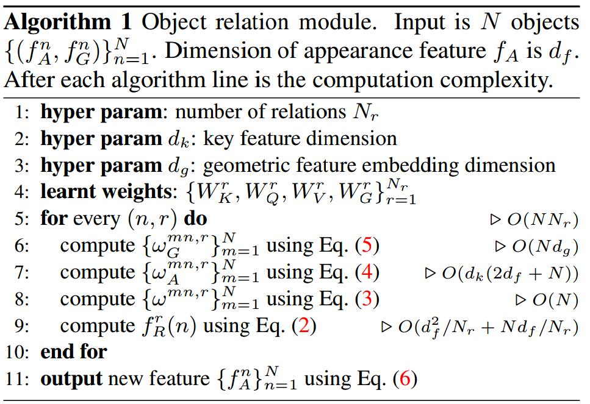
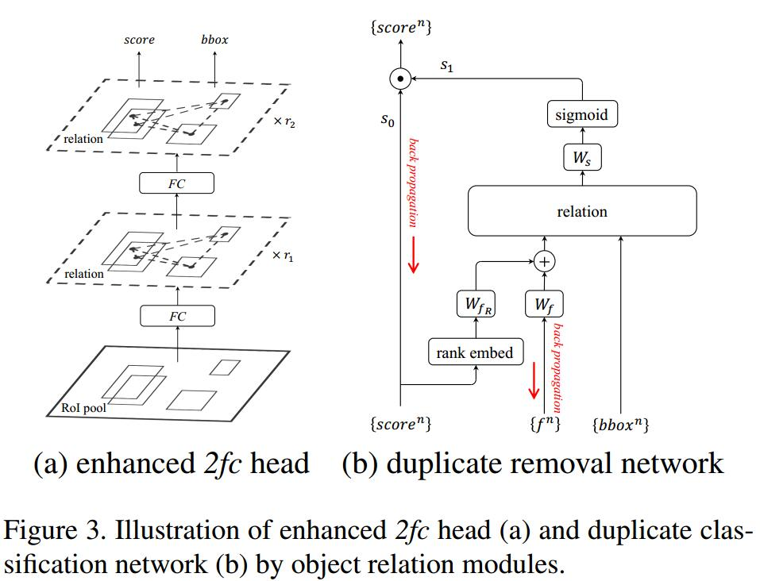

# Relation Networks for Object Detection
[arXiv](https://arxiv.org/abs/1711.11575)
[github](https://github.com/msracver/Relation-Networks-for-Object-Detection)
[blog](https://blog.sunnyan.me/2018/04/18/relation-networks-for-object-detection/)

## Introduction

1. relation module
   1. For instance recognition, the relation module enables joint reasoning of all objects and improves recognition accuracy
   2. For duplicate removal, the traditional NMS method is replaced and improved by a lightweight relation network
## Object Relation Module
1. basic attention module: Scaled Dot-Product Attention [56]
input: 1) query $\vec q$;  2) keys of dimension $d_k$ (packed into matrices $K$); 3) values of dimension $d_v$ (packed into $V$)
 $$ v^{out}=softmax(\frac{\vec qK^t}{\sqrt{d_k}})V $$
   > the output value is weighted average over input values.
   $V$ 即下面的$W_Vf^m_A$的集合
   $\vec q$ 即下面的$W_Af_A^n$

2. object relation computation
   1. an object consists of its geometric feature $f_G$ and appearance feature $f_A$
   2. $f_G$ is a 4-dimensional object bounding box; $\vec f_A$ is up to the task
   3. input: a set of $N$ objects $\{(f_A^n,f_G^n)\}_{n=1}^N$
   4. the relation feature $f_R(n)$ of the whole object set w.r.t the $n$-th object:
   $$
   \begin{array}l
   f_R(n)=\sum_mw^{mn}\cdot(W_V\cdot f_A^m) \\[10pt]
   w^{mn}=\frac{w^{mn}_G\cdot \exp(w^{mn}_A)}{\sum_k w_G^{kn}\cdot\exp(w_A^{kn}) } \\[10pt]
   w_A^{mn}=\frac{dot(W_Kf_A^m,W_Qf_A^n)}{\sqrt{d_k}} \\[10pt]
   w_G^{mn}=\max\{0,W_G\cdot\varepsilon_G(f^m_G,f^n_G)\}
   \end{array}
   $$
   > output: a weighted sum of appearance features from other objects, linearly transformed by $W_V$ (corresponding to values $V$);
   $W_K,W_Q$  project the original features $f_A^m,f_A^n$ into subspaces to measure how well they match;
   The feature dimension after projection is $d_k$

   > Two steps for $w^{mn}_G$:
   1).  To make it invariant to translation and scale transformations , use dimensional relative geometry feature, i,e, $(\log(\frac{|x_m-x_n|}{w_m}),\log(\frac{|y_m-y_n|}{h_m}),\log(\frac{w_n}{w_m}),\log(\frac{h_n}{h_m}))$. Then, the geometry features of the two objects are embedded to a high-dimensional representation $\varepsilon_G$, i,e, computing cosine and sine functions of different wavelengths[56]. The feature dimension after embedding is $d_g$.
   2). The embedded feature is transformed by $W_G$ into a scalar weight and trimmed at $0$ (acting as a ReLU nonlinearity)

   5. An object relation module aggregates in total Nr relation features and augments the input object’s appearance feature via addition
   $$f_A^n=f_A^n+Concat[f_R^1(n),...,f_R^{N_r}(n)]$$
   
   
   6. The relation module has the same input and output dimension, and hence can be regarded as a basic building block to be used in-place within any network architecture

## Relation for Duplicate Removal

1. Duplicate removal is a two class classification problem: For each ground truth object, only one detected object matched to it is classified as correct. Others matched to it are classified as duplicate.
2. This classification is performed via a network
   1. input: a set of detected objects. Each object has its final 1024-d feature, the classification score $s_0$, and bounding box.
   2. output: a binary classification probability $s_1\in [0, 1]$ ($1$ for correct and $0$ for duplicate). The multiplication of two scores $s_0s_1$ is the final classification score.
   3. Three steps:
      1. the 1024-d feature and classification score is fused to generate the appearance feature.
      2. a relation module transforms such appearance features of all objects.
      3. the transformed features of each object pass a linear classifier ($W_s$ in (b)) and sigmoid to output the probability $\in [0, 1]$
      > It is most effective to transform the score into a rank, instead of using its value. The scalar rank is then embedded into a higher dimensional 128-d feature, using the same method [56] as for geometry feature embedding in Section 3
      Both the rank feature and original 1024-d appearance feature are transformed to 128-d (via $W_{fR}$ and $W_f$ in (b), respectively), and added as the input to the relation module.

   4. How to supervise
      1. given a predefined threshold $\eta$ for the IoU between detection box and ground truth box
      2. all detection boxes with IoU$\ge\eta$ are firstly matched to the same ground truth
      3. The detection box with highest score is correct and others are duplicate
   5. End-to-end training
      1. 检测和Duplicate Removal矛盾，但可以由$s_0s_1$解决
      2. Duplicate Removal Netowrk的ground truth label依赖于检测结果，所以是不稳定的，但end-to-end训练过程中并无不稳定。作者猜测：这种不稳定反而成为了一种正则化的手段 (the duplicate removal network is relatively easy to train and the instable label may serve as a means of regularization)

## Reference
### Traditional relation learning
[14, 19, 53, 54, 46, 41, 19, 18, 7]

[56] A. Vaswani, N. Shazeer, N. Parmar, J. Uszkoreit, L. Jones, A. N. Gomez, L. Kaiser, and I. Polosukhin. Attention is all you need. arXiv preprint arXiv:1706.03762, 2017.

[30] J. Hosang, R. Benenson, and B. Schiele. Learning nonmaximum suppression. In ICCV, 2017.
## Learned
1. Relation module:
   1. 一种可嵌入检测网络的模块
   2. 主要继承了attention的思想，通过学习权重来计算各个object之间的relation feature
   3. relation feature最终augment到原特征上
2. Duplicate Removal Netowrk
   1. 本质上是学NMS，类似的工作有[30]
   2. 看做是二分类任务，输出概率$s_1$，乘到原检测得分$s_0$上，
   3. 只有$s_0$和$s_1$同时大的detection candidate才会被保留为最终的结果
