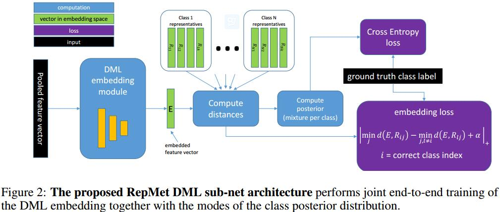

# RepMet: Representative-based metric learning for classification and one-shot object detection
[arXiv](https://arxiv.org/abs/1806.04728)

## Introduction
1. Motivation
replace the RCNN with a new sub-net that uses DML for classifying Regions Of Interest (ROIs) returned by the Region Proposal Network (RPN).

## Method

1. input of DML (Distance Metric Learning): Feature vector $X\in \mathbb R^f$
2. output: a vector $E\in \mathbb R^e, e\ll f$
3. a set of ‘representatives’ $R_{ij}\in\mathbb R^e$
> $j$ -- the $j$-th mode in the embedding space out of the $K$ modes.
$i$ -- learned discriminative mixture distributions for class $i$ out of the total of $N$ classes

4. network computes the $N\times K$ distance matrix whose elements $d_{ij}(E)=d(E,R_{ij})$  are the distances from $E$ to every representative $R_{ij}$
> 用于计算属于第$i$类的第$j$个模态的概率 {used to compute the probability of the given image (or ROI) in each mode j of each class i}
$$ p_{i,j}(E)\propto \exp(-\frac{d_{ij}^2(E)}{2\sigma^2})$$

$$ \mathbb P(\mathcal C=i|X)=\mathbb P(\mathcal C=i|E)=\max_{i=1,...,k}p_{i,j}(E) $$
> 计算分类概率

5. estimating a (discriminative) posterior for the ‘open’ background ($\mathcal B$) category.
$$ \mathbb P(\mathcal B|X)=\mathbb P(\mathcal B|E)=1-\max_{ij}p(ij)(E) $$
> 计算背景概率

5. Loss
   1.  regular cross-entropy (CE) with the ground truth labels
   2. embeding Loss
   $$ L(E,R)=|\min_j d(E,R_{i^* j})-\min_{j,i\neq i^* }d(E,R_{i,j})+\alpha|_ + $$
   > $i^* $ is the correct class index. $||_ +$ is reLue
