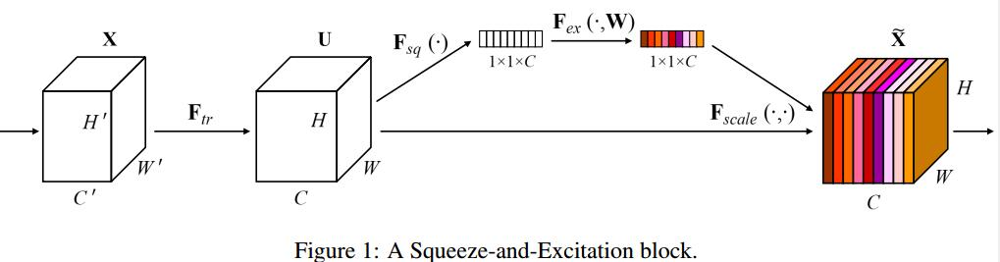

# Squeeze-and-Excitation Networks

## Squeeze-and-Excitation Blocks
1. convolution 的数学表达:
   1. $F_{tr}: X\to U, X\in\mathbb R^{H'\times W'\times C'}, U\in\mathbb R^{H\times W\times C}$
   2. learned set of filter kernels: $ V=[ v_1, v_2,..., v_C]$
   3. $u_c=v_c*X=\sum_{s=1}^{C'}v_c^s*x^s$
   > $v_c^s$ is a 2D spatial kernel

## Squeeze: Global Information Embedding
1. The issue: Each of the learned filters operates with a local receptive field and consequently each unit of the transformation output U is unable to exploit contextual information outside of this region
> 卷积操作收到感受野的限制

2. global average pooling: squeeze global spatial information into a channel descriptor
$$ z_c=F_{sq}(u_c)=\frac{1}{H\times W}\sum_{i=1}^H\sum_{j=1}^W u_c(i,j) $$

## Excitation: Adaptive Recalibration
1.
$$ s=F_{ex}(z,W)=\sigma(g(z,W))=\sigma(W_2\delta(W_1z)) $$
> $\sigma$=sigmoid, $\delta$=ReLU, $W_1\in\mathbb R^{C/r\times C}, W_2\in\mathbb R^{C\times C/r}$. 这里实际用了全连接层, dimensionality-reduction layer和dimensionality-increasing layer, $r$是

2. rescaling
$$\widetilde x=F_{scale}(u_c,s_c)=s_c\cdot u_c$$
> 这里就是一个channel-wise multiplication

