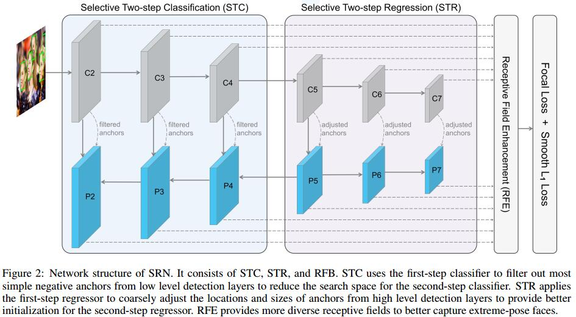
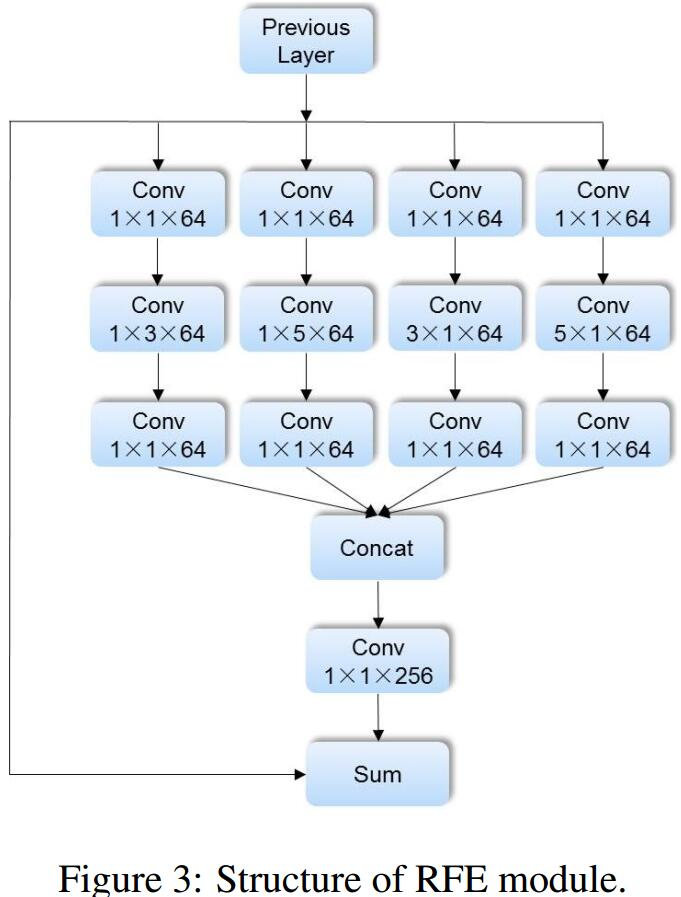

# Selective Refinement Network for High Performance Face Detection
[arXiv](https://arxiv.org/abs/1809.02693)

## Introduction
1. low recall efficiency: 虽然AP很高，但高召回率时精度还不足够，原因是为了检测小目标，铺了太多小anchor(导致严重的class imbalance problem)
    1. RetinaNet takes all the samples into account, which also leads to quite a few false positives
    > RetinaNet考虑了所有的sample, 导致一些false positives

    2. Although RefineDet filters out a large number of simple negative samples, it uses hard negative mining in both two steps, and does not make full use of negative samples.
    > RefineDet利用hard negative mining，没有充分利用negative samples

2. location accuracy：随着IoU增加AP下降快说明定位精度不好
    1. blindly adding multi-step regression to the specific task (i.e., face detection) is often counterproductive
    > 不能盲目地增加回归次数

3. This paper：selectively applies two-step classification and regression to specific levels of detection layers
    > 选择性地采用两步定位回归
    1. Selective Two-step Classification (STC)
        + filter out most simple negative samples, from the low levels of detection layers, which contains 88.9% samples.
        > 滤除底层特征的negative samples
    2. Selective Two-step Regression (STR)
        + draws on the cascade idea to coarsely adjust the locations and sizes of anchors from high levels of detection layers to provide better initialization for the subsequent regressor
        > 调整高层特征的anchor
    3. Receptive Field Enhancement (RFE)

## Method
### Selective Two-Step Classification
1. it is unnecessary to perform two-step classification in all pyramid levels. Since the anchors tiled on the three higher levels (i.e., P5, P6, and P7) only account for 11.1% and the associated features are much more adequate.
> 没必要对高层特征做两步分类，因为他们anchor少且特征充足
2. the STC increases the positive/negative sample ratio by approximately 38 times, from around 1:15441 to 1:404. In addition, we use the focal loss in both two steps to make full use of samples.
> 正负样本比例提高了38倍，所有的负样本用于focal loss

### Selective Two-Step Regression
1. applying two-step regression in the three lower pyramid levels impairs the performance.
    > 对底层feature map的两步回归对性能有害
    1. the three lower pyramid levels are associated with plenty of small anchors to detect small faces. These small faces are characterized by very coarse feature representations, so it is difficult for these small anchors to perform two-step regression
    > 小目标的特征粗糙，不适合两步回归
    2. in the training phase, if we let the network pay too much attention to the difficult regression task on the low pyramid levels, it will cause larger regression loss and hinder the more important classification task
    > 妨碍更重要的分类任务

### Receptive Field Enhancement

## Learned
1. 对比DRN：Introduction的写法需要从问题出发，而不是笼统地为了提高精度而提出。。。所以RefineDet里一定要强调class imbalance
