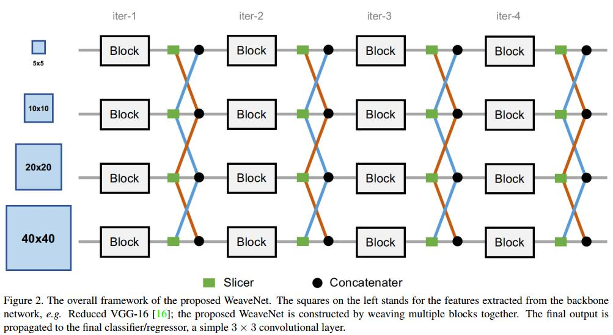
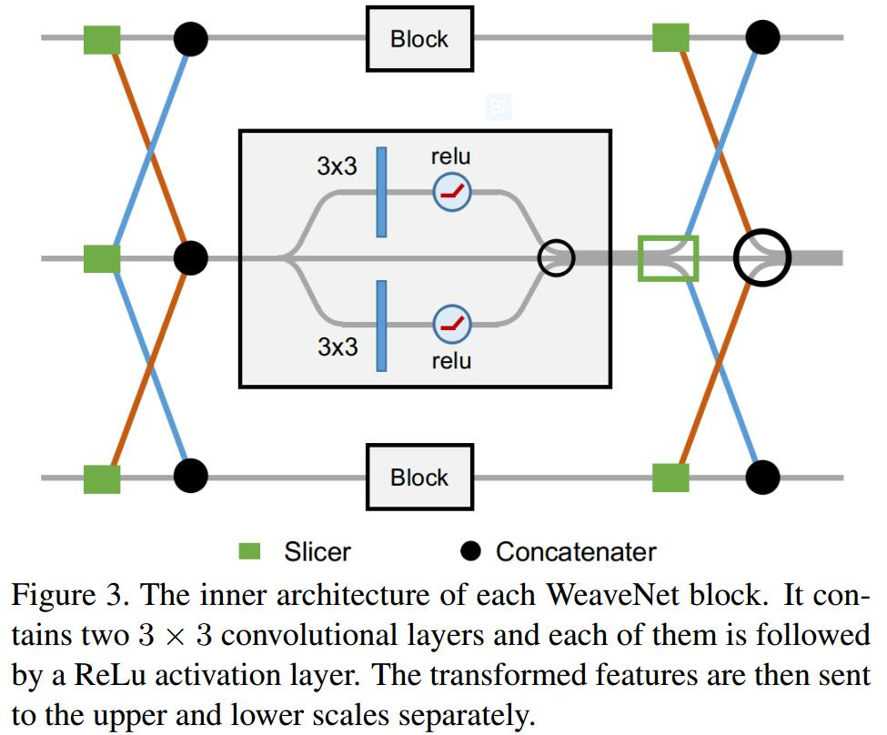
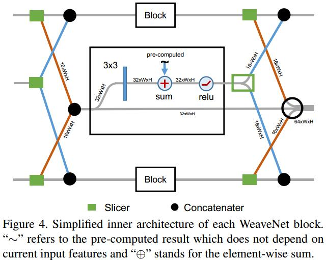

# Weaving Multi-scale Context for Single Shot Detector

## Introduction
1. multi-scale information fusion 有助于SSD， 方法有两种
   1. attach a top-down pyramid-like structure to propagate information from top layers to bottom layers to enlarge the receptive filed of each shallow layer, e.g., DSSD, RetinaNet
   2. consider both low-level and high-level information: in addition to introducing information from top layers to enlarge the receptive fields, they also pass more detailed local information to top layers for making bound box localization and category inference more precise. e.g., Rainbow SSD (RSSD) [9]
   > 这种做法一般导致很大的计算量

## WeaveNet

## Learned
迭代的方式融合临近尺度的特征信息
