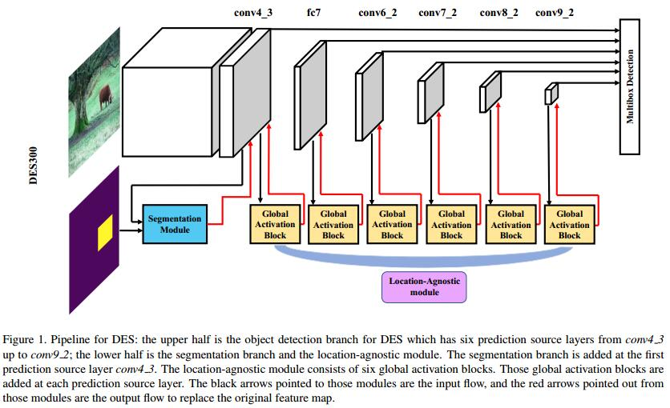
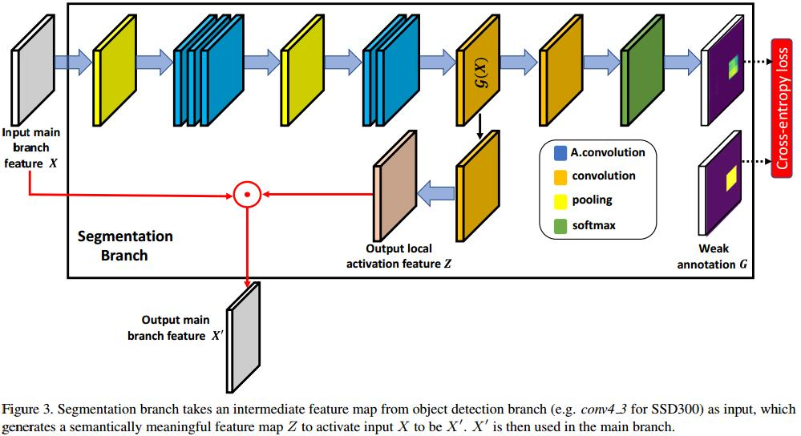

# Single-Shot Object Detection with Enriched Semantics
[arXiv](https://arxiv.org/abs/1712.00433)

## Proposed method

1. Semantic enrichment at low level layer

   1. 这里的分割实际上就是一个二分类，跟spatical attention类似，只不过用了更复杂的网络。
   2. 也用了和spetial attention 相同的监督
2. Semantic enrichment at higher level layers
   1. learn the relationship between channels and object classes
   2. three stages: spatial pooling (全局ave pooling), channel-wise learning (线性), broadcasted multiplying (乘).

## Learned
spatial attention + channel attention
