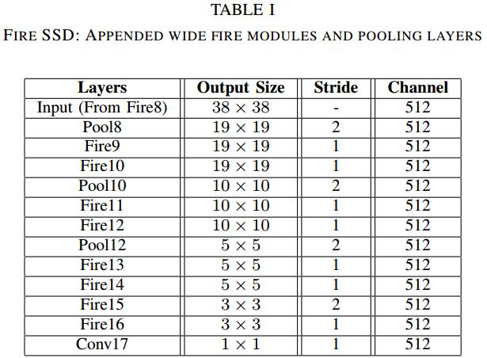
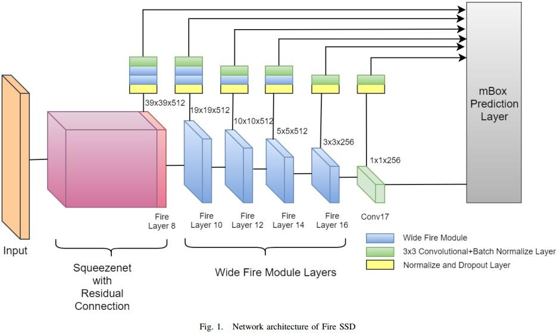
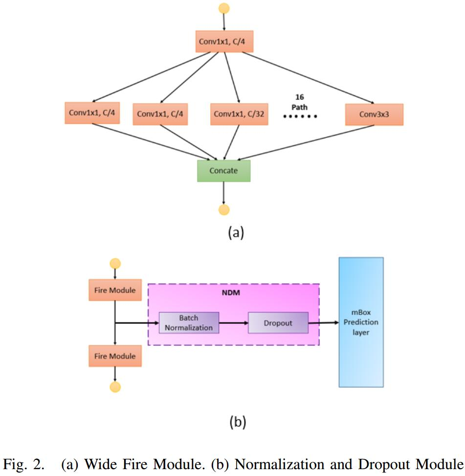

# Fire SSD: Wide Fire Modules based Single Shot Detector on Edge Device

## Introduction
1. SqueezeNet reduces the number of parameter by replacing the conventional $3\times 3$ convolutional layer by **Fire Module**
2. Fire module reduces the number of channels of the input data by employing $1\times 1$ convolutional layer before applying a $3\times 3$ convolutional and $1\times 1$ convolutional layers in parallel with $1/2$ of the targeted number of channels.
> $3\times 3$之前先用$1\times 1$减少一半的channel

3. MobileNet proposes **[depth-wise separable convolution](https://www.cnblogs.com/adong7639/p/7918527.html)**
4. ShuffleNet proposes pointwise grouped convolutions and channel shuffle

5. Normalized and dropout module improves the accuracy by $1.6\%$

## Architecture

