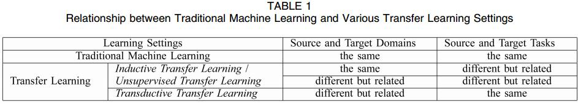
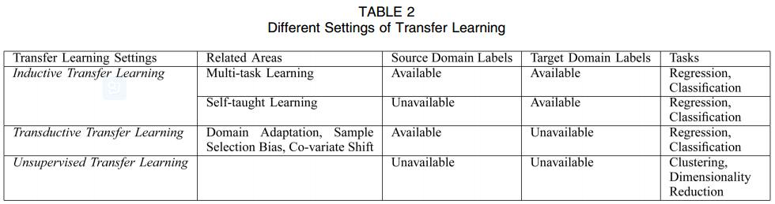
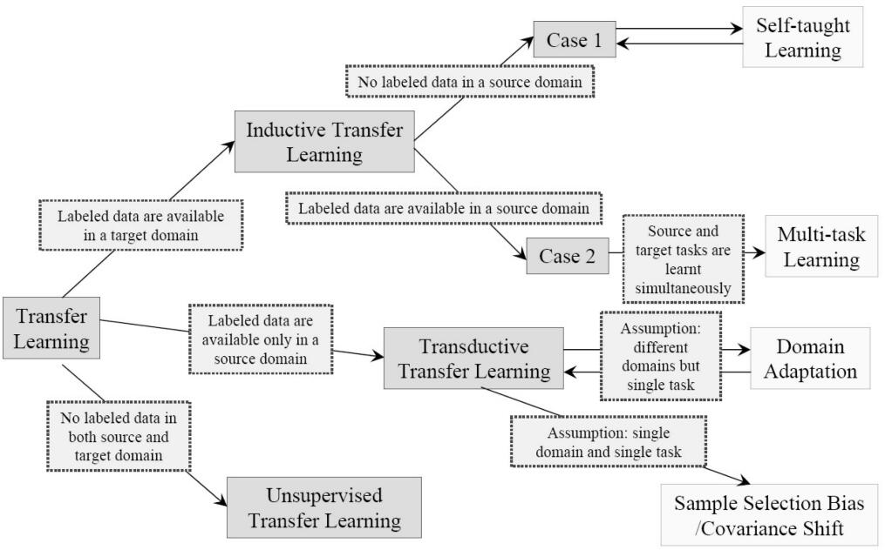
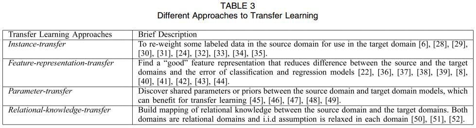

# A Survey on Transfer Learning
[IEEE](https://ieeexplore.ieee.org/abstract/document/5288526/)

## Notations and Definitions
1. a **domain** $\mathcal D=\{\mathcal X,P(X)\}$ consists of two components: a feature space $\mathcal X$ and a marginal probability distribution $P(X), X=\{x_1,...,x_n\}\in\mathcal X$
2. a **task** $\mathcal T=\{\mathcal Y,f(\cdot)\}$ consists of two components: a label space $\mathcal Y$ and an objective predictive function $f(\cdot)$.
3. source domain data $D_S=\{(x_{S_1},y_{S_1}),...,(x_{S_{n_S}},y_{S_{n_S}}))\}$
target domain data $D_T=\{(x_{T_1},y_{T_1}),...,(x_{T_{n_T}},y_{T_{n_T}}))\}$
4. **Definition 1 (Transfer Learning)**
Given a source domain $\mathcal D_S$ and learning task $\mathcal T_S$, target domain $\mathcal D_T$ and learning task $\mathcal T_T$, transfer learning aims to help improve the learning of the target predictive function $f_T(\cdot)$ in $\mathcal D_T$ using the knowledge in $\mathcal D_S$ and $\mathcal T_S$, where $\mathcal D_S\neq \mathcal D_T$, or $\mathcal T_S\neq \mathcal T_T$

## A Categorization of Transfer Learning Techniques
what to transfer? how to transfer? when to transfer
1. Inductive transfer learning
   1. A lot of labeled data in the source domain are available.
   2. No labeled data in the source domain are available.
2. Transductive transfer learning
no labeled data in the target domain are available while a lot of labeled data in the source domain are available.
3. Unsupervised transfer learning
there are no labeled data available in both source and target domains in training.

下图为transform learning的分类

下表为Approaches to transfer learning的分类

## Inductive transfer learning
1. **Definition 2 (Inductive Transfer Learning)**
Given a source domain $\mathcal D_S$ and learning task $\mathcal T_S$, target domain $\mathcal D_T$ and learning task $\mathcal T_T$, inductive transfer learning aims to help improve the learning of the target predictive function $f_T(\cdot)$ in $\mathcal D_T$ using the knowledge in $\mathcal D_S$ and $\mathcal T_S$, where $\mathcal T_S\neq \mathcal T_T$

> source domain 的数据可以有标签也可以没有，大多数方法针对前一种

2. Transferring Knowledge of Instances
although the source domain data cannot be reused directly, there are certain parts of the data that can still be reused together with a few labeled data in the target domain.
   1. TrAdaBoost

3. Transferring Knowledge of Feature Representations
The feature-representation-transfer approach to the inductive transfer learning problem aims at finding “good” feature representations to minimize domain divergence and classification or regression model error.
   1. Supervised Feature Construction
   2. Unsupervised Feature Construction
> 学习通用性的特征 common feature learning

4. Transferring Knowledge of Parameters
   1. **assumption**: individual models for related tasks should share some parameters or prior distributions of hyperparameters.
5. Transferring Relational Knowledge
