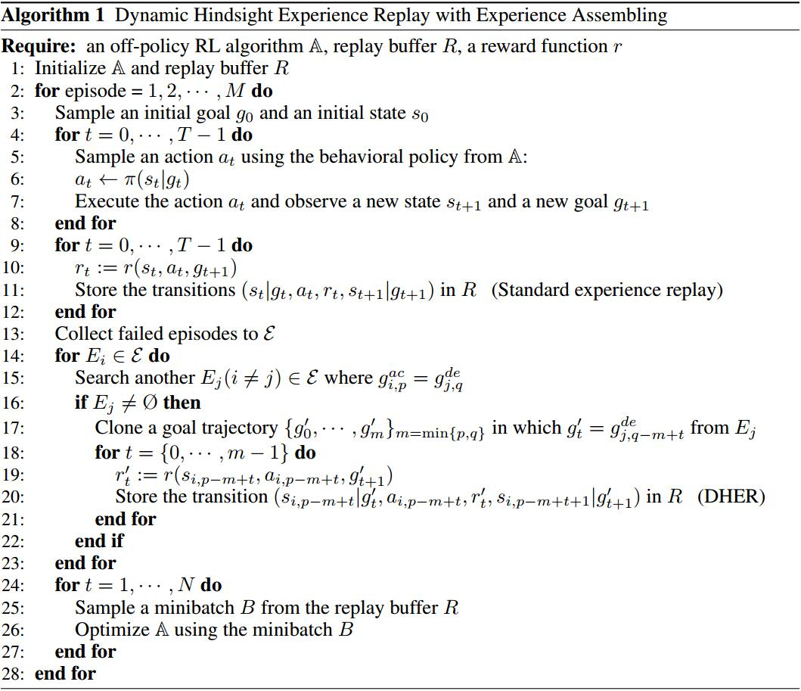

# DHER: HINDSIGHT EXPERIENCE REPLAY FOR DYNAMIC GOALS
[ICLR2019](https://openreview.net/pdf?id=Byf5-30qFX)
[git](https://github.com/mengf1/DHER)

## Introduction
1. 稀疏奖励（sparse rewards）在动态目标任务中是很有挑战性的
   1. 解决方法有：reward shaping or search
   2. 由于机器人运行的复杂环境，困难被加重
      1. 系统动力学难以建模，难以对系统小误差敏感
      2. 机器人需要执行长时间多步的任务，引入了大量的搜索空间，于是需要对变化的任务有泛化能力
2. 在稀疏奖励情况下，Hindsight experience replay (HER)是一个有效提高off-policy算法性能的方法
   1. 把目标状态作为部分输入
   2. 但需要假设目标是fixed
3. 本文提出DHER
   1. 假设目标不受环境动力学影响
   2. 需要知道目标的相似性，可用欧拉距离描述
   3. 对agent不仅被set一个新的目标，好会想像如何从新的目标到达就的目标

## Method
1. HER
   1. 假设目标不受动态环境影响
   2. 经历了一个回合$\{s_0,s_1,...,s_T\}$后，每次状态转移$s_t\to s_{t+1}$以及目标被存在回放池里
   3. 原始地，一些被保存的回合没有找到目标，就不能提供正反馈。但在HER里，这些failed experience被修改后也别存起来。用一个被访的状态代替原始目标
   4. 这种做法暗示agent如何获得一个新的目标，HER假设这种到达新目标的机制可以帮助agent学习原始目标
2. Dynamic goals
   1. 每一个时间步都change
   2. 目标是环境的一部分但不影响环境
   3. 假设动态目标 $g_t\in\mathcal G$按规则运动$g_t=g(t;\gamma)$, $\gamma$把规则参数化，但这种规则agent不知道
   4. 目标相似度
     1. $f_{g_t}(S)\in \{0,1\}, S=\mathcal G, f_{g_t}(s)=[s=g_t]$
     2. $f_{g_t}(s)$即为$s$和$g_t$之间的目标相似度
     3. agent的目标是找到$s_t,f_{g_t}(s_t)=1$
3. DHER
   1. 失败的回合暗示agent能在多个回合上建立一个新的目标
   2. 失败的经历越多，越有利于agent建立起在achieved goal以及其他回合的desired goal之间的关联
   > 以抓取为例子，desired goal是object的位置，achieved goal是gripper的位置

   3. 一个回合以后，存储$(s_t,a_t,r_t,s_{t+1})$, 状态$s_t=<o_t,g_t^{ac},g_t^{de}>$包含观测$o_t$,achieved goal $g_t^{ac}$和desired goal $g_t^{de}$
   4. 经验集成算法
     1. 对失败的经历，使用inverse simulation来创建successful rewards，具体有三步
     2. 对失败的经历，尝试从其它回合的找到desired goal trajectory
     3. 假设一个新的回合，通过匹配这个失败回合的achieved goal trajectory到找到的desired goal trajectory。数学上，$\{E_0,E_1,...\}$是失败的回合，尝试找到$E_i,E_j, \exists i,j,p,q, s.t., g_{i,p}^{ac}=g_{j,q}^{de}$，其中$p,q$是timestemp，$i,j$为回合数
     4. 如果能找这样的两次失败，可以结合起来，即$g_{i,t}^{de}=g_{j,t}^{de},t=\min\{p,q\}$, 从而想像出一次新的经历$E_i'$

