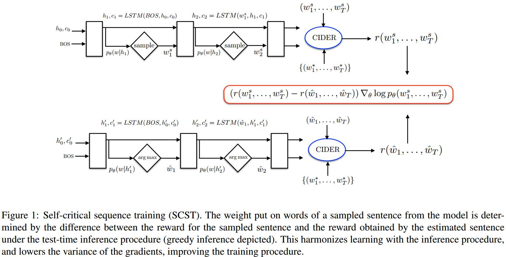

# Self-critical Sequence Training for Image Captioning
[arXiv](https://arxiv.org/abs/1612.00563)
[github](https://github.com/ruotianluo/self-critical.pytorch)

## Reinforcement Learning
1. agent: LSTMs updates its internal “state” (cells and hidden states of the LSTM, attention weights etc).
   environment: words and image features
   policy: $p_\theta$
   goal: $L(\theta)=-\mathbb E_{w^s\sim p_\theta}[r(w^s)]\approx -r(w^s)$

2. Policy Gradient with REINFORCE ([15] & Chapter 13 in [14])
$$ \nabla_\theta L(\theta)=-\mathbb E_{w^s\sim p_\theta}[r(w^s)\nabla_\theta\log p_\theta(w^s)] $$
approximating using a single Monte-Carlo sample $w^s=(w_1^s, ..., w_T^s)$
$$ \nabla_\theta L(\theta)\approx-r(w^s)\nabla\log p_\theta(w^s) $$

3. REINFORCE with a Baseline
   1. The baseline can be an arbitrary function, as long as it does not depend on the “action” $w^s$
   > 可以是与action无关的任意函数

   $$ \nabla_\theta L(\theta)=-\mathbb E_{w^s\sim p_\theta}[(r(w^s)-b)\nabla_\theta\log p_\theta(w^s)] $$

   2. This shows that the baseline does not change the expected gradient, but importantly, it can reduce the variance of the gradient estimate.
   > 不影响期望的梯度，但减小梯度估计的方差

   $$\mathbb E_{w^s\sim p_\theta}[b\nabla_\theta\log p_\theta(w^s)]=b\sum\nabla_\theta p_\theta(w^s)=b\nabla_\theta\sum p_\theta(w^s)=b\nabla_\theta1=0$$

   3. For each training case, we again approximate the expected gradient with a single sample $w^s$
   $$\nabla_\theta L(\theta)\approx -(r(w^s)-b)\nabla_\theta\log p_\theta(w^s)$$

4. Final Gradient Expression
   1. chain rule
   $$\nabla_\theta L(\theta)=\sum_{i=1}^T\frac{\partial L(\theta)}{\partial s_t}\frac{\partial s_t}{\partial \theta}$$
   > where $s_t$ is the input to the softmax function

   2. Using REINFORCE with a baseline b the estimate of the gradient is given by [17]
   $$\frac{\partial L(\theta)}{\partial s_t}\approx(r(w^s)-b)(p_\theta(w_t|h_t)-1_{w^s_t}) $$
   > $h$是LSTM的隐状态

## Self-critical sequence training (SCST)

1. central idea: to baseline the REINFORCE algorithm with the reward obtained by the current model under the inference algorithm used at test time
> 当前模型测试时的reward作为baseline

$$\frac{\partial L(\theta)}{\partial s_t}=(r(w^s)-r(\hat w))(p_\theta(w_t|h_t)-1_{w^s_t}) $$

2. Advantage：
   1. SCST has all the advantages of REINFORCE algorithms
   2. it directly optimizes the true, sequence-level evaluation metric
   3. avoids the usual scenario of having to learn a (context-dependent) estimate of expected future rewards as a baseline
   > 避免了估计未来的未来奖励期望

   4. SCST has much lower variance, and can be more effectively trained on mini-batches of samples using SGD
   5. SCST is forced to improve the performance of the model under the inference algorithm used at test time.
   6. avoids all the inherent training difficulties associated with actor-critic methods
   > 传统的actor-critic methods里，有一个critic网络同时训练来估计value fuctions，而actor只能用估计的value fuctions来训练而不是用actual rewards

3. greedy decoding
$$ \hat w_t=\arg\max_{w_t}p(w_t|h_t) $$
> This choice minimizes the impact of baselining with the test-time inference algorithm on training time

## Reference
[14]. Richard S. Sutton and Andrew G. Barto. Reinforcement learning: An introduction. MIT Press, 1998.
[15]. Ronald J. Williams. Simple statistical gradient-following algorithms for connectionist reinforcement learning. In Machine Learning, pages 229–256, 1992.
[17] Wojciech Zaremba and Ilya Sutskever. Reinforcement learning neural turing machines. Arxiv, 2015.
