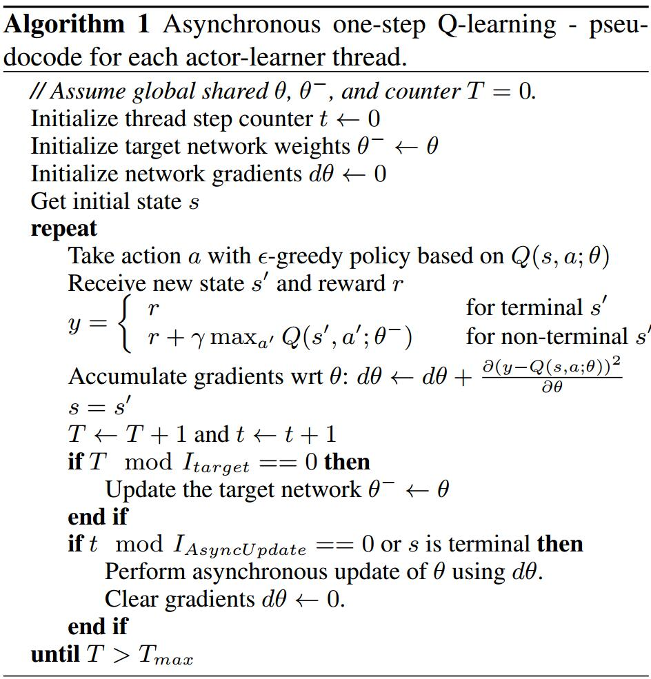
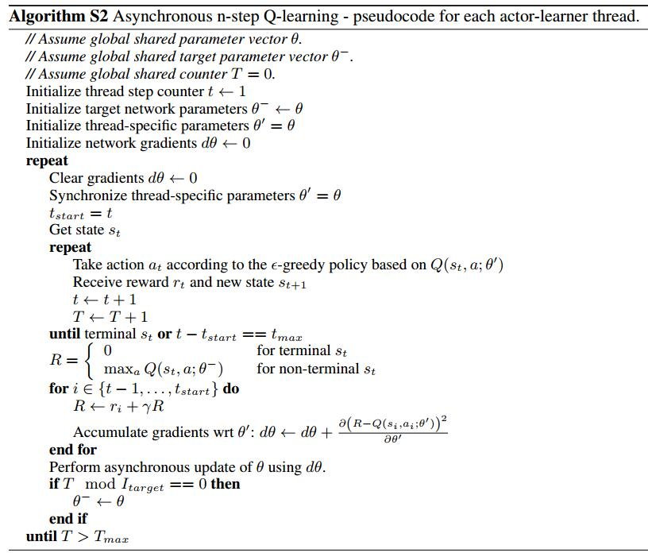
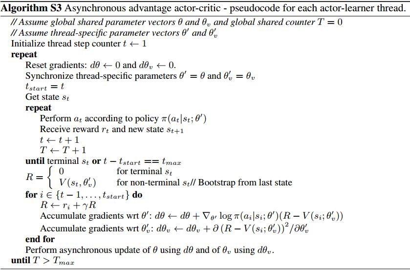

# Asynchronous Methods for Deep Reinforcement Learning
[arXiv](https://arxiv.org/abs/1602.01783)

## Introduction
1. In **one-step** Q-learning, the parameters $\theta$ of the action value function $Q(s,a;\theta)$ are learned by iteratively minimizing a sequence of loss functions
$L$, where the $i$th loss function defined as:
$$ L_i(\theta_i)=\mathbb E(r+\gamma\max_{a'}Q(s',a';\theta_{i-1})-Q(s,a,\theta_i)) $$
> $Q(s,a;\theta)$ is an approximate action-value function; $s'$ is the state after $s$
> 这种one-step方法的缺点是: $r$ 仅仅直接影响$(s,a)$, 而$(s,a)$正好有产生$r$. 其余的state-action pairs仅仅间接地被影响通过更新$Q(s,a)$
> 于是这样学习效率较低

2. In **n-step** Q-learning, $Q(s,a)$ is updated toward the n-step return defined as $r_t+\gamma r_{t+1}+...+\gamma^{n-1}r_{t+n-1}+\max_a\gamma^nQ(s_{t+n},a)$
> 直接影响$n$ state-action pairs, so potentially much more efficient

3. policy-based modelfree methods:
   1. directly parameterize the policy $\pi(a|s;\theta)$ and update the parameters $\theta$ by performing gradient ascent on $\mathbb E[R_t]$
   2. Standard REINFORCE [1] updates the policy parameters $\theta$ in the direction $\nabla_\theta\log\pi(a_t|s_t;\theta)R_t$
   > 上面的梯度是$\nabla_\theta\mathbb E[R_t]$的unbiased estimate

   3. 在上面的基础上, 为减小variance,且保持unbiased: 学一个baseline of state $b_t(s_t)$ [1]. 进而将梯度改写为$\nabla_\theta\log\pi(a_t|s_t;\theta)(R_t-b_t(s_t))$
   4. A learned estimate of the value function is commonly used as the baseline $b_t(s_t)\approx V^\pi(s_t)$, 可大大降低variance
   5. $R_t$是$Q^\pi(a_t,s_t)$的unbiased estimate, $b_t$是$V^\pi(s_t)$的estimate, $R_t-b_t$被称为advantage of action $a_t$ in state $s_t$, $A(a_t,s_t)=Q(a_t,s_t)-V(s_t)$

## Asynchronous RL Framework
1. two main ideas
   1. 用cpu的多线程来处理 asynchronous actor-learners
   2. 多个 actors learners 可以开发环境的不同部分，而且可以使用不同的探索方法来增加多样性。多个 actor learners 并行跟新参数可能没有相关性，所以不使用replay memory, 而依赖于 parallel actors 采用不同的探索策略来执行 DQN 中 experience replay 的角色
2. using multiple parallel actor-learners has multiple practical benefits
   1. reduction in training time
   2. 不再依靠experience replay来保持稳定性
3. Asynchronous one-step Q-learning

4. Asynchronous n-step Q-learning

5. Asynchronous advantage actor-critic (A3C)
   
   1. a policy: $\pi(a_t|s_t;\theta)$
   2. an estimate of the value function $V(s_t;\theta_v)$
   3. The policy and the value function are updated after every $t_{max}$ actions or when a terminal state is reached.
   4. The update performed: $\nabla_{\theta'}\log\pi(a_t|s_t;\theta')A(s_t,a_t;\theta,\theta_v)$
   > $A$是an estimate of the advantage function $\sum_{i=0}^{k-1}\gamma^ir_{t+i}+\gamma^kV(s+k;\theta)-V(s_t;\theta_v)$

## Reference
[1] Williams, R.J. Simple statistical gradient-following algorithms for connectionist reinforcement learning. Machine Learning, 8(3):229–256, 1992.
