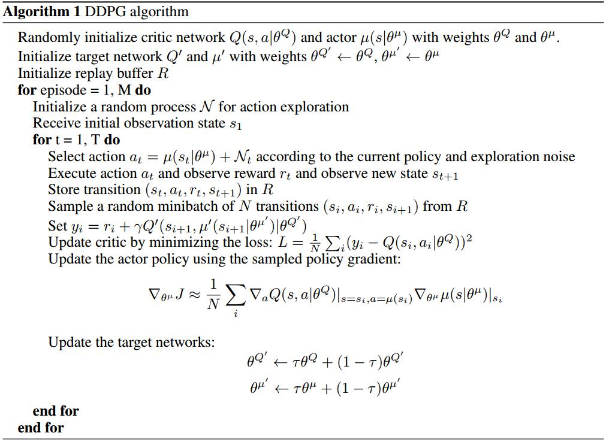

# Continuous control with deep reinforcement learning
[arXiv](https://arxiv.org/abs/1509.02971)
[github](https://github.com/vy007vikas/PyTorch-ActorCriticRL)
[zhihu](https://zhuanlan.zhihu.com/p/26754280)

## Introduction
1. a standard reinforcement learning setup
   1. an agent interacting with an environment $E$ in discrete timesteps.
   2. At each timestep $t$ the agent receives an observation $x_t$, takes an action $a_t$ and receives a scalar reward $r_t$.
   3. state: $s_t=(x_1,a_1,...,x_{t-1},a_{t-1},x_t)$
2. action-value function
$$ Q^\pi(s_t,a_t)=\mathbb E_{r_{i\ge t},s_{i\ge t}\sim E,a_{i\ge t}\sim\pi}[R_t|s_t,a_t] $$
> 在$s_t$执行$a_t$，使得未来$Q$值最大化

3. recursive relationship: Bellman等式
$$ Q^\pi(s_t,a_t)=\mathbb E_{r_t,s_{t+1}\sim E}[r(s_t,a_t)+\gamma\mathbb E_{a_{t+1}\sim\pi}[Q^\pi(s_{t+1},a_{t+1})]] $$

4. If the target policy is deterministic we can describe it as a function $\mu:\mathcal S\leftarrow\mathcal A$
$$ Q^\mu(s_t,a_t)=\mathbb E_{r_t,s_{t+1}\sim E}[r(s_t,a_t)+\gamma Q^\mu(s_{t+1},\mu(s_{t+1}))] $$

5. loss
$$
\begin{array}l
L(\theta^Q)=\mathbb E_{s_t\sim\rho^\beta,a_t\sim\beta,r_t\sim E}[(Q(s_t,a_t|\theta^Q)-y_t)]  \\
y_t=r(s_t,a_t)+\gamma Q(s_{t+1},\mu(s_{t+1})|\theta^Q)
\end{array} \qquad [4]
$$
6. [1]中两点主要的改进
   1. replay buffer
      1. Transitions were sampled from the environment according to the exploration policy and the tuple $(s_t;a_t;r_t;s_{t+1})$ was stored in the replay buffer.
      2. At each timestep the actor and critic are updated by sampling a minibatch uniformly from the buffer.
   2. a separate target network for calculating $y_t$

## Algorihtm

1. DPG [2]
   1. a parameterized actor function, $\mu(s|\theta^\mu)$, specifies the current policy by deterministically mapping states to a specific action
2. The actor is updated by following the applying the chain rule to the expected return from the start distribution $J$ with respect to the actor parameters
$$
\begin{array}l
\nabla_{\theta_\mu}J\approx \mathbb E_{s_t\sim\rho^\beta}[\nabla_{\theta_\mu}Q(s,a|\theta^Q)|_ {s=s_t,a=\mu(s_t|\theta_\mu)}] \\
=\mathbb E_{s_t\sim\rho^\beta}[\nabla_{a}Q(s,a|\theta^Q)|_ {s=s_t,a=\mu(s_t)}\nabla_{\theta_\mu}\mu(s|\theta^\mu)|s=s_t]
\end{array}
$$

3. “soft” target updates
   1. Directly implementing Q learning (equation 4) with neural networks proved to be unstable. Thus, use “soft” target updates rather than directly copying the weights.
   2. We create a copy of the actor and critic networks, $Q'(s, a'|\theta^{Q'})$ and $\mu'(s|\theta^{\mu'})$ respectively, that are used for calculating the target values.
   3. The weights of these target networks are then updated by having them slowly track the learned networks: $\theta'\leftarrow\tau\theta+(1-\tau)\theta',\tau\ll 1$
> 不稳定，因为Q网络一遍更新一遍计算target，所以使用soft target updates

4. batch normalization
   1. different scales of state values
   2. we used batch normalization on the state input and all layers of the $\mu$ network and all layers of the $Q$ network prior to the action input
> 解决state中各维度尺度不一致的问题

5. exploration policy $\mu'$
$$ \mu'(s_t)=\mu(s_t|\theta^\mu_t)+\mathcal N $$
> 在原有的 actor policy上加 random noise process形成exploration policy

## Referecne
[1] Mnih, Volodymyr, Kavukcuoglu, Koray, Silver, David, Rusu, Andrei A, Veness, Joel, Bellemare, Marc G, Graves, Alex, Riedmiller, Martin, Fidjeland, Andreas K, Ostrovski, Georg, et al. Humanlevel control through deep reinforcement learning. Nature, 518(7540):529–533, 2015.

[2] Silver, David, Lever, Guy, Heess, Nicolas, Degris, Thomas, Wierstra, Daan, and Riedmiller, Martin. Deterministic policy gradient algorithms. In ICML, 2014.
> DPG
