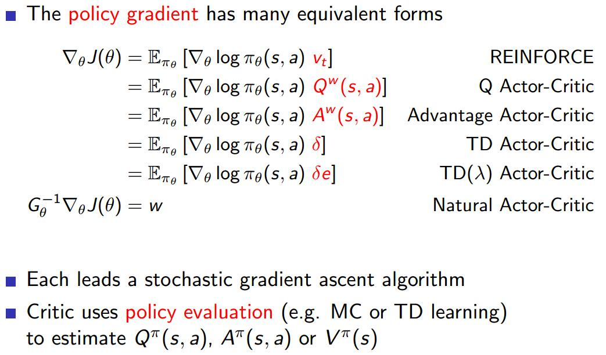

# Deterministic Policy Gradient Algorithms
[paper](http://proceedings.mlr.press/v32/silver14.pdf)

## Introduction
1. difference between the stochastic and deterministic policy gradients
   1. In the stochastic case, the policy gradient integrates over both state and action spaces
   2. in the deterministic case it only integrates over the state space.

2. Markov decision process (MDP)
   1. state space $\mathcal S$;
    action space $\mathcal A$;
    initial state distribution density: $p_1(s_1)$
    stationary transition dynamics distribution with conditional density: $p(s_{t+1}|s_t,a_t), \quad p(s_{t+1}|s_1,a_1,...,s_t,a_t)=p(s_{t+1}|s_t,a_t)$  状态转移概率
    reward function $r:\mathcal S\times \mathcal A\to\mathbb R$
   2. stochastic policy $\pi_\theta:\mathcal S\to\mathcal P(\mathcal A)$, $\pi_\theta=(a_t|s_t)$ is the conditional probability density at at associated with the policy
   3. The agent uses its policy to interact with the MDP to give a trajectory $h_{1:T}=s_1,a_1,r_1,...,s_T,a_T,r_T$
   4. total discounted reward from time-step $t$
   $$ r_t^\gamma=\sum_{k=t}^\infty\gamma^{k-t}r(s_k,a_k), 0<\gamma<1 $$
   5. Value functions are defined to be the expected total discounted reward
   $$V^\pi(s)=\mathbb E[r_1^\gamma|S_1=s;\pi] \qquad Q^\pi(s,a)=\mathbb E[r_1^\gamma|S_1=s,A_1=a;\pi]$$
   6. performance objective $J(\pi)=\mathbb E[r_1^\gamma|\pi] $, agent需要最大化$J$
   7. 从$s$,经时间$t$,转移到$s'$的概率密度为$p(s\to s',t,\pi)$;
   8. 折扣状态分布概率为(discounted state distribution): $\rho^\pi(s'):=\int_\mathcal S\sum_{t=1}^\infty\gamma^{t-1}p_1(s)p(s\to s',t,\pi)ds$.
   > 这里的积分针对状态空间中的起始点，
   累加针对时间步

   9. performance objective:
   $$ J(\pi_\theta)=\int_\mathcal S\rho^\pi(s)\int_\mathcal A\pi_\theta(s,a)r(s,a)dads=\mathbb E_{s\sim\rho^\pi,a\sim\pi_\theta}[r(s,a)] $$
   > 从里层往外看$\pi_\theta(s,a)$是在$s$产生$a$的概率，$\rho^\pi(s)$为到达$s$的概率

3. Stochastic Policy Gradient Theorem
   1. **Policy gradient**[1]: adjust the parameters $\theta$ of the policy in the direction of the performance gradient $\nabla_\theta J(\pi_\theta)$.
   $$
   \begin{array}l
   \nabla_\theta J(\pi_\theta)=\int_\mathcal S\rho^\pi(s)\int_\mathcal A\nabla_\theta\pi_\theta(a|s)Q^\pi(s,a)dads \\[10pt]
   =\mathbb E_{s\sim\rho^\pi,a\sim\pi_\theta}[\nabla_\theta\log\pi_\theta(a|s)Q^\pi(s,a)]
   \end{array}(2)$$
   

4. Stochastic Actor-Critic Algorithms
   1. The actor-critic consists of two eponymous components.
   2. An **actor** adjusts the parameters $\theta$ of the stochastic policy $\pi_\theta(s)$ by stochastic gradient ascent of (2)
   3. A **critic** estimates the action-value function $Q^\omega(s,a)\approx Q^\pi(s,a)$using an appropriate policy evaluation algorithm.
   4. 因此(2)改为:
   $$\nabla_\theta J(\pi_\theta)=\mathbb E_{s\sim\rho^\pi,a\sim\pi_\theta}[\nabla_\theta\log\pi_\theta(a|s)Q^\omega(s,a)]  $$
   5. 可能带来bias，文中分析了避免bias的前提条件

5. Off-Policy Actor-Critic
   1. a distinct behaviour policy $\beta(a|s)\neq\pi_\theta(a|s)$
   2. In an off-policy setting, the performance objective is typically modified to be the value function of the target policy, averaged over the state distribution of the behaviour policy [2]
   $$ J_\beta(\pi_\theta)=\int_\mathcal S\rho^\beta(s)V^\pi(s)ds=\int_\mathcal S\int_\mathcal A\rho^\beta(s)\pi_\theta(a|s)Q^\pi(s,a)dads $$
   2. off-policy policy-gradient [2]
   $$
   \begin{array}l
   \nabla_\theta J_\beta(\pi_\theta)\approx \int_\mathcal S\int_\mathcal A\rho^\beta(s)\nabla_\theta\pi_\theta(a|s)Q^\pi(s,a)dads \\[10pt]
   =\mathbb E_{s\sim\rho^\beta,a\sim\beta}[\frac{\pi_\theta(a|s)}{\rho_\theta(a|s)}\nabla_\theta\pi_\theta(a|s)Q^\pi(s,a)]
   \end{array}(5)$$
   > $\frac{\pi_\theta(a|s)}{\rho_\theta(a|s)}$ is a sampling ratio  to adjust for the fact that actions were selected according to $\pi$ rather than $\beta$ $\beta$是离线训练时的策略

   4. Off-Policy Actor-Critic uses behaviour policy $\beta(a|s)$ to generate trajectories.
   5. A critic estimates a state-value function, $V^v(s) \approx V^\pi(s)$
   6. An actor updates the policy parameters $\theta$, also off-policy from these trajectories, by stochastic gradient ascent of (5)
> on-policy: 训练数据都是最新的策略而非老的策略采集而来的；
off-ploicy: 训练数据是由历史的（包括最新的）策略采集而来

## Gradients of Deterministic Policies
1. a deterministic policy: $\mu_\theta:\mathcal S\to\mathcal A$
   discounted state distribution: $p^\mu(s')=p(s\to s',t,\mu)$
   performace objective
   $$J(\mu_\theta)=\int_\mathcal S\rho^\mu(s)r(s,\mu_\theta(s))ds=\mathbb E_{s\sim\rho^\mu}[r(s,\mu_\theta(s))]$$

2. Deterministic Policy Gradient Theorem
$$ \nabla_\theta J(\mu_\theta)=\int_\mathcal S\rho^\mu(s)\nabla_\theta\mu_\theta(s)\nabla_aQ^\mu(s,a)|_ {a=\mu_\theta(s)}ds= \mathbb E_{s\sim\rho^\mu}[\nabla_\theta\mu_\theta(s)\nabla_aQ^\mu(s,a)|_ {a=\mu_\theta(s)}]$$

3. the familiar machinery of policy gradients is also applicable to deterministic policy gradients
> 随机策略理论也适用于确定性策略，因为确定性策略是随机策略的特殊情况(方差等于0)

## Deterministic Actor-Critic Algorithms
1. the performance objective
$$ J_\beta(\mu_\theta)=\int_\mathcal S\rho^\beta(s)V^\mu(s)ds=J_\beta(\pi_\theta)=\int_\mathcal S\rho^\beta(s)Q^\mu(s,\mu_\theta(s))ds $$
$$ \nabla_\theta J_\beta(\mu_\theta)\approx \int_\mathcal S\rho^\beta(s)\nabla_\theta\mu_\theta(a|s)Q^\mu(s,a)ds=\mathbb E_{s\sim\rho^\beta}[\nabla_\theta\mu_\theta(s)Q^\mu(s,a)] $$

2. the critic uses Q-learning updates to estimate the action-value function $Q^\omega(s,a)$ to replace $Q^\mu(s,a)$
$$
\begin{array}l
\delta_t=r_t+\gamma Q^\omega(s_{t+1},\mu_\theta(s_{t+1}))-Q^\omega(s_t,a_t) \\
\omega_{t+1}=w_t+\alpha_\omega\delta_t\nabla_\omega Q^\omega(s_t,a_t)\\
\theta_{t+1}=\theta_t+\alpha_\theta\nabla_\theta\mu_\theta(s_t)\nabla_aQ^\omega(s_t,a_t)|_ {a=\mu_\theta(s)}
\end{array}
$$

## Reference
[1] Sutton, R. S., McAllester, D. A., Singh, S. P., and Mansour, Y. (1999). Policy gradient methods for reinforcement learning with function approximation. In Neural Information Processing Systems 12, pages 1057–1063.

[2] Degris, T., White, M., and Sutton, R. S. (2012b). Linear off-policy actor-critic. In 29th International Conference on Machine Learning.
