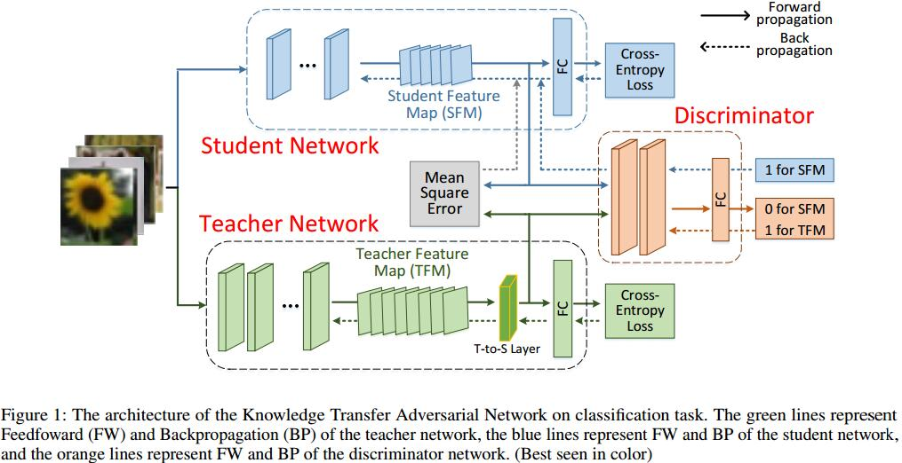

# KTAN: Knowledge Transfer Adversarial Network
[arXiv](https://arxiv.org/abs/1810.08126)

## Introduction
1. how to accelerate the computation of CNN models
   1. network quantization[1]: convert a pre-trained fullprecision CNN model into a low-precision one
   2. network pruning[2,3]: remove the redundant and insignificant connections (weights)
   3. knowledge distillation (KD)
     1. [4]: collects the outputs of the softmax layer (probability distribution) of a teacher network and use them as target objectives in training the student network.
     2. [6,7]: exploit intermediate representations as sharable knowledge.
2. discriminator in this paper: distinguishing whether an output came from TGN rather than SGN.
3. a trained shallow convolutional layer shows responds on low-level features, like edge, angle, and curve. Then, the next convolutional layer generates responds to a more complicated feature (high dimensional feature), like circle and rectangle. [8]
> 浅层更多底层特征，高层更多语义信息
## Method

## Reference
[1] Courbariaux, M.; Hubara, I.; Soudry, D.; El-Yaniv, R.; and Bengio, Y. 2016. Binarized neural networks: Training deep neural networks with weights and activations constrained to+ 1 or-1. In arXiv preprint arXiv:1602.02830.
[2] Han, S.; Mao, H.; and Dally, W. J. 2015. Deep compression: Compressing deep neural networks with pruning, trained quantization and huffman coding. In arXiv preprint arXiv:1510.00149.
[3] Li, H.; Kadav, A.; Durdanovic, I.; Samet, H.; and Graf, H. P. 2017. Pruning filters for efficient convnets. In International Conference on Learning Representations
[4] Hinton, G.; Vinyals, O.; and Dean, J. 2015. Distilling the knowledge in a neural network. In arXiv preprint arXiv:1503.02531.
[5] Luo, P.; Zhu, Z.; Liu, Z.; Wang, X.; Tang, X.; et al. 2016. Face model compression by distilling knowledge from neurons. In AAAI Conference on Artificial Intelligence,  3560–3566.
[6] Romero, A.; Ballas, N.; Kahou, S. E.; Chassang, A.; Gatta, C.; and Bengio, Y. 2014. Fitnets: Hints for thin deep nets. In International Conference on Learning Representations.
[7] [Zagoruyko and Komodakis 2017] Zagoruyko, S., and Komodakis, N. 2017. Paying more attention to attention: Improving the performance of convolutional neural networks via attention transfer. In International Conference on Learning Representations.
[8] Zeiler, M. D., and Fergus, R. 2014. Visualizing and understanding convolutional networks. In European Conference on Computer Vision, 818–833

## Learned
以GAN的思想学习KT，Student的featuremap为fake，Teacher为real
