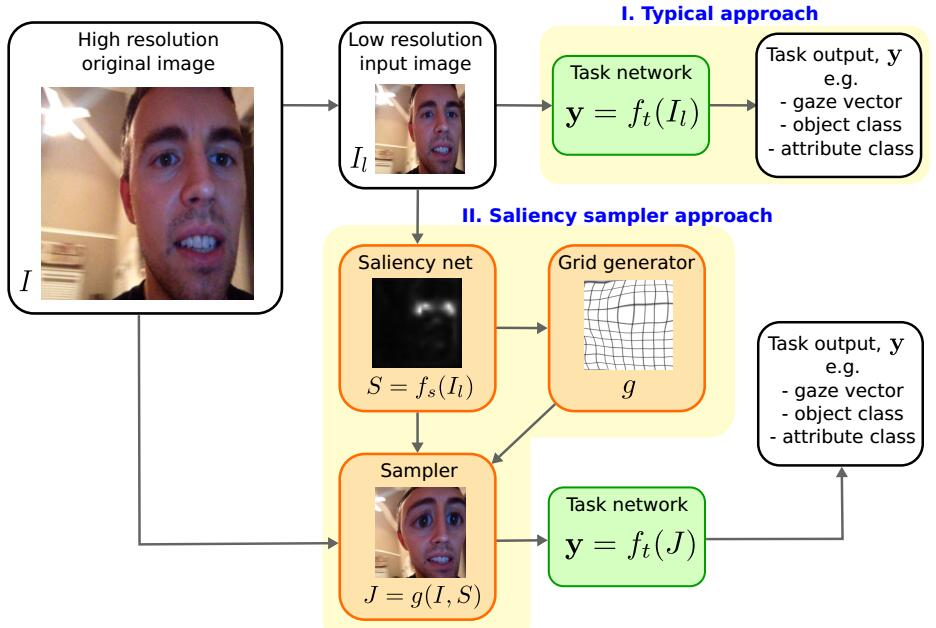
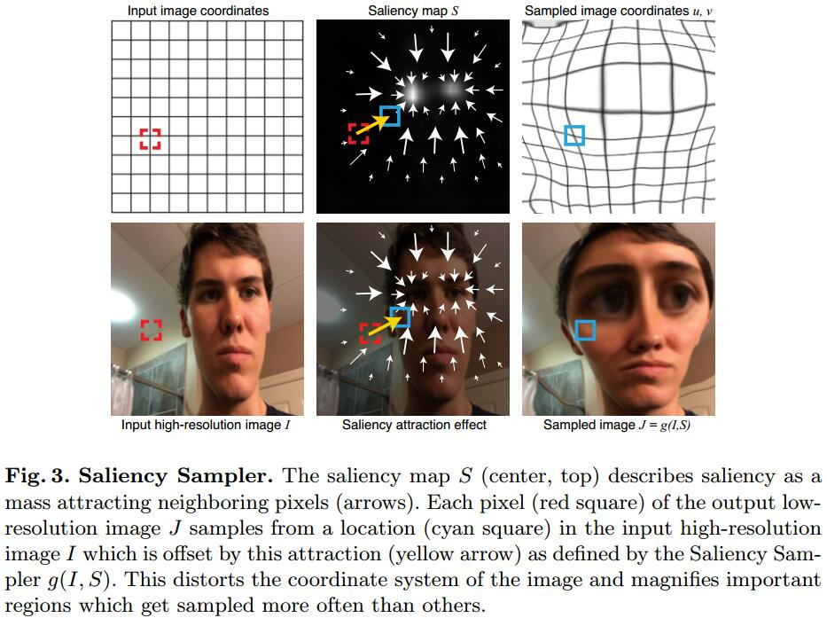

# Learning to Zoom: a Saliency-Based Sampling Layer for Neural Networks
[eccv](http://cfg.mit.edu/sites/cfg.mit.edu/files/learning_to_zoom.pdf)
[git](https://github.com/recasens/Saliency-Sampler)

## Introduction
 1. In STN, three types of transformation that could be learned: affine, projective and thin plate spline (TPS).
 2. Deformable convolutional networks (DCNs): dynamically adjust their receptive fields to adapt to the input features and improve invariance to nuisance factors. Their proposal involves the replacement of any standard convolutional layer in a CNN with a deformable layer which learns to estimate offsets to the standard kernel sampling locations, conditioned on the input.

## Method

1. Saliency Network: $S=f_s(I_l)$

2. Sampling Approach: $J=g(I,S)$
   1. $J(x,y)=I(u(x,y),v(x,y))$
   2. each pixel $(x', y')$ is pulling other pixels with a force $S(x', y')$
   3. distence kernel $k((x,y),(x',y'))$
   $$\begin{array}l
   u(x,y) = \frac{\sum_{x',y'}S(x',y')k((x,y),(x',y'))x'}{\sum_{x',y'}S(x',y')k((x,y),(x',y'))} \\
   v(x,y) =\frac{\sum_{x',y'}S(x',y')k((x,y),(x',y'))y'}{\sum_{x',y'}S(x',y')k((x,y),(x',y'))}
   \end{array}
   $$
