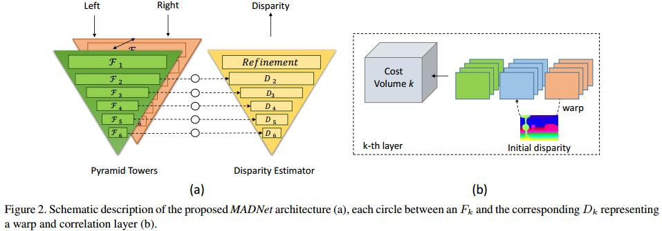

# Real-time self-adaptive deep stereo
[arXiv](https://arxiv.org/abs/1810.05424)

## Introduction
1. groundbreaking work: DispNet[19]
2.  continuous online adaptation can be achieved by deploying one of the unsupervised losses computing the loss on the current frames, updating the whole network by back-propagation and moving to the next pair of input frames.
> 无监督的在线自适应

3. end-to-end structure  [15, 22, 17, 3, 14]
> initially trained on a large amount of synthetic data with groundtruth labels [19] and then fine-tuned on the target domain (e.g., KITTI) based on stereo pairs with groundtruth

4. image reconstruction losses: unsupervised manner

## MADNet - Modularly ADaptive Network

1. inspired by very recent fast, yet accurate, architectures for optical flow [30, 35].

## MAD - Modular ADaptation
1. take a network $N$ and subdivide it into $p$ non-overlapping portions, each referred to as $n$, $N=[n_1,...,n_p]$
2. Each portion $n_i$ consists of $k$ connected layers with the last one (the deeper) able to output a disparity estimation $y_i$
3. $N$ will output $p+1$ disparity estimation with stereo frames $x$, $[y,y1,...,y_p]=forward(N,x)$, y being the final prediction of the model at full resolution
4. by alternating the portion $n_i$ of the network that is trained, it sequentially allows updating all layers.

## Referecne
[19] N. Mayer, E. Ilg, P. Hausser, P. Fischer, D. Cremers,
A. Dosovitskiy, and T. Brox. A large dataset to train convolutional networks for disparity, optical flow, and scene flow estimation. In The IEEE Conference on Computer Vision and
Pattern Recognition (CVPR), June 2016.
> the first endto-end stereo architecture
