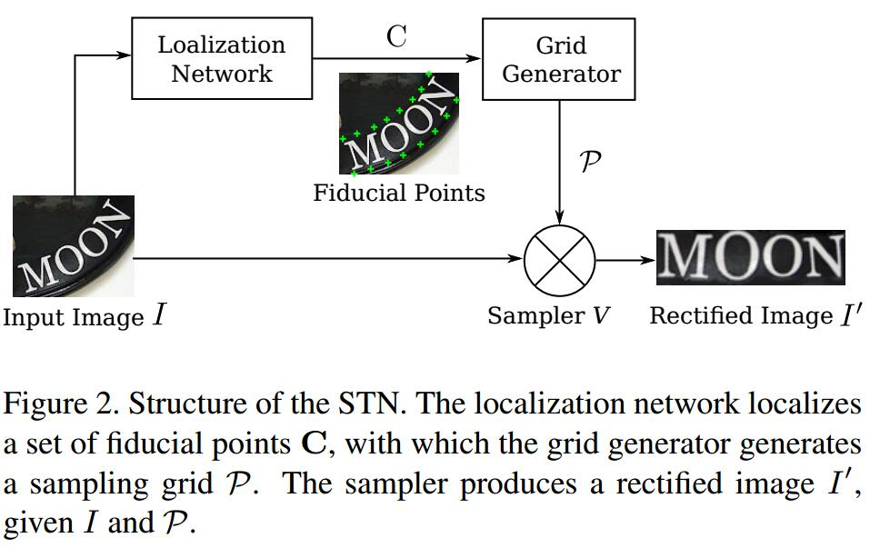
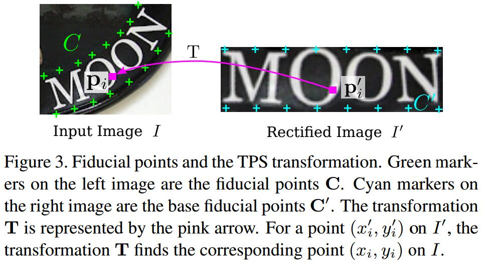

# Robust Scene Text Recognition with Automatic Rectification
[arXiv](https://arxiv.org/abs/1603.03915)
[git](https://github.com/WarBean/tps_stn_pytorch)

## Spatial Transformer Network

1. The STN transforms an input image $I$ to a rectified image $I_0$ with a predicted TPS transformation[6].
   1. predicts a set of fiducial points via its localization network
   2. inside the grid generator, it calculates the TPS transformation parameters from the fiducial points
   3. generates a sampling grid on $I$
   4. The sampler takes both the grid and the input image, it produces a rectified image I0 by sampling on the grid points

2. Localization Network: predict a set of points $C=[c_1,...,c_K]\in R^{2\times K}$

3. Grid Generator
   1.  define another set of fiducial points $C'=[c'_ 1,...,c' _ K]\in R^{2\times K}$
   2. parameters of the TPS transformation $T$
   $$ T=\left(\Delta^{-1}_{c'}\left[\begin{array}c
        C^T \\
        0^{3\times 2}
        \end{array}\right]\right)^T
   $$
   > $\Delta^{-1}_{c'}\in R^{(K+3)\times (K+3)}$ is a matrix determined only by $C'$, thus also a constant
   $$\Delta^{-1}_{c'}=\left[\begin{array}c
        1^{K\times 1} & C'^T R\\
        0 & 0 & 1^{1 \times K}
        \end{array}\right]
   $$
   where the element on the &i&-th row and &j&-th column of $R$ is $r_{i,j}=d^2_{i,j} \ln d^2_{i,j}$, $d_{i,j}$ is the euclidean distance between $c'_ i$ and $c'_ j$.

   3. The grid of pixels on a rectified image $I'$ is denoted by $P'=\{ p'_ i\}_{i=1,...,N}$
   4. for every point $p'_ i$ on $I'$, we find the corresponding point $p_i = [x_i, y_i]^T$ on $I$
   $$\begin{array}c
   r'_ {i,k}=d^2_{i,k}\ln d^2_{i,k} \\
   \hat{p}'_ i=[1,x'_ i,y'_ i,r'_ {i,1},...,r'_ {i,K}]^T \\
   p_i=T\hat{p}'_ i
   \end{array}
   $$
   > $d_{i,k}$ is the euclidean distance between $p'_ i$ and the $k$-th base fiducial point $c'_ k$.

   5. generate a grid $P = \{p_i\}_{i=1,...,N}$ on the input image $I$
4. Sampler: the pixel value of $p'$ i is bilinearly interpolated from the pixels near pi on the input image.
$$ I' = V(P,I) $$

## Reference
[6] F. L. Bookstein. Principal warps: Thin-plate splines and the decomposition of deformations. IEEE Trans. Pattern Anal. Mach. Intell., 11(6):567–585, 1989.
