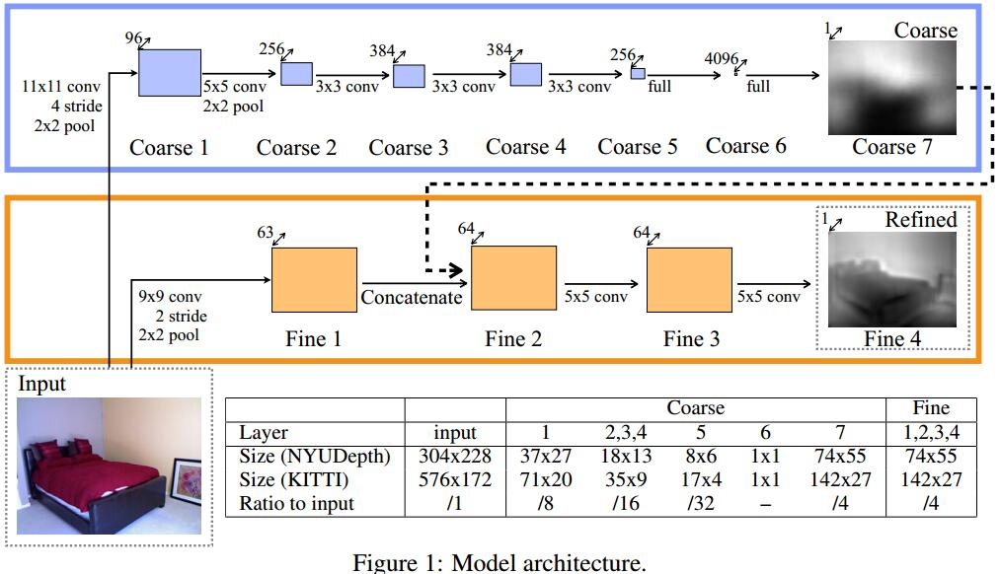

# Depth Map Prediction from a Single Image using a Multi-Scale Deep Network
[project](https://cs.nyu.edu/~deigen/depth/)
[zhihu](https://zhuanlan.zhihu.com/p/29312227)
## Introduction
1. 单目的应用 Yet the monocular case often arises in practice
better understandings of the many images distributed on the web and social media outlets, real estate listings, and shopping sites
2. 为什么单目深度研究少 There are likely several reasons why the monocular case has not yet been tackled to the same degree as the stereo one.
   1. 双目依靠局部特征即可， local disparity is sufficient for stereo
   2. 单目深度预测的线索需要全局的信息：line angles and perspective, object sizes, image position, and atmospheric effects。
3. 单目深度任务本身是病态的inherently ambiguous and technically ill-posed, fundamental ambiguity is the global scale

## Approach
1. Network

2. Scale-Invariant Error
预测结果为$y$，gt为$y^* $，共$n$个像素
$$\begin{array}l
D(y,y^* )=\frac{1}{2n}\sum_{i=1}^n(\log y_i-\log y_i^* +\alpha(y,y^* ))^2 \\[10pt]
\alpha(y,y^* )=\frac{1}{n}\sum_i\log y_i^* -\log y_i
\end{array}$$
$\alpha$的作用就是一个尺度。对于$y$，$e^\alpha$为最佳尺度。另$d_i=\log y_i-\log y_i^* $
$$\begin{array}l
D(y,y^* )=\frac{1}{2n}\sum_{i,j}((\log y_i-\log y_j) -(\log y_i^* -\log y_j^* ))^2 \\[10pt]
=\frac{1}{n}\sum_id_i^2-\frac{1}{n^2}\sum_id_id_j=\frac{1}{n}\sum_id_i^2-\frac{1}{n^2}(\sum_id_i)^2
\end{array}$$

```
``
