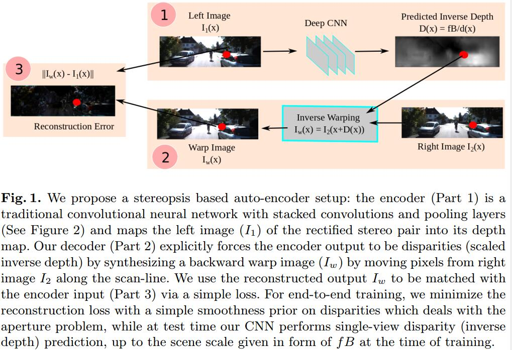
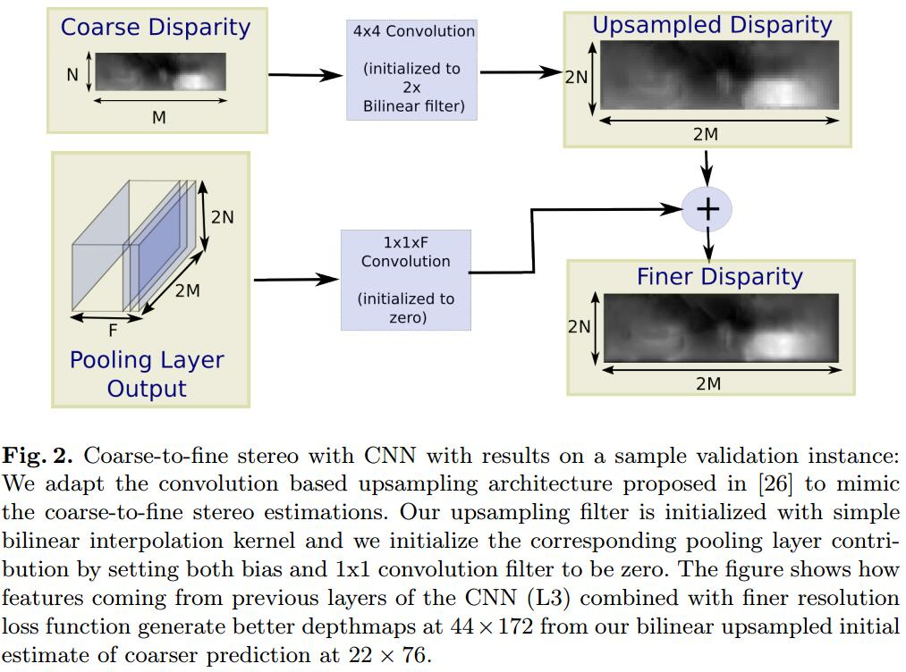

# Unsupervised CNN for Single View Depth Estimation: Geometry to the Rescue

## Introduction
1. 现有的深度预测训练方法
   1. 有监督。最小化预测和gt之间的scale invariant RMS [8] or the log RMS [24]。这样学习的泛化能力不强
   2. 产生一个合成的dataset[15]，但在这样的dataset中很难捕捉真实数据中的full variability
   3. 利用双目生成dataset，但标准的双目方法处理不好sensor flare, motion blur, lighting changes, shadows, etc

## Method

1. encode: left image -> depth
   decode: Inverse warping 基于预测的深度和相机位姿
2. 重建
   1. 图相对$\{I_1^i, I_2^i\},i=1,...,N$，来自标定好的视觉设备(焦距$f$，基线$B$)
   2. 对左图像的像素$x$的深度预测为$d^i(x)$
   3. 像素$x$沿基线的移动为$D^i(x)=fB/d^i(x)$
   4. 基于$I^i_2$重建该像素$I^i_w=I^i_2(x+fB/d^i(x))$
3. 重建误差
$$ E^i_{recons}=\int_\Omega||I^i_w(x)-I^i_1(x)||^2dx $$
这种误差在均匀的区域homogeneous regions作用不大，所以多种输出可能有相同的$E^i_{recons}$，所以需要加入一些先验
4. smooth
$$ E^i_{smooth}=||\nabla D^i(x)||^2 $$

## Coarse-to-fine training with skip architecture
1. 用泰勒展开线性化warp image
$$I_2(x+D^n(x))=I_2(x+D^{n-1}(x))+(D^{n}(x)-D^{n-1}(x))+I_{2h}(x+D^{n-1}(x))$$
$n$为迭代次数，$I_{2h}$为在$D^{n-1}$下的横向梯度
2. Coarse-to-fine 改良

大尺度的预测初始化为0，仅起到改良作用，没有抑制Coarse的主导作用
```
```
