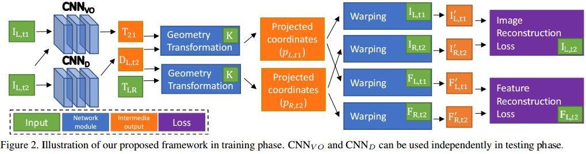

# Unsupervised Learning of Monocular Depth Estimation and Visual Odometry with Deep Feature Reconstruction

## Method

1. Image reconstruction as supervision
对一个单目图像$I_{L,t2}$，时间上有一个ref frame$I_{L,t1}$，空间上有一个ref frame$I_{R,t2}$， 这两个ref重建I
2. Differentiable geometry modules
   1. $p_{L,t2}$为$I_{L,t2}$的齐次坐标，则$p_{L,t2}$在ref上的投影$p_{R,t2},p_{L,t1}$可以用极线几何表示
   $$\begin{array}l
   p_{R,t2}=KT_{L\to R}D_{L,t2}(p_{L,t2})K^{-1}p_{L,t2} \\
   p_{L,t1}=KT_{t2\to t1}D_{L,t2}(p_{L,t2})K^{-1}p_{L,t2}
   \end{array}$$
3. Feature reconstruction as supervision
类似于Image reconstruction
4. Smooth loss
$$L=\sum_{m,n}^{W,H}|\partial_xD_{m,n}|e^{-|\partial_xI_{m,n}|}+\partial_yD_{m,n}|e^{-|\partial_yI_{m,n}|}$$
