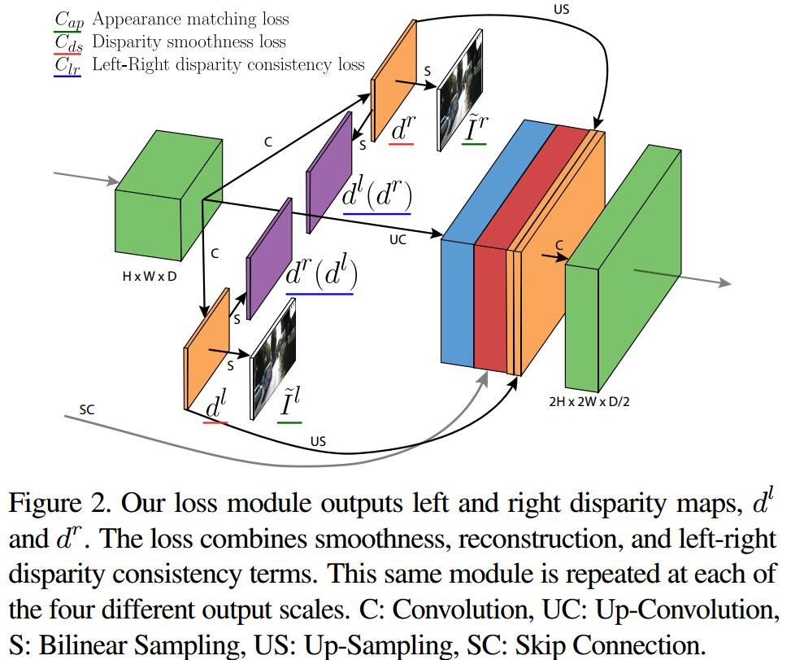
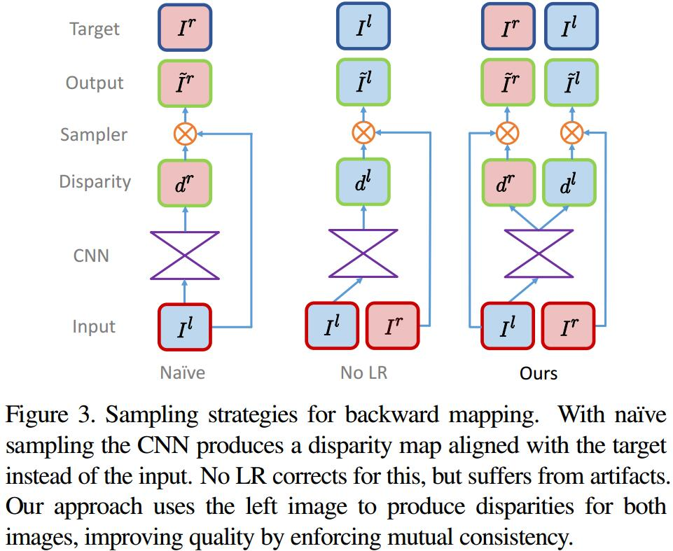

# Unsupervised Monocular Depth Estimation with Left-Right Consistency
[arXiv](https://arxiv.org/abs/1609.03677)
[cvpr](http://openaccess.thecvf.com/content_cvpr_2017/papers/Godard_Unsupervised_Monocular_Depth_CVPR_2017_paper.pdf)

## Introduction
1. 传统的深度计算
computes the similarity between each pixel in the first image and every other pixel in the second image. Typically the stereo pair is rectified and thus the problem of disparity (i.e. scaled inverse depth) estimation can be posed as a 1D search problem for each pixel.

2. matching as a supervised learning problem [54, 31]
3. posing this binocular correspondence search as a multi-class classification  [38]
4. Unsupervised
   1. DeepStereo [13]: requires several nearby posed images at test time
   2. Deep3D [53]:  generate the corresponding right view from an input left image

5. This work: posing monocular depth estimation as an image reconstruction problem

## Method
1. Depth Estimation as Image Reconstruction
   1. goal: $\hat d=f(I)$, $I$为图像，$d$为深度
   2. The intuition here is that, given a calibrated pair of binocular cameras, if we can learn a function that is able to reconstruct one image from the other, then we have learned something about the 3D shape of the scene that is being imaged.
   > 给定双目图像，从其中一个重建另一个

   3. $\widetilde I^r=I^l(d^r), \widetilde I^l=I^r(d^l)$

2. Depth Estimation Network

   1. using only the left input image, and obtain better depths by enforcing them to be consistent with each other.
   2. loss
   网络输出4个尺度
   $$\begin{array}l
   C=\sum_{s=1}^4 C_s \\
   C_s=\alpha_{ap}(C_{ap}^l+C_{ap}^r)+\alpha_{ds}(C_{ds}^l+C_{ds}^r)+\alpha_{lr}(C_{lr}^l+C_{lr}^r)
   \end{array}
   $$
   > $C_{ap}$ 促进重建的图像与原图相似
   > $C_{ap}$ 使视差图平滑
   > $C_{lr}$ 促进左右视差图一致

   3. Appearance Matching Loss
   $$ C_{ap}^l=\frac{1}{N}\sum_{i,j}\alpha\frac{1-SSIM(I^l_{ij}, \widetilde I^l_{ij})}{2}+(1-\alpha)||I^l_{ij}-\widetilde I^l_{ij}|| $$
   > SSIM[51] 使用$3\times 3$的block filter代替原有的高斯滤波器，$\alpha=0.85$, $N$为像素个数

   4. Disparity Smoothness Loss
   $$C_{ds}^l=\frac{1}{N}\sum_{i,j}|\partial_x d^l_{ij}|e^{-||\partial_xI^l_{ij}||}+ |\partial_y d^l_{ij}|e^{-||\partial_yI^l_{ij}||}$$
   > $\partial$求梯度, $\partial I$为 edge-aware term

   5. Left-Right Disparity Consistency Loss
   $$C^l_{lr}=\frac{1}{N}\sum_{i,j}|d_{ij}^l-d_{ij+d^l_{ij}}^r|$$
