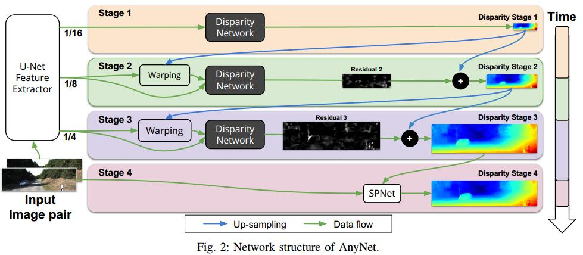
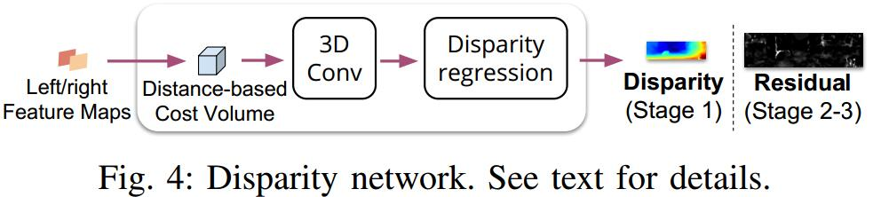

# Anytime Stereo Image Depth Estimation on Mobile Devices
[arXiv](https://arxiv.org/abs/1810.11408)
[github](https://github.com/mileyan/AnyNet)

## Relatied work
1. traditional [2,11,12,13,39]
   1. computing the costs of matching image patches over a range of disparities
   2. smoothing of the resulting cost tensor via aggregation methods
   3. estimation of the disparity by finding a low-cost match between the patches in the left image and those in the right image
   4. refinement of these disparity estimates by introducing global smoothness priors on the disparity map
   > 1可以用CNN解决： [50] use a Siamese convolutional network to predict patch similarities for matching left and right patches.

2. End-to-end disparity prediction [30,19,23,34]
   1. superivised
      1. Disp [30]: directly predicts disparities for an image pair
      2. cascaded refinement procedure [34]
   2. unsupervised [9,52]

## AnyNet

1. Process
    1. U-Net feature extractor: computes feature maps at several
    output resolutions (of scale 1/16, 1/8, 1/4).
    2. Stage 1: only the lowest scale features (1/16) are computed and passed through a disparity network
    3. Stage 2:
       1. compute feature of larger scale (1/8)
       2. only compute a correction of the already existing disparity map from Stage 1
    4. Stage 3: similar to Stage 2
    5. Stage 4: Stage 4 refines the disparity map from Stage 3 with an SPNet [24]
2. Disparity Network

   1. For Stage 1: compute a disparity cost volume
      1. Input feature size: $H\times W$
      2. cost volume dimension: $H\times W\times M$, $(i,j,k)$ entry describes how well pixel $(i, j)$ of the left image matches the pixel $(i, j-k)$ in the right image and $M$ denotes the maximum disparity under consideration.
   2. predict residuals in Stage 2&3
3. Spacial Propagation Network[24]
