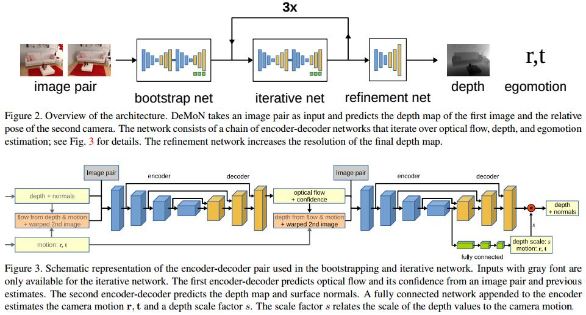

# DeMoN: Depth and Motion Network for Learning Monocular Stereo
[arXiv](https://arxiv.org/abs/1612.02401)

## Network Architecture

1. 网络预测的是inverse depth(i.e., 1/depth)而不是depth，是为了表达“points at infinity”
2. 预测一个scale来转化归一化深度和绝对深度
