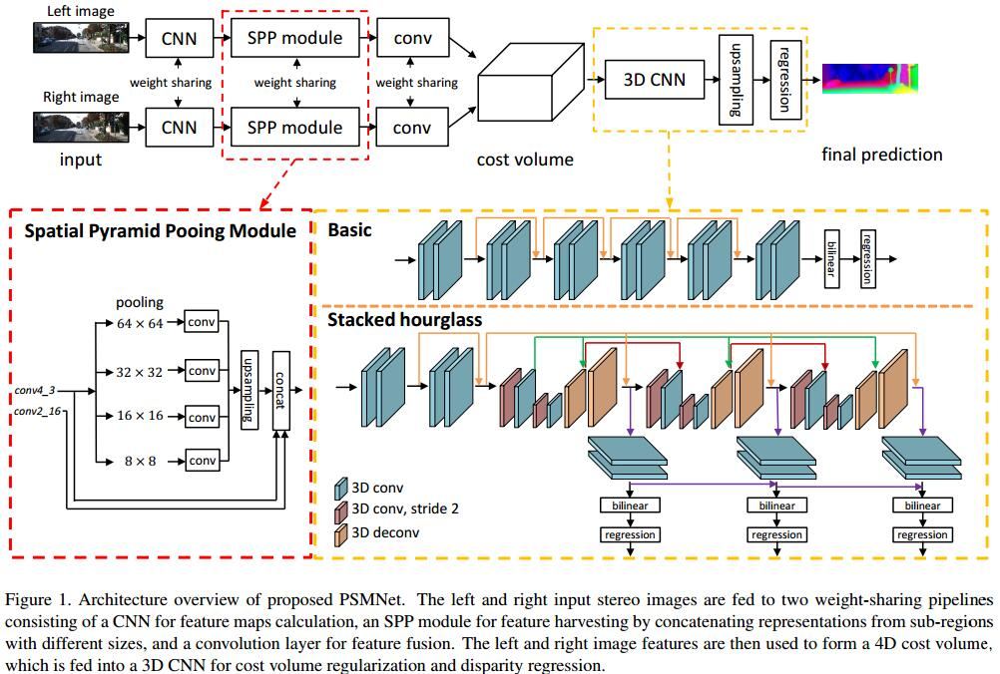

# Pyramid Stereo Matching Network
[arXiv](https://arxiv.org/abs/1803.08669)
[git](https://github.com/ClubAI/MonoDepth-PyTorch)

## Introduction
1.  CNN is still difficult to find accurate corresponding points in inherently ill-posed regions such as occlusion areas, repeated patterns, textureless regions, and reflective surfaces.
> 困难：遮挡、重复、结构不清、反射

2. ParseNet[16]: empirical receptive field is much smaller than the theoretical receptive field in deep networks

## Method

1. Spatial Pyramid Pooling Module, SPP
2. Cost Volume
3. 3D CNN:
   1. basic architecture
   2. stacked hourglass architecture
     1. three main hourglass networks, each of which generates a disparity map.

## Reference
[16] W. Liu, A. Rabinovich, and A. C. Berg. ParseNet: Looking wider to see better. arXiv preprint arXiv:1506.04579, 2015.

## Learned
采用特殊的结构end-to-end回归出视差图，有监督训练，所用的数据集有Scene Flow, KITTI 2015, KITTI 2012
