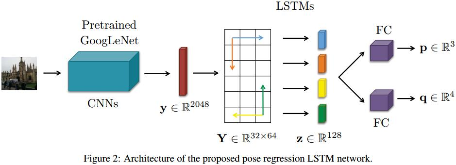

# Image-based localization using LSTMs for structured feature correlation
[git](https://github.com/hazirbas/poselstm-pytorch)
[arXiv](https://arxiv.org/abs/1611.07890)
[iccv](https://ieeexplore.ieee.org/stamp/stamp.jsp?tp=&arnumber=8237337)

## Introduction
1. SIFT-based: [31,44,50,62]
   1. 不适合用于以下场景：large textureless areas, repetitive structures.
   2.
2. PlaNet [57]: formulates localization as a classification problem, where the current position is matched to the best position in the training set.
> 看做分类任务

3. PostNet [23,24]:
   1. formulates 6DoF pose estimation as a regression problem.
   2. significantly less accurate than state-of-theart SIFT methods [31,44,50,62]
4. regressing the pose after the high dimensional output of a FC layer is not optimal. high dimensionality of the FC output makes the network prone to overfitting to training data.
> 高维FC层造成过拟合

## Architecture

1. 仿照PoseNet到2048的FC层
2. reshape 2048的向量到32*64的矩阵
3. 4个LSTM从上下左右4个方向处理
4. 4个输出concat，再由FC处理
