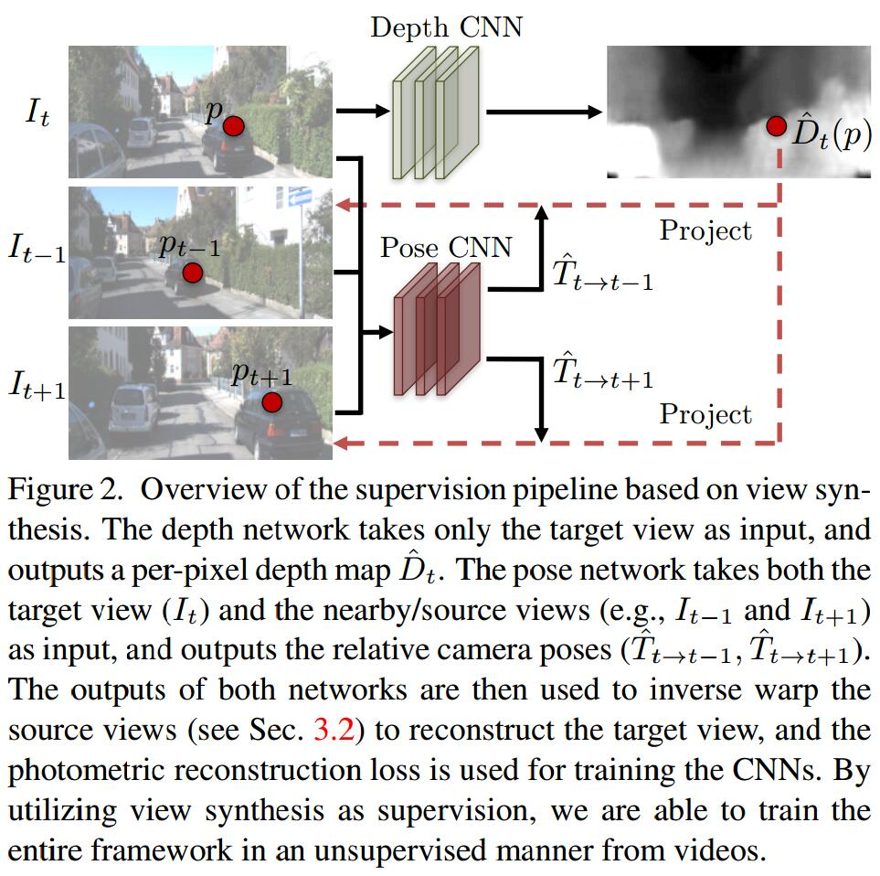
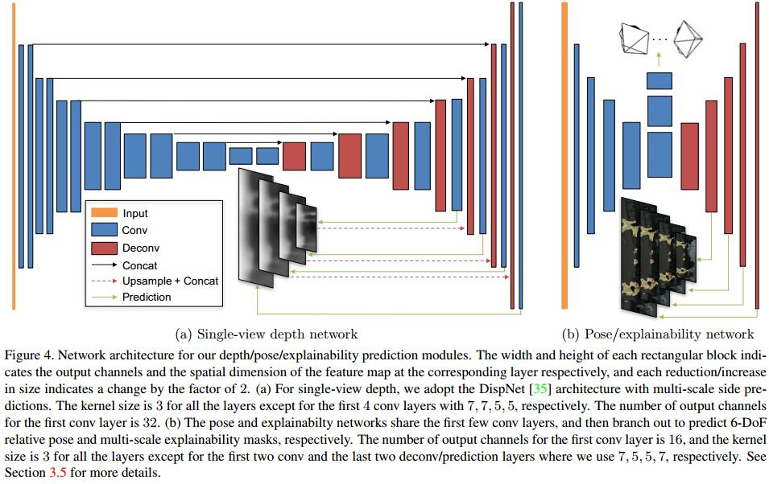

# Unsupervised Learning of Depth and Ego-Motion from Video
[arXiv](https://arxiv.org/abs/1704.07813)
[git](https://github.com/tinghuiz/SfMLearner)
[机器之心](http://www.sohu.com/a/160234058_465975)
[CSDN](https://blog.csdn.net/Kevin_cc98/article/details/78957218)
[相机与图像](https://zhuanlan.zhihu.com/p/33583981)
## Related work
1. deep learning for feature matching [18], pose estimation [26], and stereo [10, 27, 53].

## Approach

1. View synthesis as supervision
   1. novel view synthesis: given one input view of a scene, synthesize a new image of the scene seen from a different camera pose.
   2. view synthesis objective: $<I_1,...,I_N>$ is trainig image sequence with target view $I_t$, and the rest are source views $I_s(1\le s\le N,s\ne t)$
   $$ L_{v,s}=\sum_s\sum_p|I_t(p)-\hat I_s(p)| $$
   > $p$是像素点, $\hat I_s$:从$I_s$warp到$I_t$坐标系[8]

2. Differentiable depth image-based rendering
> 一个关键的步骤：基于深度估计$\hat D_t$和相对姿态$\hat T_{t\to s}$, 从$I_s$重建$I_t$

   1. target view pixel $p_t$’s projected coordinates onto the source view $p_s$
   $$ p_s\sim K \hat T_{t\to s}\hat D_t(p_t)K^{-1}p_t$$
   > K为相机内参数

3. Modeling the model limitation
   1. 运用上面的合成有两个假设
      1. 没有运动目标
      2. 没有遮挡
      3.  the surface is Lambertian so that the photo-consistency error is meaningful.
    2. explainability prediction network
       1.  outputs a per-pixel soft mask $\hat E^s$ for each target-source pair, indicating the network’s belief in where direct view synthesis will be successfully modeled for each target pixel.
       > 预测一个可解释区域满足上面的假设

       2. loss based on $\hat E^s$
       $$ L_{v,s}=\sum_s\sum_p\hat E^s(p)|I_t(p)-\hat I_s(p)| $$
       3. $\hat E^s$没有监督，容易被训成全0，于是加一个正则项$L_{reg}(\hat E)$

4. Overcoming the gradient locality
梯度主要由$I(p_t),I(p_s)$像素的差异，当$p_s$被映射到low-texture region或远离当前的估计，会对训练产生不好的影响。有两种解决方法：
   1. using a convolutional encoder-decoder architecture with a small bottleneck for the depth network that implicitly constrains the output to be globally smooth and facilitates gradients to propagate from meaningful regions to nearby regions
   > bottleneck变细

   2. explicit multi-scale and smoothness loss that allows gradients to be derived from larger spatial regions directly. i.e., minimize the L1 norm of the second-order gradients for the predicted depth maps
   > 多尺度的平滑损失，最小化depth map的二阶梯度

   3. final objective
   $$ L_{f} = \sum_lL_{vs}^l+\lambda_s L_{smooth}^l+\lambda_e\sum_eL_{reg}(\hat E_s^l) $$
   > $l$代表不同尺度

5. Networks

1. Depth prediction layer
$$ \frac{1}{\alpha*sigmoid(x)+\beta} $$
> $\beta=0.01$ 保证预测的depth在一个合理的范围

2. pose
   1. input: target view concatenated with all the source views
   2. output: relative poses between the target view and each of the source views. out channel $6*(N-1)$
   > $N$为总输入图像数，pose为3 Euler angles and 3-D translation

3. Explainability
   1. 与pose共享前5层
   2. output: $2*(N-1)$ normalized by softmax

## Reference
[10] J. Flynn, I. Neulander, J. Philbin, and N. Snavely. DeepStereo: Learning to predict new views from the world’s imagery. In Computer Vision and Pattern Recognition, 2016.
