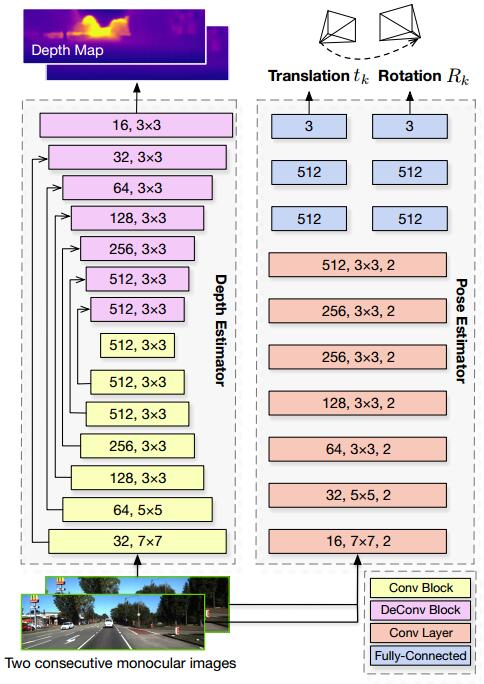
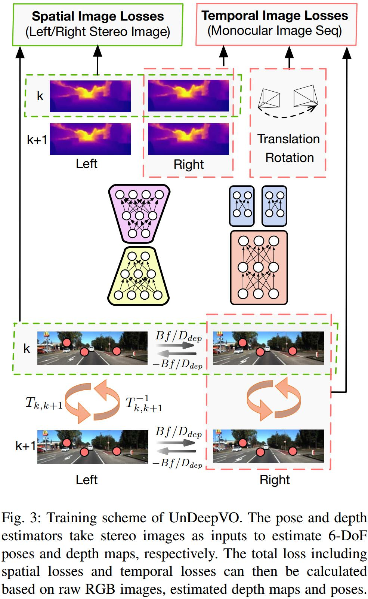

# UnDeepVO: Monocular Visual Odometry through Unsupervised Deep Learning
[arXiv](https://arxiv.org/abs/1709.06841)

## System overview

空间重建+时间重建
## Loss
1. Spatial Image Losses of a Stereo Image Pair
   1. 空间重建可以产生绝对尺度，recover scaled depth，solve scaling ambiguity issue
   2. Photometric Consistency Loss
   左右图像依靠视差互相重建，计算相似度
   [SSIM](https://www.cnblogs.com/wxl845235800/p/7692578.html)
   3. Disparity Consistency Loss
   计算是视差图的相似度
   4. Pose Consistency Loss
   左右图像都预测pose，两种pose应一致
2. Temporal Image Losses of Consecutive Monocular Images
   1. Photometric Consistency Loss
   $$p_{k+1}=K(^{k+1}T_k)DK^{-1}p_k$$
   其中k为时间，K为内参数，T为transform矩阵，D为深度
   2. 3D Geometric Registration Loss
   在k下的三维点可转移到k+1下，反之亦然
