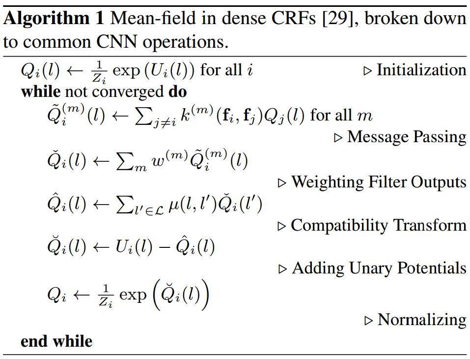
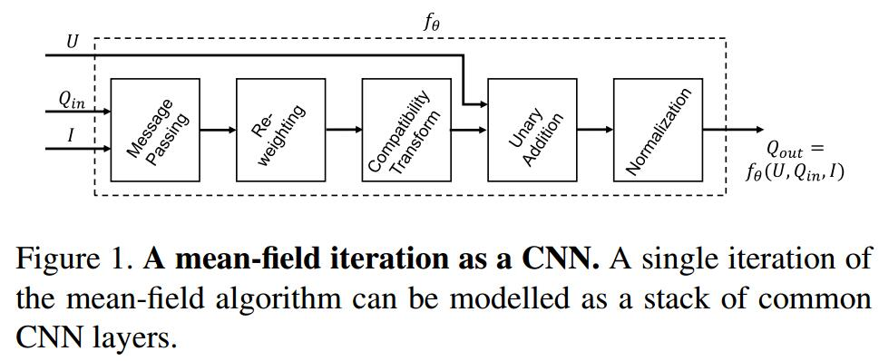
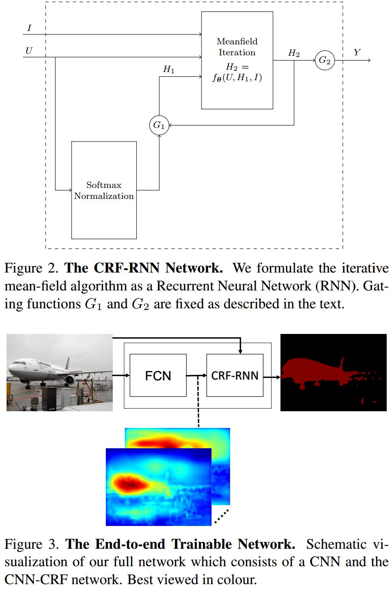

# Conditional Random Fields as Recurrent Neural Networks
[arXiv](https://arxiv.org/abs/1502.03240)
[CSDN](https://blog.csdn.net/hjimce/article/details/50888915)

## Introduction
1. CNN在语义分割的问题
   1. 感受野太大，结果粗糙
   2. 缺乏平滑约束
2. CRF作为后处理模块 [5,10,41]

## mean-field approximation

## A Mean-field Iteration as a Stack of CNN Layers
1. mean-field approximation

$U_i(l)=-\psi_u(X_i=l)$
2. Initialization
$$ Q_i(l)\leftarrow \frac{\exp(U_i(l))}{\sum_l \exp(U_i(l))}$$
等价于对$U$使用softmax across all the labels at each pixel.
3. Message Passing
   1. 在denseCRF中，此操作为，对Q使用M个高斯滤波器，高斯滤波器的权值基于像素点的位置和RGB，反映一个像素点与其他像素点的关联程度
   2. 由于denseCRF是全连接的，每一个滤波器的感受野都是全图，使得这种滤波器的实现不切实际
   3. 本文 使用Permutohedral lattice implementation [1]，构建两个高斯核，一个 spatial kernel 和一个 bilateral kernel
4. Weighting Filter Outputs
   1. 原操作：对M和输出加权求和
   2. 可看做$1\times 1$的卷积，对M个通道操作，输出单通道的map
   3. 对每个类别，使用独立的卷积权值
5. Compatibility Transform
   1. 原操作：$\mu(l,l')=|l\neq l'|$，局限在于对所有不同的label对惩罚程度相同
   2. 假设$\mu(l,l')\neq\mu(l',l)$
   3. 可看做一个$1\times 1$的卷积，输入输出通道都是$L$
6. Adding Unary Potentials
无参数操作
7. Normalization
可看做softmax

## The End-to-end Trainable Network
### CRF as RNN

1. 一次迭代过程记为$f_\theta=f_\theta(U,Q_{in},I)$，$Q_{in}$为上一次迭代的结果，$I$为图像，$U$为一元势
2. CRF的参数: $\theta=\{w^{(m)},\mu(l,l')\},m\in\{1,...,M\},l\in\{l1_,...,l_L\}$
3. $G_1,G_2$是控制门，$G_2$只在最后一次迭代后打开，$G_1$在第一次迭代是选择下方箭头，以后选择右方箭头

### Completing the Picture
1. FCN用于预测像素点的label，不考虑结构
2. CRF-RNN用概率图模型为结构建模
