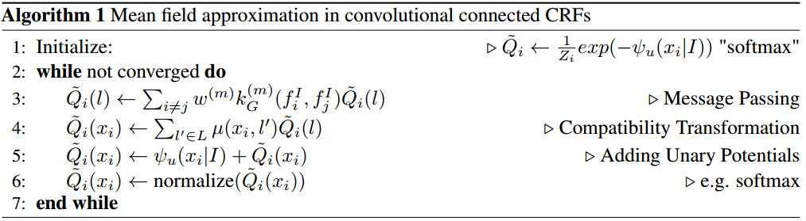

# Convolutional CRFs for Semantic Segmentation
[arXiv](https://arxiv.org/abs/1805.04777)
[git](https://github.com/MarvinTeichmann/ConvCRF)

## Introduction
1. CRF的drawback: CRFs are notoriously slow and hard to optimize
   1. many approaches rely on entirely hand-crafted Gaussian features [17, 41, 31, 6].
   2. CRF inference is two orders of magnitude slower then CNN inference.
   3. long training time

## Fully Connected CRFs
1. segementation
   1. 图像 $I$ 有 $n$ 个像素，则可以被建模为一个随机场: $X=\{X_1,...,X_n\}$
   2. 共$k$个类别，则随机变量$X_i$在$\{1,...,k\}$中取值
   3. 即，求解$\arg\max_X P(X|I)$来得到$I$的分割$X$
   4. $P(X|I)$可建模为
   $$P(X=\hat x|\widetilde I=I)=\frac{1}{Z(I)}\exp(-E(\hat x|I))$$
   其中$E$为energy function ($\hat x$为预测的label),可表达为
   $$E(\hat x|I)=\sum_{i\leq N}\psi_u(\hat x_i|I)+\sum_{i\neq j \leq N}\psi_p(\hat x_i, \hat x_j|I)$$
   其中$\psi_u(\hat x_i|I)$为unary potential，可被视为图像的分割，任一种分割方法可用于预测unary potential。
   $\psi_p(\hat x_i, \hat x_j|I)$为pairwise potential，负责像素点$i,j$的联合分布，有助于建立像素间的关系，可定义为weighted sum of Gaussian kernels $k_G$
   $$ \psi_p(\hat x_i, \hat x_j|I)=\mu(x_i,x_j)\sum_{m=1}^Mw^{(m)}k_G^{(m)}(f_i^I,f_j^I) $$
   其中$w^{(m)}$为可学习的参数，$f^I$为特征向量，$\mu(x_i,x_j)=|x_i\neq x_j|$为 compatibility transformation，CRFasRNN中使用$1\times 1$的卷积作为$\mu$
   FullCRFs有两个高斯核：appearance kernel $k_\alpha$, smoothness kernel
   $$k(f_i^I,f_j^I)=w^{(1)}\exp(-\frac{|p_i-p_j|^2}{2\theta_\alpha^2}-\frac{|I_i-I_j|^2}{2\theta_\beta^2})+w^{(2)}\exp(-\frac{|p_i-p_j|^2}{2\theta_\gamma^2})$$
   其中$p$为位置,$I_i,I_j$为颜色
   $w^{(1)},w^{(2)},\theta_\alpha,\theta_\beta,\theta_\gamma$为仅有的可学习参数

2. Mean Field Inference

### Convolutional CRFs
1. conditional independence assumption: the label distribution of two pixels $i, j$ are conditionally independent, if for the Manhattan distance $d$ holds $d(i, j) > k$. We call the hyperparameter $k$ filter-size
> 如果两个像素的马氏距离大于$k$，它们的label条件独立, 即对于所有距离超过$k$的像素点, $\psi_p=0$
> 这个假设来源于CNN的局部操作

2. Efficient Message Passing in ConvCRFs:
   1. 输入$P$的shape为[bs,c,h,w] (batch size, number of classes, input hight and width)
   2. 对于由$f_1,...,f_d$组成的高斯核$g$，每一个[bs,h,w]可定义一个kernel matrix
   $$ k_g[b,dx,dy,x,y]=\exp(-\sum_{i=1}^d\frac{|f_i^{(d)}[b,x,y]-f_i^{(d)}[b,x-dx,y-dy]|}{2\dot\theta_i}) $$
   3. 对于$s$个高斯核$g_1,...,g_s$,定义merged kernel matrix $K=\sum_{i=1}^sw_i,g_i$
   4. message passing operation is similar to standard 2d-convolutions of CNNs.
    $$Q[b,c,x,y]=\sum_{dx,dy\leq k}K[b,dx,dy,x,y]\cdot P[b,c,x+dx,y+dy]$$

## Pytorch
