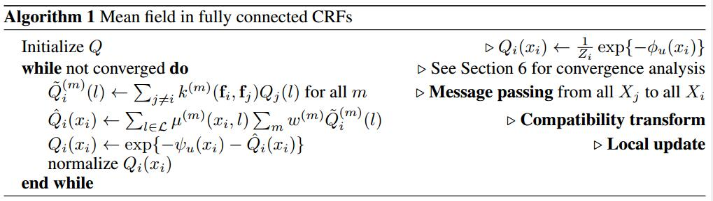
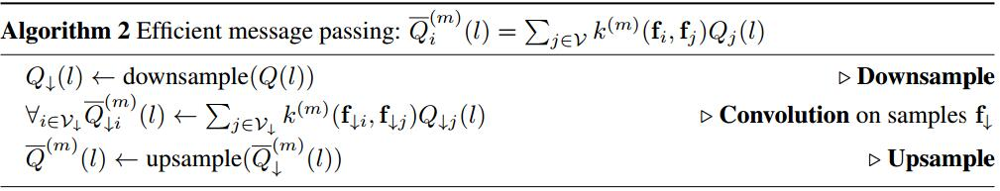

# Efficient Inference in Fully Connected CRFs with Gaussian Edge Potentials
[arXiv](https://arxiv.org/abs/1210.5644)
[nips](https://papers.nips.cc/paper/4296-efficient-inference-in-fully-connected-crfs-with-gaussian-edge-potentials.pdf)
[supplementary](http://vladlen.info/papers/densecrf-supplementary.pdf)
[zhihu](https://zhuanlan.zhihu.com/p/22464586)
[双边滤波](https://www.cnblogs.com/walccott/p/4957108.html)
[permutohedral lattice](https://blog.csdn.net/xuanwu_yan/article/details/7962508)

## Fully Connected CRF Model
1. 随机变量$X=\{X_1,..,X_N\}$ 为像素点的标签，可能取值为$L=\{l_1,...,l_k\}$, $N$为总像素点个数
2. $I=\{I_1,...,I_N\}$ 为颜色向量
3. CRF表示为 $(I,X)$，服从Gibbs distribution
4. Gibbs distribution:
$$P(X|I)=\frac{1}{Z(I)}\exp(\sum_{c\in C_G}\phi_c(X_c|I))$$
其中$G=(\mathcal V,\mathcal E)$为在$X$上的图，$\mathcal V=X$，$C_G$为$G$中的团cliques，$c$为其中一个团clique，引发一个势函数$\phi_c$
5. Gibbs energy: 对于一个标注$x\in L^N$, $E(x|I)=\sum_{c\in C_G}\phi_c(x_c|I)$
6. 最大后验标注 maximum a posteriori (MAP) labeling: $x^* =\arg\max_{x\in L^N}P(x|I)$
7. 简化符号$\psi_c(x_c)=\phi_c(x_c|I)$
8. 在fully connected pairwise CRF 中，$G$为$X$上的完全图complete graph，$C_G$为所有一元团和成对团的集合 the set of all unary and pairwise cliques.
9. 从而Gibbs energy可表达为
$$ E(x)=\sum_i\psi_u(x_i)+\sum_{i<j}\psi_p(x_i,x_j) $$
其中$i,j=1,...,N$.
10. $\psi_u(x_i)$为一元势函数，用一个分类器计算每个独立的像素，产生$x_i$的标注分布。
11. 成对势函数表示如下
$$ \begin{array}l
\psi_p(x_i,x_j)=\mu(x_i,x_j)k(f_i,f_j) \\[10pt]
k(f_i,f_j)=\sum_{m=1}^kw^{(m)}k^{(m)}(f_i,f_j)
\end{array}$$
其中$k^{(m)}$为高斯核，$k^{(m)}(f_i,f_j)=\exp(-0.5(f_i-f_j)^T\Lambda^{(m)}(f_i-f_j))$, $f_i,f_j$为任意特征空间中的特征向量，$w$为权值，$\mu$为兼容性函数 label compatibility function，$\Lambda$为对称正定矩阵
12. 对于对类别分割，用$I_i,I_j$表示颜色，$p_i,p_j$表示位置
$$ k(f_i,f_j)=w^{(1)}\exp(-\frac{|p_i-p_j|^2}{2\theta_\alpha^2}-\frac{|I_i-I_j|^2}{2\theta_\beta^2})+w^{(2)}\exp(-\frac{|p_i-p_j|^2}{2\theta_\gamma^2}) $$
其中第一项为 appearance kernel，含义为位置临近且颜色相近的像素可能属于同一类别。第二项为smoothness kernel，目的是去除小的孤立的区域。$\mu(x_i,x_j)=|x_i\neq x_j|$惩罚临近且相似的像素被分为不同类别的情况

## Efficient Inference in Fully Connected CRFs
### Mean Field Approximation
1. 精确的分布$P(X)$难以获得，mean field approximation 计算$Q(X)$来最小化KL散度$D(Q||P)$. $Q$可表达为乘积形式
$$Q(X)=\Pi_iQ_i(X_i)$$
2. 根据一下对待方程，最小化KL散度的同时约束$Q(X),Q_i(X)$为有效的分布
$$ Q_i(x_i=l) =\frac{1}{Z}\exp\{-\psi_u(x_i)-\sum_{l'\in L}\mu(l,l')\sum_{m=1}^Kw^{(m)}\sum_{j\neq i}k^{(m)}(f_i,f_j)Q_j(l')\}$$


message passing很耗时，可以用approximate high-dimensional filtering简化计算

### Efficient Message Passing Using High-Dimensional Filtering
1. message passing 能用基于高斯核$G_{\Lambda^{(m)}}$的卷积表达
$$ \widetilde Q^{(m)}_i(l)=\sum_{j\in\mathcal V}k^{(m)}(f_i,f_j)Q_j(l)-Q_i(l)=[G_{\Lambda^{(m)}}* Q(l)] (f_i)-Q_i(l) $$
这个卷积是一个低通滤波，可用分解为三步：下采样$Q(l)$,卷积，上采样卷积的结果


## Learning
1. 训练一个unary classifiers
2. 用grid search训练appearance kernel 的$w^{(1)},\theta_\alpha,\theta_\beta$
3. $w^{(2)}=\theta\gamma=1$

## UNet-DenseCRF推理过程
[code](https://github.com/milesial/Pytorch-UNet)
```py
def dense_crf(img, output_probs):
  # img[h,w,3]为原图，output_probs[h,w]为UNet的输出，这里只分割两类，所以输出通道为1
    h = output_probs.shape[0]
    w = output_probs.shape[1]

    output_probs = np.expand_dims(output_probs, 0) # 增加一维[1,h,w]
    output_probs = np.append(1 - output_probs, output_probs, axis=0)# 构建2通道分割图[2,h,w]

    d = dcrf.DenseCRF2D(w, h, 2)
    U = -np.log(output_probs) # [2,h,w]
    U = U.reshape((2, -1)) # 展开[2,h*w]
    U = np.ascontiguousarray(U) # 返回一个地址连续的array
    img = np.ascontiguousarray(img)

    d.setUnaryEnergy(U)

    d.addPairwiseGaussian(sxy=20, compat=3)
    d.addPairwiseBilateral(sxy=30, srgb=20, rgbim=img, compat=10)

    Q = d.inference(5)
    Q = np.argmax(np.array(Q), axis=0).reshape((h, w))

    return Q # 最后的概率
```

[PydenseCRF](https://github.com/lucasb-eyer/pydensecrf/blob/master/pydensecrf/densecrf/src/densecrf.cpp)

```cpp
void DenseCRF2D::addPairwiseGaussian ( float sx, float sy, LabelCompatibility * function, KernelType kernel_type, NormalizationType normalization_type ) {
	MatrixXf feature( 2, N_ );
	for( int j=0; j<H_; j++ )
		for( int i=0; i<W_; i++ ){
			feature(0,j*W_+i) = i / sx;
			feature(1,j*W_+i) = j / sy;
		}
	addPairwiseEnergy( feature, function, kernel_type, normalization_type );
}
void DenseCRF2D::addPairwiseBilateral ( float sx, float sy, float sr, float sg, float sb, const unsigned char* im, LabelCompatibility * function, KernelType kernel_type, NormalizationType normalization_type ) {
	MatrixXf feature( 5, N_ );
	for( int j=0; j<H_; j++ )
		for( int i=0; i<W_; i++ ){
			feature(0,j*W_+i) = i / sx;
			feature(1,j*W_+i) = j / sy;
			feature(2,j*W_+i) = im[(i+j* W_)* 3+0] / sr;
			feature(3,j*W_+i) = im[(i+j* W_)* 3+1] / sg;
			feature(4,j*W_+i) = im[(i+j* W_)* 3+2] / sb;
		}
	addPairwiseEnergy( feature, function, kernel_type, normalization_type );
}

MatrixXf DenseCRF::inference ( int n_iterations ) const {
	MatrixXf Q( M_, N_ ), tmp1, unary( M_, N_ ), tmp2;
	unary.fill(0);
	if( unary_ )
		unary = unary_->get();
	expAndNormalize( Q, -unary );

	for( int it=0; it<n_iterations; it++ ) {
		tmp1 = -unary;
		for( unsigned int k=0; k<pairwise_.size(); k++ ) {
			pairwise_[k]->apply( tmp2, Q );
			tmp1 -= tmp2;
		}
		expAndNormalize( Q, tmp1 );
	}
	return Q;
}
```
