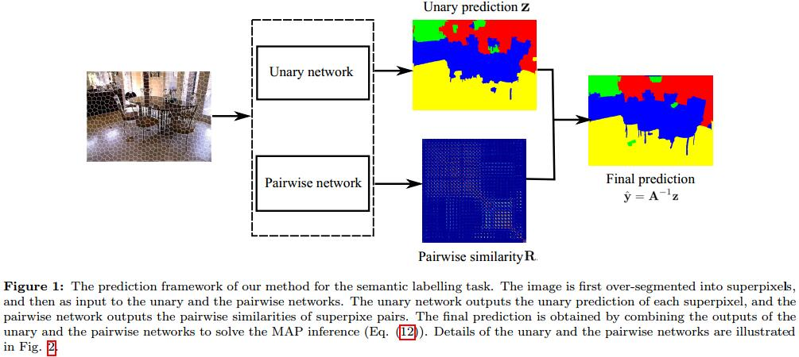
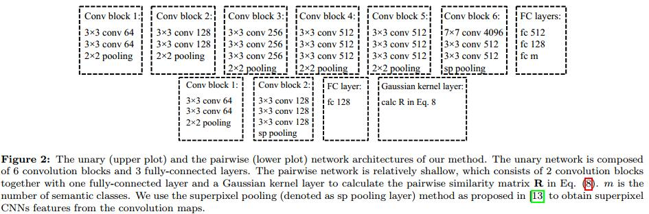

# Discriminative Training of Deep Fully-connected Continuous CRFs with Task-specific Loss

## Introduction
1. CRF原文
J. D. Lafferty, A. McCallum, and F. C. N. Pereira, “Conditional random fields: Probabilistic models for segmenting and labeling sequence data,” in Proc. Int. Conf. Mach. Learn., 2001.

## Fully-connected deep continuous CRFs

