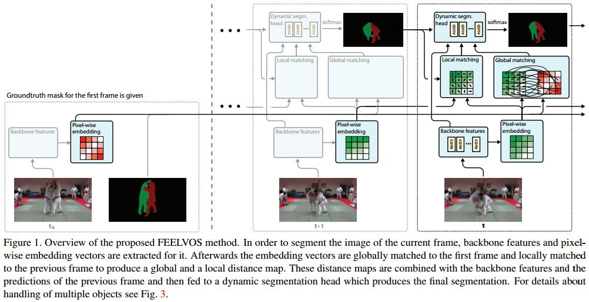
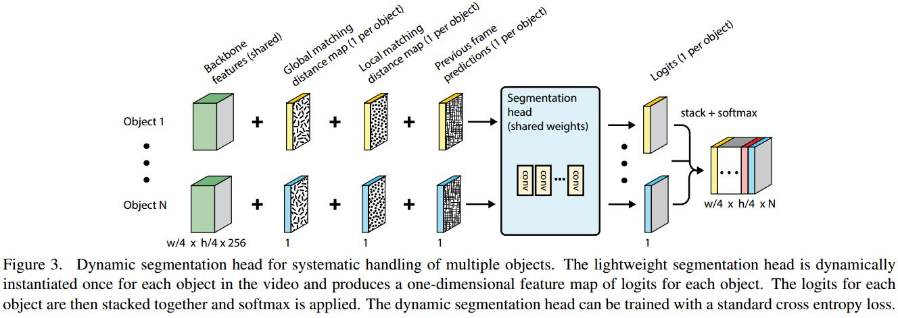

# FEELVOS: Fast End-to-End Embedding Learning for Video Object Segmentation

1. Semantic Embedding
   1. $e$ 表示embedding向量
   2. 0~1 distance
   $$ d(p,q)=1-\frac{2}{1+\exp(e_p-e_q)^2} $$
   $d(p,p)=0,d(p,\infty)=1$
2. Global Matching: 把第一帧的信息传递到当前帧，方法是在embedding space中匹配最相似的neighbors。第$t$帧的所有像素集为$P_t$, $P_t,o$是属于object $o$的像素
   $$ G_{t,o}(p)=\min_{q\in P_{1,o}} d(p,q) $$
   > 表达一个soft cue of how likely it belongs to this object

3. Local Previous Frame Matching：传播临近帧的信息,基金在邻域内计算。在$P_{t-1,o}$不为空的情况下
   $$ L_{t,o}(p)=\min_{q\in P^p_{t-1,o}} d(p,q) $$
   否则 $L_{t,o}(p)=1$

4. Dynamic Segmentation Head
   1. 输入：$G_{t,o},L_{t,o}$，t-1帧的预测概率分布，和backbone feature(每个object共享)
   2. 每个object都做一次
   

5. 训练
   1. 三帧训练，前两帧有gt，对第三帧predict
