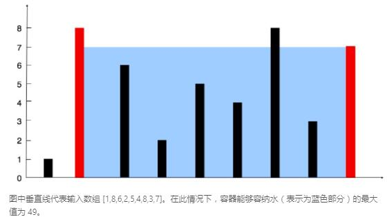
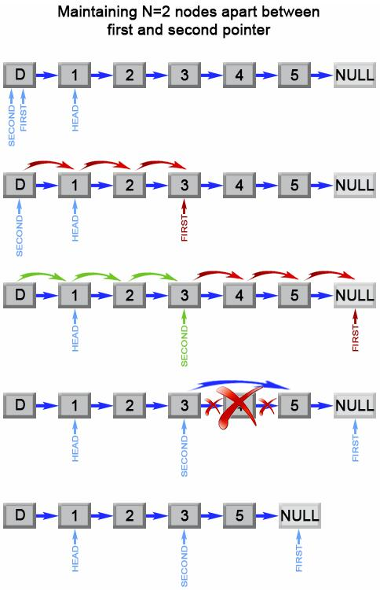

[TOC]

### 1. 两数之和(Face++)
*给定 nums = [2, 7, 11, 15], target = 9; 因为 nums[0] + nums[1] = 2 + 7 = 9, 所以返回 [0, 1]*
1. 建立两重for循环，两个索引i、j，j始终在i后面
2. 判断nums[j]是否等于target-nums[i]
```cpp
// 暴力法
vector<int> twoSum(vector<int>& nums, int target) {
    vector<int> res(2);
    for (int i=0; i<nums.size()-1; i++){
        for (int j=i+1; j<nums.size(); j++)
            if (nums.at(j) == target-nums.at(i)){
                res.at(0) = i;
                res.at(1) = j;
                return res;
            }
    }
    throw "error";
    return res;
}
// 哈希法
vector<int> twoSum(vector<int>& nums, int target) {
    unordered_map<int, int> m;
    vector<int> res(2);
    for (int second = 0; second < nums.size(); ++second) {
        int first = target - nums[second];
        if (m.find(first) != m.end()) {
            res[0] = m[first], res[1] = second;
            return res;
        }
        m[nums[second]] = second;
    }
    return throw std::invalid_argument("err"), res;
}
```
```py
def twoSum(self, numbers, target):
  hash_table = {}
  for i, ele in enumerate(numbers):
      gap = target - ele
      if gap in hash_table.keys():
          return [i + 1, hash_table[gap] + 1]
      hash_table[ele] = i
```

### 2. 两数相加(ByteDance)
*输入链表：(2 -> 4 -> 3) + (5 -> 6 -> 4)；输出链表：7 -> 0 -> 8；原因：342 + 465 = 807*
1. 创建一个哑结点res_ret，一个动态节点res
2. 初始化进位flag为0
3. 判断两个链表是否为NULL
   1. 均为NULL$\to$跳出循环
   2. 有一个为NULL$\to$创建值为0的节点
4. 带进位计算加和，得到当前值和新的进位
5. 链表节点移动；**note：先创建下next节点再移动**
```cpp
/**
 * Definition for singly-linked list.
 * struct ListNode {
 *     int val;
 *     ListNode *next;
 *     ListNode(int x) : val(x), next(NULL) {}
 * };
 */
 ListNode* addTwoNumbers(ListNode* l1, ListNode* l2) {
   ListNode* res_ret = new ListNode(0);
   ListNode* res = res_ret;

   int carry = 0;
   int temp;
   while(1){
       if (l1 == NULL && l2 == NULL){
           if (carry == 1) res->next = new ListNode(carry);
           break;
       }
       int x = (l1 != NULL) ? l1->val : 0;
       int y = (l2 != NULL) ? l2->val : 0;
       temp = x + y + carry;
       carry = temp / 10;
       temp %= 10;

       res->next = new ListNode(temp);
       res = res->next;
       if(l1 != NULL) l1 = l1->next;
       if(l2 != NULL) l2 = l2->next;
   }
   return res_ret->next;
}
```
可能会遇到需要链表翻转的情况
```cpp
ListNode* reverseList(ListNode* head) {
    ListNode next = NULL;
    ListNode pre = NULL;
    while (head != null) {
        next = head->next;
        head->next = pre;
        pre = head;
        head = next;
    }
    return pre;
}
```

### 3. 无重复字符的最长子串(Tencent)
*输入: "pwwkew" 输出: 3 解释: 因为无重复字符的最长子串是 "wke"，所以其长度为 3。请注意，你的答案必须是 子串 的长度，"pwke" 是一个子序列，不是子串。*
1. 创建set来保存已有的字符（set的特性：不存在重复元素）
2. 创建两个索引，一个用于遍历字符串，一个用于保持当前子串的起点
3. 遍历中发现
   1. set中没有的字符$\to$加入set，遍历索引后移
   2. set中已有的字符$\to$删除当前子串的begin，子串起点索引后移
+ 两重遍历（滑动窗口）
  * 遍历子串起点
  * 在当前起点下遍历后续内容，找到最长不重复子串
```cpp
int lengthOfLongestSubstring(string s) {
    int maxlen = 0;
    set<char> cache;
    int left = 0;
    int index = 0;
    while(index < s.size()){
        if (cache.find(s[index]) == cache.end()){
            cache.insert(s[index++]);
            maxlen = max(maxlen, (int)cache.size());
        }else cache.erase(s[left++]);
    }
    return maxlen;
}
```

### 5. 最长回文子串(HuaWei)
*输入: "babad"; 输出: "bab"; 注意: "aba" 也是一个有效答案。回文: 左读右读都一样*
+ 回文字符串去掉最左最右以后依然回文
+ 对于长度为n的字符串，有2n-1和可能的中心，遍历这些中心扩展至最长
```c
string longestPalindrome(string s) {
  if (s.size()==0)
      return "";
  int start = 0;
  int max_length = 0;
  for (int i=0; i<s.size(); i++){
      int len1 = expandAroundCenter(s,i,i);
      int len2 = expandAroundCenter(s, i,i+1);
      int len = max(len1, len2);
      if (len > max_length){
          start = i-(len-1)/2;
          max_length = len;
      }
    }
    return s.substr(start, max_length);
}
int expandAroundCenter(string s, int left, int right){
  int L= left;
  int R = right;
  while(L>=0 && R<s.size() && s[L]==s[R]){
      L--;
      R++;
  }
  return R-L-1;
}
```
+ 若只需判断字符串是否回文，翻转比较即可

### 6. Z型字母变换
+ 生成三角波
```cpp
string convert(string s, int numRows){
    if (numRows==1) return s;
    vector<string> rows(min(numRows, int(s.size())));
    bool dir = false;
    int pos = 0;
    for (char c: s){
        rows[pos] += c;
        if (pos == 0 || pos == numRows - 1) dir = !dir;
        pos += dir ? 1 : -1;
    }
    string ret;
    for (string row : rows) ret += row;
    return ret;
}
```

### 7. 整数反转
*输入: 123 输出: 321 假设我们的环境只能存储得下 32 位的有符号整数，则其数值范围为 $[-2^{31},  2^{31}-1]$。请根据这个假设，如果反转后整数溢出那么就返回 0。*
* $2^{31}-1=2147483647,-2^{31}=-2147483648$，计算时不能超过边界
```cpp
int reverse(int x) {
    int a=0;
    while (x != 0){
        int pop = x%10;
        if (a > INT_MAX/10 || (a == INT_MAX / 10 && pop > 7)) return 0;
        if (a < INT_MIN/10 || (a == INT_MIN / 10 && pop < -8)) return 0;
        a = a*10 + pop;
        x /= 10;
    }
    return a;
}
```

### 9. 回文数
*回文数是指正序（从左向右）和倒序（从右向左）读都是一样的整数。*
+ 只需要反转整数的后一半，与前一半对比
```cpp
bool isPalindrome(int x) {
    if (x<0 || (x % 10 == 0 && x != 0)) return false;
    int rev=0;
    while(x > rev){
        rev = rev*10 + x%10;
        x /= 10;
    }
    return x == rev || x == rev/10;
}
```

### 11. 盛最多水的容器(ByteDance)

+ 双指针从两头开始移动，每次只移动矮的，直到碰头
```cpp
int maxArea(vector<int>& height) {
    int i = 0;
    int j = height.size()-1;
    int max_volumn = 0;
    while (i<j){
        int volumn = (j-i) * min(height.at(i), height.at(j));
        if (volumn > max_volumn) max_volumn = volumn;
        if (height.at(i) < height.at(j)) i++;
        else j--;
    }
    return max_volumn;
}
```

### 14. 最长公共前缀
*输入: ["flower","flow","flight"] 输出: "fl"，输入: ["dog","racecar","car"] 输出: ""*
1. 公共前缀的长度不可能超过最小字符串的长度,
2. 确定长度之后二分法查找
```cpp
string longestCommonPrefix(vector<string>& strs) {
  if (strs.size()==0) return "";
  int min_len = INT_MAX;
  for (string str: strs){
      if (str.size() < min_len) min_len = str.size();
  }
  int low = 1;
  int high = min_len;
  while (low<=high){
      int split = (low+high)/2;
      if (isPrefix(strs, split)) low=split+1;
      else high = split-1;

  }
  return strs.at(0).substr(0, (low+high)/2);
}
bool isPrefix(vector<string>& strs, int split){
  string ref_str = strs.at(0).substr(0,split);
  for (int i=1; i<strs.size(); i++)
      if (strs.at(i).substr(0,split) != ref_str) return false;
  return true;
}
```

### 19. 删除链表的倒数第N个节点
给定一个链表，删除链表的倒数第n个节点，并且返回链表的头结点。输入1->2->3->4->5和n=2，输出1->2->3->5.

+ 使用两个指针，第一个指针跑完链表时，第二个指针的next恰好是要删除的节点
```cpp
ListNode* removeNthFromEnd(ListNode* head, int n) {
    ListNode* dummy = new ListNode(0);
    dummy->next = head;
    ListNode* first = dummy;
    ListNode* second = dummy;
    for (int i=0; i<=n; i++){
        first = first->next;
    }
    while (first!=NULL){
        first = first->next;
        second = second->next;
    }
    second->next = second->next->next;
    return dummy->next;
}
```
### 21. 合并两个有序链表
*输入：1->2->4, 1->3->4 输出：1->1->2->3->4->4*
```cpp
ListNode* mergeTwoLists(ListNode* l1, ListNode* l2) {
    ListNode* dummy = new ListNode(0);
    ListNode* res = dummy;
    while (l1!=NULL || l2!=NULL){
        if (l1==NULL || (l2!=NULL && (l2->val<l1->val))){
            res->next = new ListNode(l2->val);
            l2 = l2->next;
        }
        else if (l2==NULL || (l1!=NULL && (l1->val<=l2->val))){
            res->next = new ListNode(l1->val);
            l1 = l1->next;
        }
        res = res->next;
    }
    return dummy->next;
}
```

### 26. 删除排序数组中的重复项
*给定 nums = [0,0,1,1,1,2,2,3,3,4], 函数应该返回新的长度 5, 并且原数组 nums 的前五个元素被修改为 0, 1, 2, 3, 4。*
1. 建立两个索引（双指针法，前提是完成排序）
   1. i为慢指针，指向最后的无重复位置
   2. j为快指针，遍历i以后的元素
      1. 元素j与元素i相同$\to$pass
      2. 元素j与元素i不同$\to$i后移并赋值为元素j
```cpp
int removeDuplicates(vector<int>& nums) {
        if (nums.size()==0) return 0;
        int i = 0;
        for (int j = 1; j < nums.size(); j++) {
            if (nums.at(i) != nums.at(j)){
                i ++;
                nums.at(i) = nums.at(j);
            }       
        }
        return i+1;
    }
```
