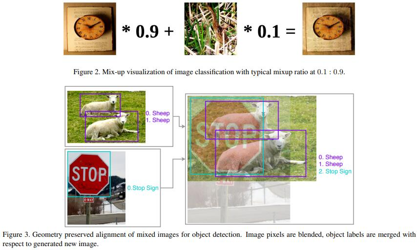
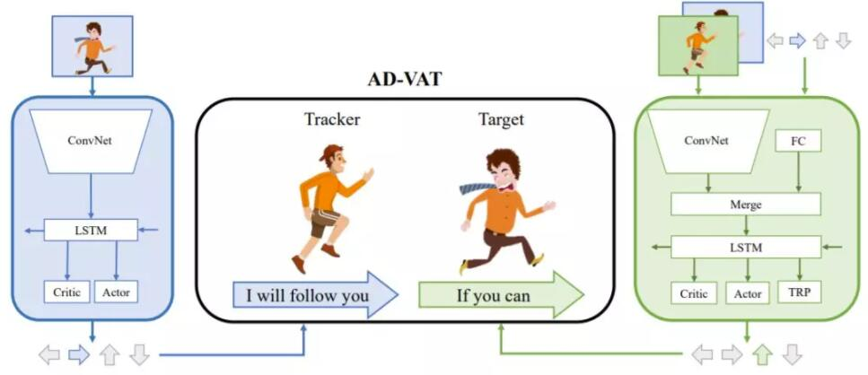
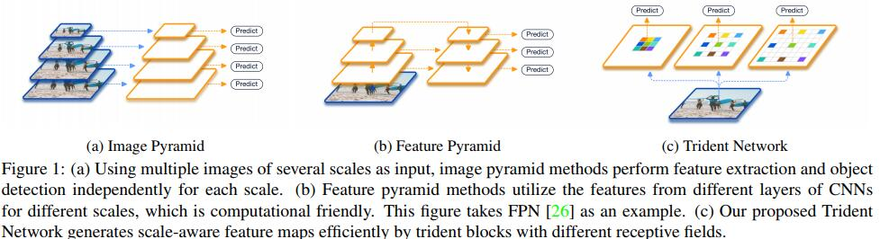

[TOC]

## Bag of Freebies for Training Object Detection Neural Networks
[arXiv](https://arxiv.org/pdf/1902.04103.pdf)
[机器之心](https://mp.weixin.qq.com/s?__biz=MzA3MzI4MjgzMw==&mid=2650757118&idx=4&sn=af6ddb3274c8bb58a1043abf70da03eb&chksm=871a9380b06d1a969b360c4dde13182675eee5011e9a6c4591540d5c0e09aa013840e793293a&mpshare=1&scene=23&srcid=0216iviIZPMRXdRe1kFljvnx&appinstall=0#rd)
[cver](https://mp.weixin.qq.com/s?__biz=MzUxNjcxMjQxNg==&mid=2247487275&idx=1&sn=1ce95b2f1ef3cc410c4ea87d53515120&chksm=f9a27da4ced5f4b2c6cd5ec6911fbca905c821d5132837c30c561c9312388c9029b497bce5b2&scene=21#wechat_redirect)
混合图像内容来训练检测网络

## Attention is All you need
[zhihu](https://zhuanlan.zhihu.com/p/46990010?utm_source=qq&utm_medium=social&utm_oi=638711330211762176)
[zhihu](https://zhuanlan.zhihu.com/p/34781297)

## Improved Selective Refinement Network for Face Detection
[arXiv](https://arxiv.org/abs/1901.06651)
[cver](https://mp.weixin.qq.com/s/G_a48N9WGRs4TMt1QEUPKw)
[zhihu](https://zhuanlan.zhihu.com/p/55983565)
1. Data Augmentation：data-anchor-sampling
2. Feature Extractor：New-ResNet-18
3. Training Strategy：
   1. double thetraining epoch to 260 epochs and train the model with modified backbone from scratch
   2. Group Normalization
   3. pretraining on COCO
4. 尝试无用的策略
   1. Decoupled Classification Refinement
   2. Segmentation Branch: element-wise(空间) attention
   3. Squeeze-and-Excitation (SE) Block: channel-wise attention

## AD-VAT: An Asymmetric Dueling mechanism for learning Visual Active Tracking
[xinzhiyuan](https://mp.weixin.qq.com/s?__biz=MzI3MTA0MTk1MA==&mid=2652038724&idx=3&sn=26520d06130fe388c06f9775cb97de51&chksm=f12192b5c6561ba3f8d00531a91e42e3df3fab140c9c99f76c4ef582539191d09f75973dc2ae&mpshare=1&scene=23&srcid=#rd)
1. 主动视觉跟踪（Visual Active Tracking）:智能体根据视觉观测信息主动控制相机的移动，从而实现对目标物体的跟踪（与目标保持特定距离）
2. 深度强化学习的局限
   1. 深度强化学习需要通过大量试错来进行学习，而直接让机器人在真实世界中试错的代价是高昂的
   2. 使用虚拟环境进行训练，但难以克服虚拟和现实之间的差异
3. 基于对抗博弈的强化学习框架用于主动视觉跟踪的训练
   1. 跟踪器要尽量跟随目标
   2. 目标要想办法脱离跟踪
   
4. 直接构造成零和游戏进行对抗训练是十分不稳定且难以收敛的, 解决方法有
   1. partial zero-sum reward: 仅鼓励跟踪器和目标在一定相对范围内进行零和博弈
   2. tracker-aware model: 除了其自身的视觉观测外，还额外获得了跟踪器的观测和动作输出作为模型的输入。

## Multi-Object Tracking with Multiple Cues and Switcher-Aware Classification
[arXiv](https://arxiv.org/abs/1901.06129)
[CSDN](https://blog.csdn.net/donkey_1993/article/details/86627756)
1. Using SOT Tracker for Short Term Cues 短期线索
2. Using ReID Network for Long Term Cues 长期线索
3. Switcher-Aware Classifier用于决策匹配, 其实就是对检测器和跟踪器的信任程度

## Augmentation for small object detection
[arXiv](https://arxiv.org/abs/1902.07296)
[cver](https://mp.weixin.qq.com/s?__biz=MzUxNjcxMjQxNg==&mid=2247487431&idx=1&sn=85969c79dfaf1db1076b428a7f88a2f9&chksm=f9a27d48ced5f45e4f4508d78f109ada8471912acd2ac0637b4308798a66692dd43f1f9834ed&mpshare=1&scene=23&srcid=#rd)
1. MS COCO中，训练集中出现的所有目标中有41.43％是小的，而只有34.4％和24.2％分别是中型和大型目标;另一方面，只有约一半的训练图像包含任何小物体，而70.07％和82.28％的训练图像分别包含中型和大型物体。
2. Oversampling: 创建了多个图像副本，对这些带有小目标的图像进行过采样
3. Augmentation
   1. 复制并粘贴每个图像中的所有小目标一次
   2. 用带有 copy-pasted 的小目标的图像替换每个图像
4. Copy-Pasting Strategies
   1. 选择一个小目标，并在随机位置复制粘贴多次
   2. 选择了许多小目标，并在任意位置复制粘贴这些目标一次
   3. 在随机位置多次复制粘贴每个图像中的所有小目标，保留原始图像和增强副本
5. Pasting Algorithms
   1. 必须确定粘贴的目标是否会与任何其他目标重叠
   2. 是否执行添加过程以平滑粘贴对象的边缘是一种设计选择。我们试验具有不同滤波器尺寸的边界的高斯模糊是否可以帮助进一步处理。

## Scale-Aware Trident Networks for Object Detection
[arXiv](https://arxiv.org/abs/1901.01892)
[zhihu](https://zhuanlan.zhihu.com/p/54334986)
[git](https://github.com/TuSimple/simpledet/tree/master/models/tridentnet)
1. 回顾
   1. image pyramid：直接对图像进行不同尺度的缩放，然后将这些图像直接输入到detector中去进行检测
   2. feature pyramid (FPN): 直接在feature层面上来近似image pyramid
   3. backbone有哪些因素会影响性能: network depth（网络越深表示能力更强），downsample rate(下采样次数过多对于小物体有负面影响)和receptive field。

2. 实验结论：更大的receptive field对于大物体性能会更好，更小的receptive field对于小物体更加友好。
3. TridentNet在原始的backbone上做了三点变化
   1. 构造了不同receptive field的parallel multi-branch
   2. trident block中每一个branch的weight是share的
   3. 每个branch，训练和测试都只负责一定尺度范围内的样本，也就是所谓的scale-aware
