[TOC]


[面试](https://www.zhihu.com/question/23259302/answer/527513387?utm_source=qq&utm_medium=social&utm_oi=638711330211762176)
[深度学习面试100题](https://zhuanlan.zhihu.com/c_140166199)
[面试笔记](https://github.com/imhuay/Algorithm_Interview_Notes-Chinese)

# 复习

## [Leecode](./Leetcode.md)

## Python、C++与数据结构
### [vector的内存管理机制(SenceTime)](https://blog.csdn.net/qq_30835655/article/details/60762196)

### list与vector(SenceTime)
list将元素按顺序储存在链表中，与向量(vector)相比，它允许快速的插入和删除，但是随机访问却比较慢.

### C++五大内存分区(SenceTime)
在C++中，内存分成5个区，他们分别是**堆、栈、自由存储区、全局/静态存储区和常量存储区**。
1. 栈，就是那些由编译器在需要的时候分配，在不需要的时候自动清楚的变量的存储区。里面的变量通常是局部变量、函数参数等。
2. 堆，就是那些由new分配的内存块，他们的释放编译器不去管，由我们的应用程序去控制，一般一个new就要对应一个delete。如果程序员没有释放掉，那么在程序结束后，操作系统会自动回收。
3. 自由存储区，就是那些由malloc等分配的内存块，他和堆是十分相似的，不过它是用free来结束自己的生命的。
4. 全局/静态存储区，全局变量和静态变量被分配到同一块内存中，在以前的C语言中，全局变量又分为初始化的和未初始化的，在C++里面没有这个区分了，他们共同占用同一块内存区。
5. 常量存储区，这是一块比较特殊的存储区，他们里面存放的是常量，不允许修改

### 构造函数的调用顺序(SenceTime)
1. 创建对象时，先调用父类的构造函数
2. 释放空间时，先调用子类的析构函数

### [多态和纯虚函数(Face++)](https://blog.csdn.net/Hackbuteer1/article/details/7475622)

### [快速排序的性能分析(SenceTime)](https://blog.csdn.net/weshjiness/article/details/8660583)
1. c++代码
```c
void quick_sort_recursive(vector<int> &a, int start, int end) {
    if (start >= end) return;
    int base = a[end];
    int left = start, right = end - 1;
    while (true) {
        while (i<j && a[left] < base) ++left;
        while (i<j && a[right] >= base) --right;
        if (left >= right) break;
        swap(a[left], a[right]);
    }
    if (a[left] >= a[end]) swap(a[left], a[end]);   // 将base放到指定位置
    else ++left;
    quick_sort_recursive(a, start, left - 1);
    quick_sort_recursive(a, left + 1, end);
}
```
2. 快速排序的时间性能取决于快速排序递归的深度，可以用递归树来描述递归算法的执行情况。
3. 最好的时间复杂度$O(n\log n)$
4. 最坏的情况：待排序的序列为正序或者逆序，每次划分只得到一个比上一次划分少一个记录的子序列，复杂度为$O(n^2)$
5. 避免：随机选择参考
### [常用排序、查找算法的时间复杂度(ByteDance)](https://blog.csdn.net/Sparkle_007/article/details/54971257)
### [Python中`*args, **kwargs`的用法(Tencent)](https://www.jianshu.com/p/1f830aa7109b)
1. `*arg`来发送一个**非键值对的可变数量的**参数列表给一个函数.
2. `**kwargs`允许你将**不定长度的键值对**, 作为参数传递给一个函数。

### [C++的引用](https://blog.csdn.net/qq_33266987/article/details/52047473)

### Pytorch写一个对角矩阵，对角线上的元素随机


## 图像处理
### 连通域(Ali)
1. 连通区域（Connected Component）一般是指图像中具有相同像素值且位置相邻的前景像素点组成的图像区域（Region，Blob）。通常连通区域分析处理的对象是一张二值化后的图像。
2. 方法：Two-Pass法，Seed-Filling种子填充法，见[CSDN](https://blog.csdn.net/liangchunjiang/article/details/79431339)

### K-means
1. 聚类的目的是找到每个$x_i \in x={x_1,...,x_m}$潜在的类别$y$
2. K-means算法是将样本聚类成$k$个簇（cluster）
3. 算法
  1. 随机选取$k$个聚类质心（cluster centroids）$u_1,...,u_k$
  2. 重复直至收敛
     1. 对每一个$x_i$计算其应所属的类c_i别$c_i=\arg\min_j||x_i-u_j||^2$
     2. 对每一个类，重新计算其质心$u_j=\frac{\sum_{i=1}^m1\{c_i=j\}x_i}{\sum_{i=1}^m1\{c_i=j\}}$
4. 收敛性
    1. 畸变函数$J(c,u)=\sum_{i=1}^m||x_i-u_{c_i}||$, 即每个样本点到其质心的距离平方和
    2. K-means是要将$J$调整到最小
    3. 可以固定每个类的质心$u$，调整每个样例的所属的类别$c$来让$J$函数减少
    4. 固定$c$，调整每个类的质心$u$也可以使$J$减小
    5. 当$J$递减到最小时，$u$和$c$也同时收敛。（在理论上，可以有多组不同的$u$和$c$值能够使得J取得最小值，但这种现象实际上很少见）

## 神经网络
### 神经网络（MLP）的万能近似定理(ByteDance)
1. 一个前馈神经网络如果具有至少一个非线性输出层，那么只要给予网络足够数量的隐藏单元，它就可以以任意的精度来近似任何从一个有限维空间到另一个有限维空间的函数。
2. 深度与宽度的关系: 一个单层的网络就足以表达任意函数，但是该层的维数可能非常大，且几乎没有泛化能力；此时，使用更深的模型能够减少所需的单元数，同时增强泛化能力（减少泛化误差）。参数数量相同的情况下，浅层网络比深层网络更容易过拟合。

### 迁移学习相关概念
1. 迁移学习：迁移学习和领域自适应指的是利用一个任务（例如，分布 P1）中已经学到的内容去改善另一个任务（比如分布 P2）中的泛化情况。
2. one-shot learning：只有少量标注样本的迁移任务被称为 one-shot learning。在大数据上学习 general knowledge，然后在特定任务的小数据上有技巧的 fine tuning。
3. zero-shot learning：没有标注样本的迁移任务被称为 zero-shot learning。假设学习器已经学会了关于动物、腿和耳朵的概念。如果已知猫有四条腿和尖尖的耳朵，那么学习器可以在没有见过猫的情况下猜测该图像中的动物是猫。

### [GAN的稳定性(HuaWei)](https://mp.weixin.qq.com/s?__biz=MzA3MzI4MjgzMw==&mid=2650757216&idx=3&sn=6d448901ef2b8350e0c9a83cf63f3d97&chksm=871a9c1eb06d150836bb9e73385a7ef59eb3a0dc06c2af412cc0a1470608a377fc5a20061936&mpshare=1&scene=23&srcid=#rd)
1. 使用 GAN 的弊端
   1. 模式崩溃：生成单一模式的的数据
   2. 收敛性：无法从loss变化中判断收敛性
2. 解决方法
   1. Wasserstein GAN: Wasserstein距离，即使真实的和生成的样本的数据分布没有交集，Wasserstein距离也是连续的
   2. [LSGAN](https://wiseodd.github.io/techblog/2017/03/02/least-squares-gan/): 对远离决策边界的生成样本进行惩罚，本质上将生成的数据分布拉向实际的数据分布
   3. 两个时间尺度上的更新规则: 通过不同的学习率, 生成器使用较慢的更新规则, 判别器使用较快的更新规则
   4. 自注意力机制(Self-Attention)：提供全局信息（远距离依赖）, ref paper：Attention is All You Need

### G和D哪个先训练(SenceTime)
D

### 降低过拟合风险的方法(ByteDance)
1. 数据增强
2. 降低模型复杂度
3. 权值约束（添加正则化项）: L1,L2 正则化
4. Dropout, Bagging, BN
5. 提前终止
6. 参数绑定与参数共享

### 梯度爆炸、消失的解决办法(ByteDance)
1. 爆炸：梯度截断（gradient clipping）——如果梯度超过某个阈值，就对其进行限制
   1. 截断value
   2. 截断norm
2. 良好的参数初始化策略也能缓解梯度爆炸问题（权重正则化）
2. 使用线性整流激活函数，如 ReLU 等
4. BN
5. 消失：门卷积、残差

### [BN(HuaWei)](https://www.cnblogs.com/guoyaohua/p/8724433.html)
1. BN 是一种正则化方法（减少泛化误差），主要作用有(解决了什么问题)：
   1. 加速网络的训练（缓解梯度消失，支持更大的学习率）
   2. 防止过拟合，增加模型泛化能力
   3. 降低了参数初始化的要求。
2. 基本原理
   1. 针对mini-batch，在网络的每一层输入之前增加归一化处理，使输入的均值为 0，标准差为 1。目的是将数据限制在统一的分布下。(白化)
  $$\hat x = \frac{x-mean}{var}$$
   2. 但同时 BN 也降低了模型的拟合能力，破坏了之前学到的特征分布；为了恢复数据的原始分布，BN 引入了一个重构变换来还原最优的输入数据分布，下面的$\gamma,\beta$就是$bn.weight,bn.bias$
   $$ y = \gamma\hat x +\beta $$
   3. 测试时使用全局mean和var，即bn.running_mean,bn.running_var

### [L1/L2 范数正则化](https://blog.csdn.net/jinping_shi/article/details/52433975)
1. 相同点
限制模型的学习能力，通过限制参数的规模，使模型偏好于权值较小的目标函数，防止过拟合。
2. 不同点
   1. L1 正则化可以产生稀疏权值矩阵，即产生一个稀疏模型，可以用于特征选择；一定程度上防止过拟合
   2. L2 正则化主要用于防止模型过拟合
   3. L1 适用于特征之间有关联的情况；L2 适用于特征之间没有关联的情况

### Dropout & Bagging
1. 给定一个大小为 ${\displaystyle n}$ 的训练集 ${\displaystyle D}$，Bagging算法从中均匀、有放回地（即使用自助抽样法）选出 ${\displaystyle m}$ 个大小为 ${\displaystyle n'}$ 的子集 ${\displaystyle D_{i}}$，作为新的训练集。在这 ${\displaystyle m}$ 个训练集上使用分类、回归等算法，则可得到 ${\displaystyle m}$ 个模型，再通过取平均值、取多数票等方法，即可得到Bagging的结果。
> 提高其准确率、稳定性的同时，通过降低结果的方差，避免过拟合的发生。

2. Dropout 通过参数共享提供了一种廉价的 Bagging 集成近似—— Dropout 策略相当于集成了包括所有从基础网络除去部分单元后形成的子网络。
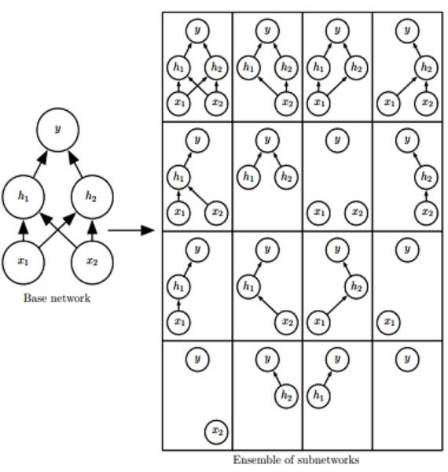

### CNN
#### 基本特性
局部连接、稀疏交互、参数共享
#### 输出尺寸计算公式为
$$n_{out} = (n_{in}+2*n_{padding}-n_{filter})/n_{slide}+1$$
> 有分数时取floor

#### [卷积的实现](https://hal.inria.fr/inria-00112631/document)
im2col转换为矩阵相乘
#### 运算过程
   1. 前向: $y=x*W$ * 为矩阵相乘，x，W已展开
   2. 反向: $\nabla x=\nabla y * W^T$
   3. 参数梯度: $\nabla W=x^T * \nabla y$
   4. 参数更新: $W=W-\nabla W$
#### 卷积核
   1. 构造：kernel $[k_h, k_w, n_{in}, n_{out}]$，bias $[n_{out}]$
   2. 数量 $n_{in}* n_{out}$
#### [转置卷积(SenceTime)](https://github.com/vdumoulin/conv_arithmetic)
   1. 反卷积就是卷积，只是中间padding了下，然后再做卷积。算法实现上也是先padding然后卷积
   2. 数学形式: 卷积可以转化为一副图像与一个矩阵C的乘积。反卷积（转置卷积）只是正向时左乘$C^T$，而反向时左乘$(C^T)^T$。
#### 空洞卷积（扩张卷积、膨胀卷积）
#### 空间可分离卷积：3x3的核分离为一个3x1和一个1x3
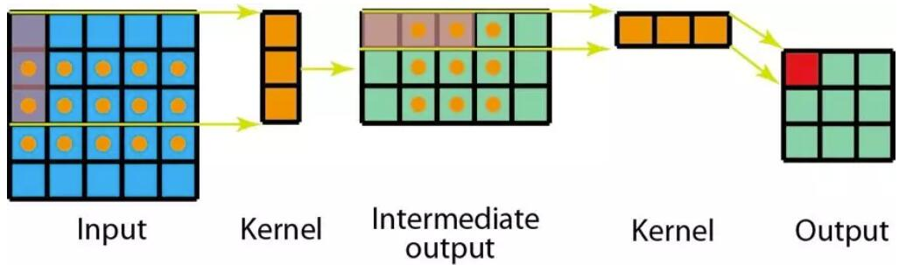
#### [深度可分离卷积](https://yinguobing.com/separable-convolution/):
1. 降低参数量
1. Depthwise Convolution: 每个channel单独用一个kernel做，输出与输入channel数相同
2. Pointwise Convolution, 用1*1的kernel融合channel信息
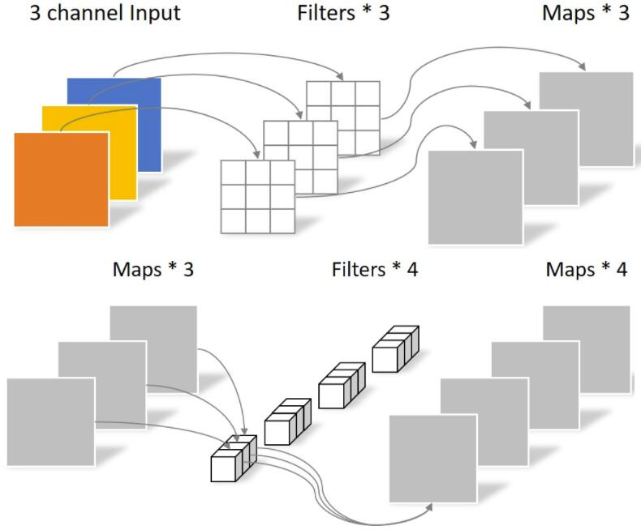
#### 门卷积
1. $Y=Conv_1(X)\odot Sigmoid(Conv_2(X))$
2. 可缓解梯度消失：因为公式中有一个卷积没有经过激活函数，所以对这部分求导是个常数，所以梯度消失的概率很小
#### 分组卷积：
相当于多次卷积，每次负责一部分channel，有利于提高并行程度
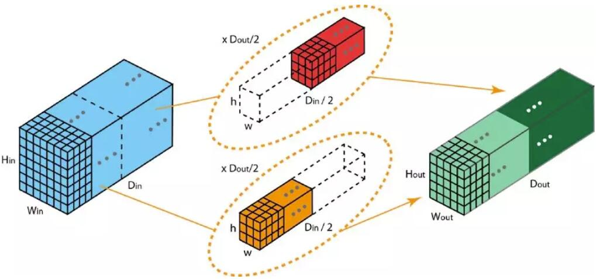

### [基本卷积模块](https://mp.weixin.qq.com/s?__biz=MzUxNjcxMjQxNg==&mid=2247487358&idx=2&sn=34d3dd9968f933f75870c9e843d37dc0&chksm=f9a27df1ced5f4e72298ca776835a25e11f9fc41258be346ed33bb1a749e751a98be9890232b&mpshare=1&scene=23&srcid=#rd)
1. 瓶颈模块: 1×1 卷积来降低通道数
2. Inception
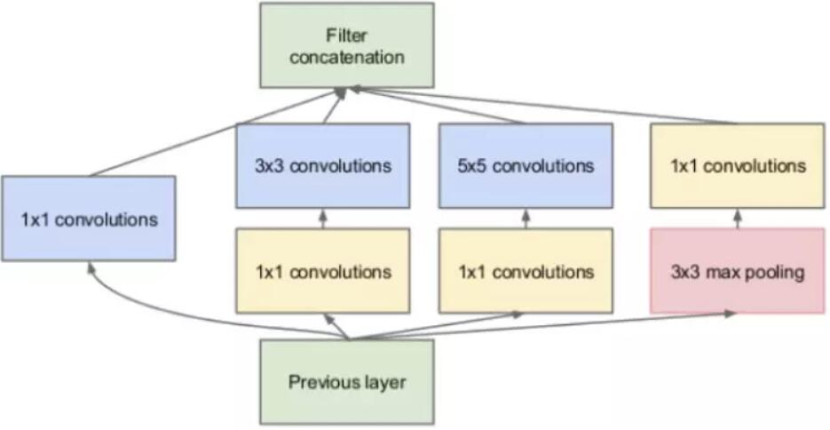
3. ResNet & ResNeXt
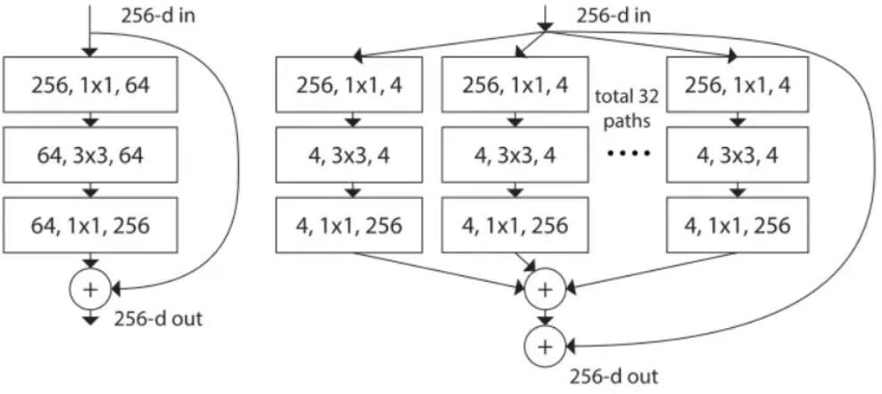
4. Dense
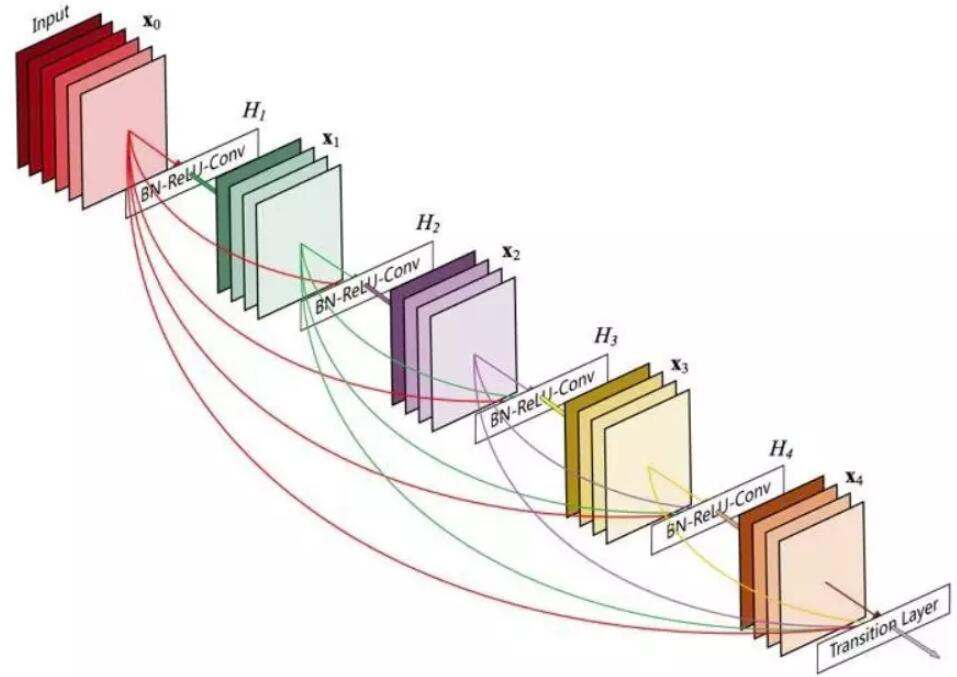
5. Squeeze-and-Excitation
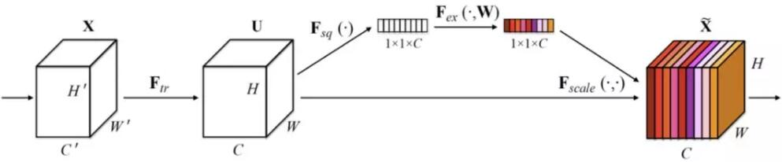

### 为什么高层特征包含更多语义(SenceTime)
感受野更大

### RNN
#### 种类
1. Elman network：每个时间步都有输出，且隐藏单元之间有循环连接
$h^t=tanh(Wx^t+Uh^t_b+b), o=softmax(wh^t+b)$
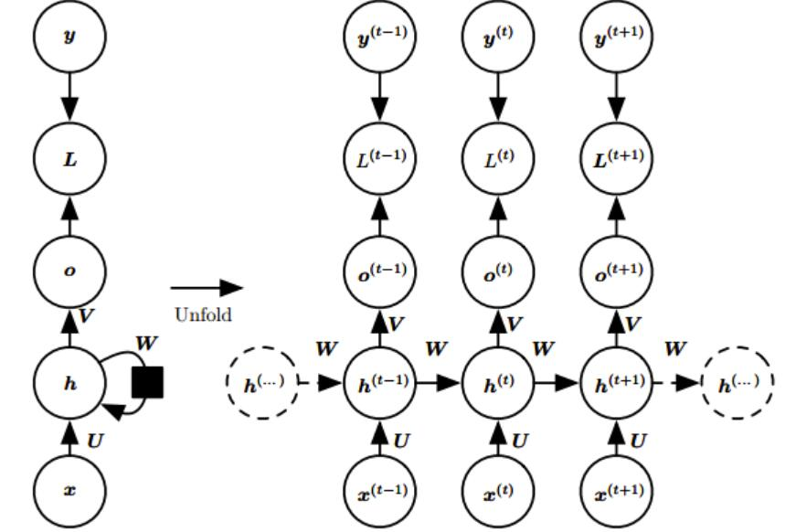
2. Jordan network：每个时间步都有输出，但是隐藏单元之间没有循环连接，只有当前时刻的输出到下个时刻的隐藏单元之间有循环连接
$h^t=tanh(Wx^t+Uo^t_b+b), o=softmax(wh^t+b)$
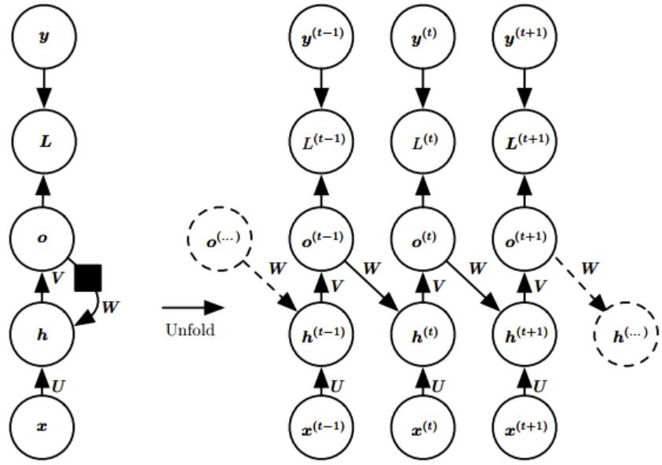
3. 隐藏单元之间有循环连接，但只有最后一个时间步有输出
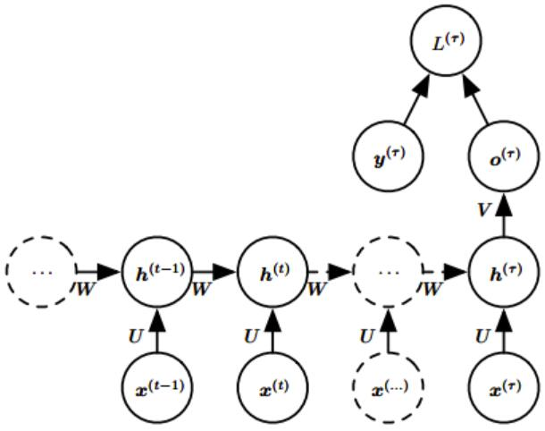
#### 为什么梯度消失、爆炸
1. 最大步长为 T 的 RNN 展开后相当于一个共享参数的 T 层前馈网络
2. 解决方法：梯度截断
3. 残差结构、LSTM、GRU
### RNN中的Relu
RNN中可以使用ReLu，但最好使用单位矩阵来初始化权重矩阵
#### LSTM(ByteDance)
增加了遗忘门 f、输入门 i、输出门 o，以及一个内部记忆状态c，一般由输入x和上一时刻隐状态h计算
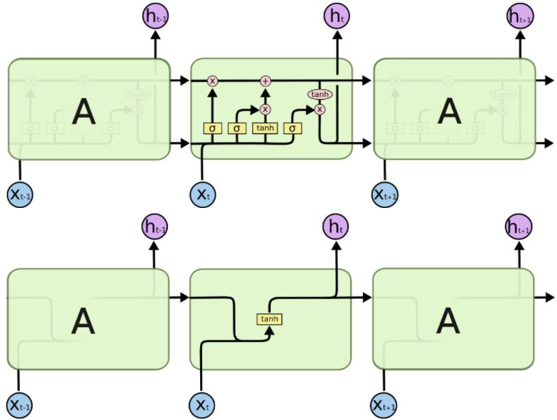
1. $$
\begin{array}{l}
i_t=\sigma(W_i*[x,h_{t-1}]+b_i) \\
f_t=\sigma(W_f*[x,h_{t-1}]+b_f) \\
o_t=\sigma(W_o*[x,h_{t-1}]+b_o) \\
\widetilde c_t=\tanh(W_c*[x,h_{t-1}]+b_c) \\
c_t=(f_t\odot c_{t-1})+(i_t\odot\widetilde  c_t) \\
h_t=o_t\odot\tanh(c_t),
\end{array}$$
1. 长期记忆 $f\to 1,i\to 0$
2. 短期记忆 $f\to 0,i\to 1$
3. 长短期记忆 $f\to 1,i\to 1$
4. hard gate：门只取0,1
5. 窥孔机制：c也参与门的计算
6. LSTM如何反传，训练过程中会遇到什么问题，如何解决
   1. BPTT
   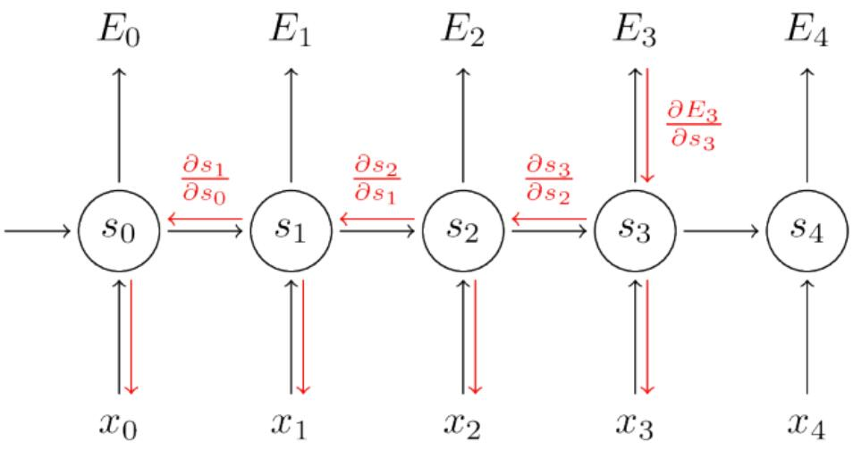
   2. 梯度norm过大，难以训练
   3. clip梯度norm或value
   4. 时间上截断反转
#### GRU:
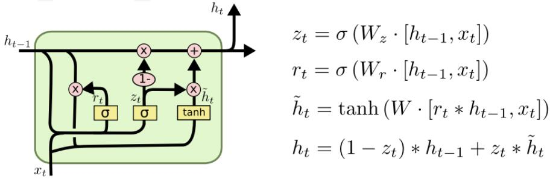
1. LSTM 中的遗忘门和输入门的功能有一定的重合，于是将其合并为一个更新门$z$, 控制前一时刻的状态信息被融合到当前状态中的程度
2. 并使用重置门$r$代替输出门, 用于控制忽略前一时刻的状态信息的程度

### [梯度下降与SGD(HuaWei)](https://zhuanlan.zhihu.com/p/31229539)
#### 基本的梯度下降法
1. 每次使用所有训练样本的平均损失来更新参数；
2. 因此，经典的梯度下降在每次对模型参数进行更新时，需要遍历所有数据；
3. 当训练样本的数量很大时，这需要消耗相当大的计算资源，在实际应用中基本不可行。
#### 随机梯度下降（SGD）
每次使用单个样本的损失来近似平均损失
#### 小批量 SGD 的更新过程
1. 在训练集上抽取指定大小（batch_size）的一批数据 ${(x,y)}$
2. 【前向传播】将这批数据送入网络，得到这批数据的预测值 $y_pred$
3. 计算网络在这批数据上的损失，用于衡量 $y_pred$ 和 $y$ 之间的距离
4. 【反向传播】计算损失相对于所有网络中可训练参数的梯度 $g$
5. 将参数沿着负梯度的方向移动，即 $W=W-lr*g$
#### batch size的影响
1. **较大的批能得到更精确的梯度估计**；
2. **较小的批能带来更好的泛化误差**, 但需要**较小的学习率**以保持稳定性，这意味着**更长的训练时间**
3. 内存消耗和批的大小成正比
4. 通常使用 2 的幂数作为批量大小可以获得更少的运行时间。
#### SDG的问题
1. 学习率难以选择
1. 放弃了**梯度的准确性**，仅采用一部分样本来估计当前的梯度；因此 SGD 对梯度的估计常常出现偏差，造成目标函数收敛不稳定，甚至不收敛的情况
2. 无论是经典的梯度下降还是随机梯度下降，都可能陷入**局部极值点**，SGD 还可能遇到“峡谷”和“鞍点”两种情况
  1. 峡谷类似一个带有坡度的狭长小道，左右两侧是“峭壁”；在峡谷中，准确的梯度方向应该沿着坡的方向向下，但粗糙的梯度估计使其稍有偏离就撞向两侧的峭壁，然后在两个峭壁间来回震荡。
  2. 鞍点的形状类似一个马鞍，一个方向两头翘，一个方向两头垂，而中间区域近似平地；一旦优化的过程中不慎落入鞍点，优化很可能就会停滞下来。
#### 避免病态问题
1. 导致病态的原因是问题的条件数（condition number）非常大。条件数大意味着目标函数在有的地方（或有的方向）变化很快、有的地方很慢，比较不规律，从而很难用当前的局部信息（梯度）去比较准确地预测最优点所在的位置，只能一步步缓慢的逼近最优点，从而优化时需要更多的迭代次数。
2. 办法：随机梯度下降（SGD）、批量随机梯度下降动态的学习率、带动量的 SGD
#### 带动量的 SGD
一方面是为了解决“峡谷”和“鞍点”问题；一方面也可以用于SGD 加速。原始 SGD 每次更新的步长只是梯度乘以学习率；现在，步长还取决于**历史梯度序列的大小和方向**；当许多连续的梯度指向相同的方向时，步长会被不断增大；
$v_t=\alpha v_{t-1}-\eta g , \theta_{t+1}=\theta_t+v_t$，在实践中，$\alpha$的一般取 0.5, 0.9, 0.99，分别对应最大 2 倍、10 倍、100 倍的步长$(v=\frac{-\eta g}{1-\alpha})$
1. 如果把原始的 SGD 想象成一个纸团在重力作用向下滚动，由于质量小受到山壁弹力的干扰大，导致来回震荡；或者在鞍点处因为质量小速度很快减为 0，导致无法离开这块平地。
2. 动量方法相当于把纸团换成了铁球；不容易受到外力的干扰，轨迹更加稳定；同时因为在鞍点处因为惯性的作用，更有可能离开平地。
3. 动量方法以一种廉价的方式模拟了二阶梯度（牛顿法）
#### AdaGrad
独立地适应模型的每个参数, 引入小正数$\delta$
$$ r\leftarrow r+g^2,\Delta\theta=\frac{-\eta}{\sqrt{r+\delta}}* g$$
1. 前期$g$较小的时候，能够放大梯度
2. 后期$g$较大的时候，能够约束梯度
3. 适合处理稀疏梯度

#### RMSProp
解决 AdaGrad 方法中学习率过度衰减的问题,使用**指数衰减平均**,加入了一个超参数$\rho$ 用于控制衰减速率
$$\begin{array}l
r\leftarrow \mathbb E[g^2]_ t= \rho\mathbb E[g^2]_ {t-1}+(1-\rho)g^2 \\
RMS[g]_ t=\sqrt{\mathbb E[g^2]_ t+\delta} \\
\Delta\theta=\frac{-\eta}{RMS[g]_ t}* g
\end{array}$$
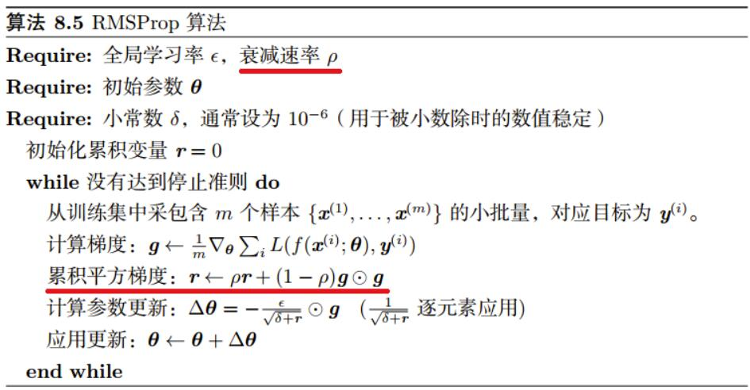
#### AdaDelta
AdaDelta 的前半部分与 RMSProp 完全一致 $\Delta\theta=\frac{RMS[\theta]_ {t-1}}{RMS[g]_ t}* g$, **不需要全局学习率**
#### Adam
在 RMSProp 方法的基础上更进一步
1. 除了加入**历史梯度平方的指数衰减平均**（r）外，还保留了**历史梯度的指数衰减平均**（s），相当于**动量**。
2. Adam 行为就像一个带有摩擦力的小球，在误差面上倾向于平坦的极小值。
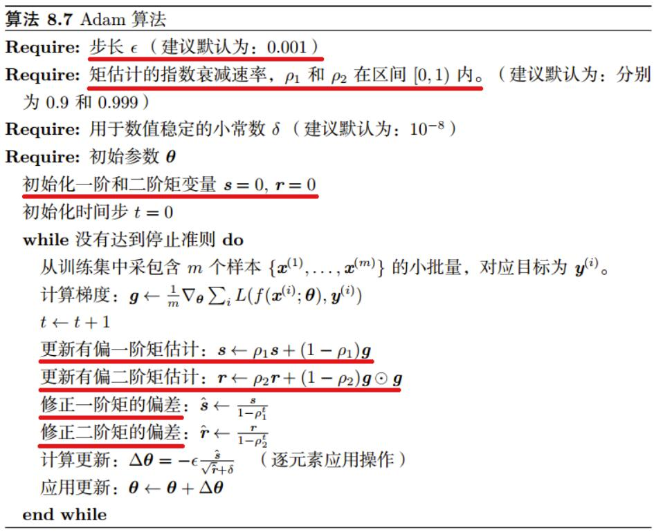
3. 注意到，$s,r$ 需要初始化为0；且 $ρ1,ρ2$ 推荐的初始值都很接近1（0.9 和 0.999）,这将导致在训练初期 s 和 r 都很小（偏向于 0），从而训练缓慢, 因此，Adam 通过修正偏差来抵消这个倾向。
4. 缺点
  1. 可能不收敛
  2. 可能错过全局最优解，Adam的收敛速度比SGD要快，但最终收敛的结果并没有SGD好。他们进一步实验发现，主要是后期Adam的学习率太低，影响了有效的收敛。可以对下界进行控制来改善

### 平移等变、不变性
1. 不变性：（局部）平移不变性是一个很有用的性质，尤其是当我们关心某个特征是否出现而不关心它出现的具体位置时。卷积核池化具有这种性质，**池化操作有助于卷积网络的平移不变性**
2. 等变性：如果一个函数满足输入改变，输出也以同样的方式改变这一性质，我们就说它是等变 (equivariant) 的。于卷积来说，如果令 g 是输入的任意平移函数，那么卷积函数对于 g 具有等变性。

### NMS代码(Face++)
```py
def nms(boxes, scores, overlap=0.5, top_k=200):
    """Apply non-maximum suppression at test time to avoid detecting too many
    overlapping bounding boxes for a given object.
    Args:
        boxes: (tensor) The location preds for the img, Shape: [num_priors,4].
        scores: (tensor) The class predscores for the img, Shape:[num_priors].
        overlap: (float) The overlap thresh for suppressing unnecessary boxes.
        top_k: (int) The Maximum number of box preds to consider.
    Return:
        The indices of the kept boxes with respect to num_priors.
    """

    keep = scores.new(scores.size(0)).zero_().long()
    if boxes.numel() == 0:
        return keep
    x1 = boxes[:, 0]
    y1 = boxes[:, 1]
    x2 = boxes[:, 2]
    y2 = boxes[:, 3]
    area = torch.mul(x2 - x1, y2 - y1)
    v, idx = scores.sort(0)  # sort in ascending order
    idx = idx[-top_k:]  # indices of the top-k largest vals
    xx1 = boxes.new()
    yy1 = boxes.new()
    xx2 = boxes.new()
    yy2 = boxes.new()
    w = boxes.new()
    h = boxes.new()

    # keep = torch.Tensor()
    count = 0
    while idx.numel() > 0:
        i = idx[-1]  # index of current largest val
        # keep.append(i)
        keep[count] = i
        count += 1
        if idx.size(0) == 1:
            break
        idx = idx[:-1]  # remove kept element from view
        # load bboxes of next highest vals
        torch.index_select(x1, 0, idx, out=xx1)
        torch.index_select(y1, 0, idx, out=yy1)
        torch.index_select(x2, 0, idx, out=xx2)
        torch.index_select(y2, 0, idx, out=yy2)
        # store element-wise max with next highest score
        xx1 = torch.clamp(xx1, min=x1[i])
        yy1 = torch.clamp(yy1, min=y1[i])
        xx2 = torch.clamp(xx2, max=x2[i])
        yy2 = torch.clamp(yy2, max=y2[i])
        w.resize_as_(xx2)
        h.resize_as_(yy2)
        w = xx2 - xx1
        h = yy2 - yy1
        # check sizes of xx1 and xx2.. after each iteration
        w = torch.clamp(w, min=0.0)
        h = torch.clamp(h, min=0.0)
        inter = w*h
        # IoU = i / (area(a) + area(b) - i)
        rem_areas = torch.index_select(area, 0, idx)  # load remaining areas)
        union = (rem_areas - inter) + area[i]
        IoU = inter/union  # store result in iou
        # keep only elements with an IoU <= overlap
        idx = idx[IoU.le(overlap)]
    return keep, count
```

## 概率

### 距离
1. 欧氏距离 $d=\sqrt{(\bf x-y)^T(x-y)}=\sqrt{(x1-x2)^2+(y1-y2)^2}$
2. 曼哈顿距离 $d=|x_1-x_2|+|y_1-y_2|$
3. 闵可夫斯基距离 $d=(\bf |x-y|^p)^{1/p}$, $p=1$退化为曼哈顿距离，$p=2$退化为欧氏距离
3. 切比雪夫距离 $d=\max(|x_1-x_2|,|y_1-y_2|)$
4. 余弦距离 $cos\theta=\frac{x_1x_2+y_1y_2}{\sqrt{x_1^2+y_1^2}\sqrt{x_2^2+y_2^2}}$
5. Jaccard相似度 $J(A,B)=\frac{A\cap B}{A\cup B}$
6. 相关系数 $\rho=\frac{Cov(X,Y)}{\sqrt{Var(X)}\sqrt{Var(Y)}}=\frac{E((X-EX)(Y-EY))}{\sqrt{Var(X)}\sqrt{Var(Y)}}$,$Cov$为协方差,$Var$为方差,$\rho=0$描述$X,Y$之间不存在**线性**关系，“不相关”是一个比“独立”要弱的概念
> 方差针对一维数据$Var(X)=\frac{1}{n-1}(X_i-\bar X)(X_i-\bar X)$
> 协方差针对二维数据$Cov(X,Y)=\frac{1}{n-1}(X_i-\bar X)(Y_i-\bar Y)$
> 协方差矩阵针对多维数据, 是一个对称的矩阵
$\sum(X,Y,Z)=\left(\begin{array}c
Cov(X,X) & Cov(X,Y) & Cov(X,Z) \\
Cov(Y,X) & Cov(Y,Y) & Cov(Y,Z) \\
Cov(Z,X) & Cov(Z,Y) & Cov(Z,Z)
\end{array}\right)$

8. 马氏距离 $d=\sqrt{(\bf x-y)^T\sum^{-1}(x-y)}$

### 范数
1. L0: 向量中非零元素的个数
2. L1: 向量中所有元素的绝对值之和
3. L2: 向量中所有元素平方和的开方
4. Lp：$|x|_ p=(\sum_i|x_i|^p)^{1/p}$
5. L$\infty$: 向量中最大元素的绝对值，也称最大范数
6. Frobenius 范数：相当于作用于矩阵的 L2 范数 $||A||_ F=\sqrt{\sum_{i,j}A_{i,j}^2}$
7. 范数的应用：正则化——权重衰减/参数范数惩罚
8. 权重衰减的目的: 限制模型的学习能力，通过限制参数$\theta$的规模（主要是权重$W$的规模，偏置$b$不参与惩罚），使模型偏好于权值较小的目标函数，防止过拟合。

### [概率分布的距离度量](https://zhuanlan.zhihu.com/p/27305237)
1. KL散度(不具备交换性) $D_{KL}(P||Q)=\sum_{i=1}P(i)\log\frac{P(i)}{Q(i)}$
2. JS距离 $D_{JS}(P||Q)=0.5D_{KL}(P||M)+0.5D_{KL}(Q||M),M=0.5(P+Q)$
3. [Wasserstein距离](https://blog.chaofan.io/archives/earth-movers-distance-%E6%8E%A8%E5%9C%9F%E6%9C%BA%E8%B7%9D%E7%A6%BB)，描述分布Q能够变换成分布P所需要的最小代价

### 高斯分布的好处
$$\begin{array}l
N(x;\mu,\sigma^2)=\frac{1}{\sqrt{2\pi\sigma^2}}\exp(-\frac{(x-\mu)^2}{2\sigma^2}) \\
N(x;\mu,\Sigma)=\frac{1}{\sqrt{(2\pi)^n det(\Sigma) }}\exp(-\frac{1}{2}(x-\mu)^T\Sigma^{-1}(x-\mu))
\end{array}$$
1. 我们想要建模的很多分布的真实情况是比较接近正态分布的。中心极限定理（central limit theorem）说明很多独立随机变量的和近似服从正态分布。这意味着在实际中，很多复杂系统都可以被成功地建模成正态分布的噪声，即使系统可以被分解成一些更结构化的部分。
2. 第二，在具有相同方差的所有可能的概率分布中，正态分布在实数上具有最大的不确定性。因此，我们可以认为正态分布是对模型加入的先验知识量最少的分布。

### [贝叶斯](https://zhuanlan.zhihu.com/p/30926070)

### 图模型、结构化概率模型相关概念
1. 有向图模型：有向图模型（directed graphical model）是一种结构化概率模型，也被称为信念网络（belief network）或者贝叶斯网络（Bayesian network）
2. 无向图模型：无向图模型（undirected graphical Model），也被称为马尔可夫随机场（Markov random field, MRF）或者是马尔可夫网络（Markov network）
3. 图模型的优点：减少参数的规模、统计的高效性、减少运行时间
4. 图模型如何用于深度学习：限玻尔兹曼机（RBM）

### 交叉熵损失相对均方误差损失的优势(ByteDance)
交叉熵损失的导数中不含激活函数的导数$\sigma'$（[具体推导](https://blog.csdn.net/sinat_35512245/article/details/78627450)），如果$\sigma=Sigmoid$，$\sigma'$可能很小

### 交叉熵与最大似然估计(ByteDance)
[分析1](https://www.jianshu.com/p/191c029ad369)
[分析2](https://zhuanlan.zhihu.com/p/27719875)
1. 最大似然估计（MLE）：在已知模型，未知参数的情况下，找出一组参数，使得模型产生出观测数据的概率最大
2. 在分类问题中，交叉熵的本质就是**对数似然函数**的最大化。对数的作用是：乘法转加法，以免多个概率相乘趋近于0，有更好的收敛性
3. 以交叉熵函数作为成本函数的数学基础来自于统计学中的最大似然估计

### 交叉熵与KL散度(ByteDance)
1. KL散度(不具备交换性) $D_{KL}(P||Q)=\sum_{i=1}P(i)\log\frac{P(i)}{Q(i)}=P(i)\log(P(i))-P(i)\log(Q(i))$
2. 交叉熵 $H(P,Q)=-\sum_{i=1}P(i)\log Q(i)$
3. P一般表示样例的标签的真实分布，为确定值，故最小化交叉熵和最小化KL-devergence是**等价的**，只不过之间相差了一个常数。

### [KL散度存在什么问题(HuaWei)](https://www.zhihu.com/question/28181173)
不对称

## 强化学习

### MDP (Markov decision process)
1. 马尔科夫性质: 在给定当前状态的情况下，未来的状态与过去无关。
2. 马尔科夫过程 $<\mathcal S,\mathcal P>$: 无记忆的随机过程，满足马尔科夫性质
   1. 状态集$s\in \mathcal S$
   2. 状态转移矩阵 $\mathcal P_{ss'}=\mathbb P[S_{t+1}=s'|S_t=s]$
3. 马尔科夫奖励过程$<\mathcal S,\mathcal P, \mathcal R, \gamma>$：带有价值的马尔科夫过程
   1. 奖励 $R_s=\mathbb E[R_{t+1}|S_t=s]$,返回奖励$G_t=\sum_{k=0}^\infty R_{t+k+1}$
   2. 折扣因子 $\gamma\in[0,1]$
   3. 状态方程 $v(s)=\mathbb E[G_t|S_t=s]=$, 贝尔曼方程$v(s)=\mathbb E[R_{t+1}+\gamma v(S_{t+1})|S_t=s]$
4. 马尔科夫决策过程$<\mathcal S, \mathcal A, \mathcal P, \mathcal R, \gamma>$: 带有决策的内马尔科夫奖励过程
   1. 动作 $a\in \mathcal A$
   2. 状态转移矩阵 $\mathcal P^a_{ss'}=\mathbb P[S_{t+1}=s'|S_t=s,A_t=a]$
   3. 奖励 $R^a_s=\mathbb E[R_{t+1}|S_t=s,A_t=a]$
   4. 决策 $\pi(a|s)=\mathbb P[A_t=a|S_t=s]$
   5. 状态值函数$v_\pi(s)=\mathbb E_\pi[G_t|S_t=s]$, 动作值函数$q_\pi(s,a)=\mathbb E_\pi[G_t|S_t=s,A_t=a]$$
   6. 贝尔曼方程$v_\pi(s)=\mathbb E_\pi[R_{t+1}+\gamma v_\pi(S_{t+1})|S_t=s]$, $q_\pi(s,a)=\mathbb E_\pi[R_{t+1}+\gamma q_\pi(S_{t+1},A_{t+1})|S_t=s,A_t=a]$

### Monte Carlo & Temporal-Difference
1. MC：探索结束后更新，更好的收敛性，无偏估计
   TD：可以每步更新，效率更高，有偏估计
2. MC：$V(S_t)=V(S_t)+\alpha(G_t-V(S_t))$
   TD: $V(S_t)=V(S_t)+\alpha(R_{t+1}+\gamma V(S_{t+1})-V(S_t))$
   > $R$为奖励，$G_t=R_{t+1}+\gamma R_{t+2}...$
   > $R_{t+1}+\gamma V(S_{t+1})$为TD target，$R_{t+1}+\gamma V(S_{t+1})-V(S_t)$为TD error

### [Q-learning](https://www.zhihu.com/question/26408259)
[例子](https://blog.csdn.net/itplus/article/details/9361915)
1. 学习流程
```cpp
初始化 Q = {};
while Q 未收敛：
    初始化小鸟的位置S，开始新一轮游戏
    while S != 死亡状态：
        使用策略π，获得动作a=π(S)
        使用动作a进行游戏，获得小鸟的新位置S’,与奖励R(S,a)
        Q[S,A] ← (1-α)*Q[S,A] + α*(R(S,a) + γ* max Q[S’,a]) // 更新Q
        S ← S’
```
$$Q(S,A)=Q(S,A)+\alpha[R(S,a)+\gamma\max_{a'}Q(S',a')-Q(S,A)]$$
1. $S'$为在$S$执行$a$之后的新位置，$R$是眼前利益，$\max_{a'}Q(S',a')$是记忆中的利益, 新位置$S'$能给出的最大Q值
2. $\gamma$越大，小鸟就会越重视以往经验，越小，小鸟只重视眼前利益$R$。
3. ε-greedy：防止困于局部极值，以ε的概率进行探索(explore, 随机选择action)，1-ε的概率则进行开发(exploit，按Q表选择action)
4. off-policy: 学习已有的/过去的经验

### SASA
$$Q(S,A)=Q(S,A)+\alpha[R(S,a)+\gamma Q(S',a')-Q(S,A)]$$
1. $S'$为在$S$执行$a$之后的新位置，$a'$为在$S'$选择的动作
2. on-policy: 学习正在做的事情
3. Sarsa(lambda):
   1. Sarsa(0)单步更新，
   2. Sarsa(1)回合更新，可将最后的reward传播到之前的每一步，但同时影响之前无关的步，且对所有步更新的力度相同
   3. Sarsa(lambda): 回合更新，可将最后的reward传播到之前的每一步，但同时影响之前无关的步，且对更接近目标的步更新力度更大

### DQN
1. 网络更新
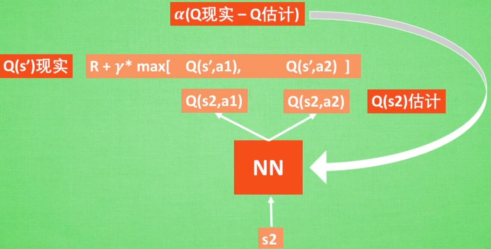
2. 经验回放 Experience replay
随机抽取之前的经历学习，打乱经历之前的相关性
3. Fixed Q-targets
使用两个结构相同但参数不同的网络
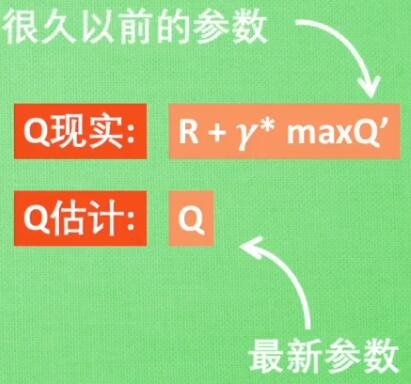

### Policy Gradients
1. 输出一个高斯分布，再随机选择动作
2. 公式推导
$$\begin{array}l
J(\theta)=\mathbb E(r_1+\gamma r_2+\gamma^2 r_3...|\pi_\theta) \\[10pt]
\nabla J(\theta)=\nabla_\theta\mathbb E(R(S,A)|\pi_\theta) \\[10pt]
=\nabla_\theta\sum_sd(s)\sum_a\pi_\theta(a|s)R(s,a) \\[10pt]
=\sum_sd(s)\sum_a\nabla_\theta\pi_\theta(a|s)R(s,a) \\[10pt]
=\sum_sd(s)\sum_a\pi_\theta(a|s)\frac{\nabla_\theta\pi_\theta(a|s)}{\pi_\theta(a|s)}R(s,a) \\[10pt]
=\sum_sd(s)\sum_a\pi_\theta(a|s)\nabla_\theta\log\pi_\theta(a|s)R(s,a) \\[10pt]
=\mathbb E[\nabla_\theta\log\pi_\theta(a|s)R(s,a)]
\end{array}
$$
3. 参数更新
$\theta=\theta+\alpha\nabla_\theta\log\pi_\theta(s_t,a_t)v_t$
$v_t$可以是reward，也可以见下表
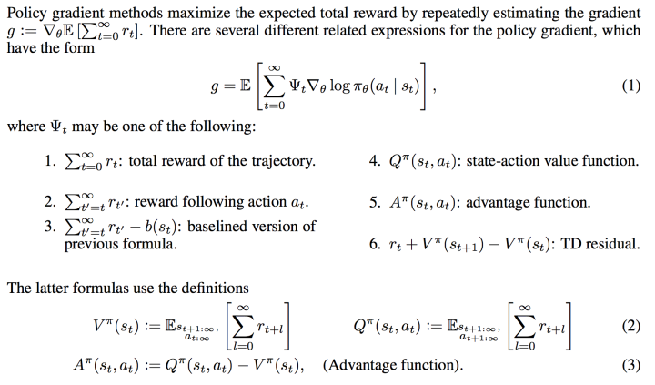
   1. 用reward来作为动作的评价是最直接的，采用上图第3种做法reward-baseline是很常见的一种做法（b可以是V）。这样做bias比较低，但是variance很大，也就是reward值太不稳定。
   2. Q值是对reward的期望值，使用Q值variance比较小，bias比较大。
   3. A=Q-V，是一个动作相对当前状态的价值。本质上V可以看做是baseline。
   4. 为了平衡variance和bias的问题，使用TD会是比较好的做法，既兼顾了实际值reward，又使用了估计值V。在TD中，TD(lambda)平衡不同长度的TD值，会是比较好的做法。

4. tf loss 计算
```py
self.all_act_prob = tf.nn.softmax(all_act, name='act_prob') # 网络输出所有动作的选择概率
neg_log_prob = tf.reduce_sum(-tf.log(self.all_act_prob)*tf.one_hot(self.tf_acts, self.n_actions), axis=1) # 所选择动作的概率以log形式相加
loss = tf.reduce_mean(neg_log_prob * self.tf_vt)
```

### Actor Critic
1. Actor: Policy Gradients，选择动作
2. Critic: 学习环境和奖惩之间的关系，能看到当前状态潜在的奖励
   1. 输入state
   2. 输出value(可以是Q)
   3. 根据Reward和两步状态的value计算TD error
3. 可以单步更新

### DDPG
1. Policy Gradient
   1. 估计网络：输出实际执行的动作
   2. 现实网络：用于更新价值网络
2. DQN
   1. 估计网络：计算当前状态、动作的value
   2. 现实网络：计算TD target
   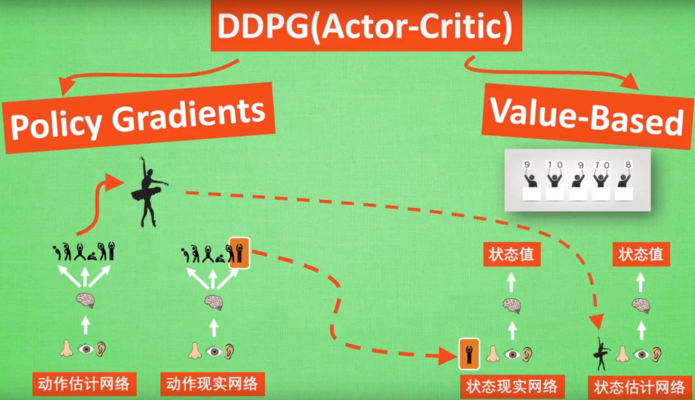

### GAN & Actor-Critic
1. 相似之处
   1. GAN: 生成器拟合一个分布，判别器评估拟合的好坏
   2. AC: Actor拟合一个策略分布$\pi(a|s)$, Critic评估拟合的好坏
2. 不同点
   1. 目标不同
      1. GAN(不影响环境)的目标是模拟一个给定的分布
      2. AC(影响环境)的目标是探索一个环境，在这个环境中，AC处理一个序列决策问题，当前的决策影响后面的数据。
   2. 评估方式不同
      1. G的唯一约束来自于D，G无法在没有D的情况下训练
      2. Critic提高对Actor监督效果，没有Critic也可以训
