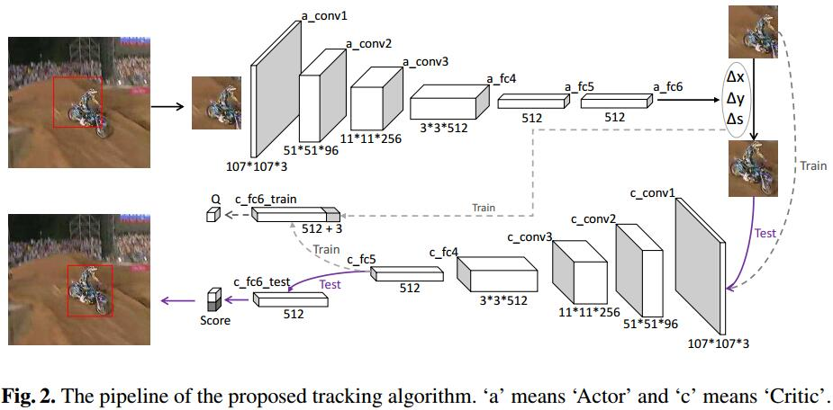
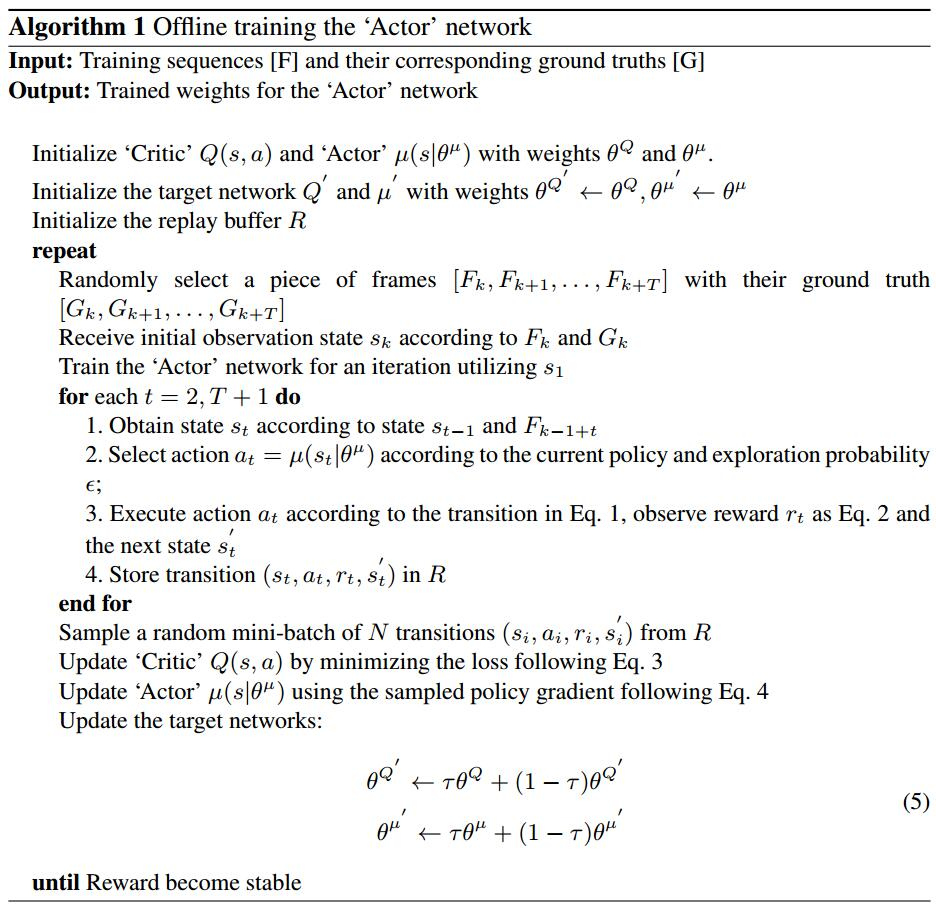

# Real-time ‘Actor-Critic’ Tracking
[eccv](http://openaccess.thecvf.com/content_ECCV_2018/papers/Boyu_Chen_Real-time_Actor-Critic_Tracking_ECCV_2018_paper.pdf)
[git](https://github.com/bychen515/ACT)

## Method

1. state: bbox $b=[x,y,h,w]$里的Image patch, 具体操作为crop然后resize $s=\phi(b,F)$
2. action: $a=[\Delta x,\Delta y,\Delta s]$为相对的x，y偏移和尺度变化
3. Actor: $a=\mu(s|\theta^\mu)$
4. reward: $$r(s,a)=\left\{\begin{array}l
1 \quad if IoU(b',G)>0.7\\
-1 \quad else
\end{array}\right.$$
4. 训练提升策略
   1. 由于样本空间太大，很难获得正reward，所以加入gt action监督
   2. 正负样本不平衡，所以进入expert decision guidance 取代exploration

