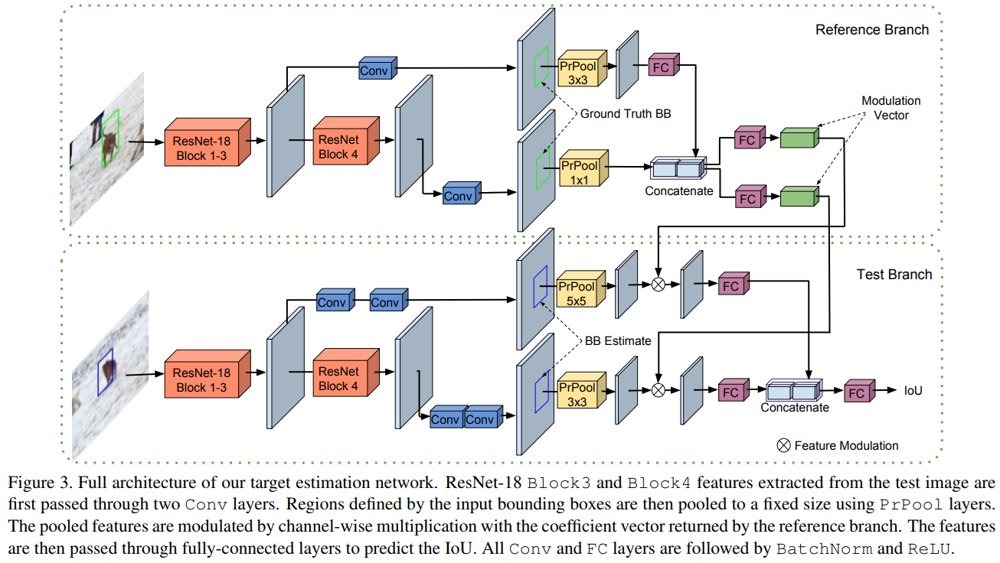

# ATOM: Accurate Tracking by Overlap Maximization
[arXiv](https://arxiv.org/pdf/1811.07628.pdf)

## Method
### Overview
1. target estimation module, offline, IoU-predictor network
   1. input: 当前帧的特征，bbox估计，参考帧特征，参考帧的bbox
   2. 输出：IoU score
   3. tracking的目标是最大化IoU score，利用gradient ascent
2. target classification module, online
   1. 鉴别目标和干扰物体，利用分类方法
3. 基于Conjugate Gradient and Gauss-Newton的优化

### Target Estimation by Overlap Maximization
1. IoUNet：anchor-based的检测回归方法，预测object和bbox candidate的IoU
   1. 给出图像的特征$x\in R^{W\times H\times D}$和一个object $x$的预测bbox $B\in R^4$
   2. RoIPooling（adaptive average pooling），的到特征$x_B$
   3. 最大化IoU来refine $B$
2. modulation-based network 针对任意目标预测IoU，基于reference

   1. reference分支针对templete产生调制vector
   2. test分支针对current frame计算IoU

### Target Classification by Fast Online Learning
1. 一个两层的网络，$x$为backbone的输出
$$f(x;w)=\phi_2(w2*\phi_1(w_1*x))$$
2. error
$$ L(w)=\sum_{j=1}^m\gamma_j||f(x_j;w)-y_j||^2+\sum_k\lambda_k||w_k||^2 $$
> $j$ 索引训练样本

3. online learning
   1. 把$L$展开
    $$\begin{array}l
    r_j(w)=\sqrt{r_i}(f(x_j;w)-y_j), j\in\{1,...,m\} \\
    r_{m+k}(w)=\sqrt{\lambda_k},k=1,2 \\
    L(w)=||r(w)||^2
    \end{array}$$
   2. quadratic Gauss-Newton approximation
   $$\hat L_w(\Delta w)=L(w+\Delta w) $$
   

### Online Tracking
1. Classification
   1. 首帧数据增广到30个样本, 优化$w$
   2. 后面只优化$w_2$, 10帧优化一次
   3. $y_i$为以 estimated target location为中心的高斯分布
2. Target Estimation
   1. 在之前估计的location提取特征
   2. 分类得到得分最大的框
   3. 和之前估计的width，height融合得到$B$
   4. 随机抖动$B$得到10个initial proposals
   5. 预测IoU，最终的box为IoU最好的3个box的平均
3. Hard Negative Mining
   1. 如果分类得到一个distractor，提高这个sample的学习率，立刻进行一轮优化
   2. 得分低于0.25被判为lost

## Thoughts
设计了一个siamese的IoUNet，并在线训练一个分类器，在线分类的标签又基于IoUNet的结果。
