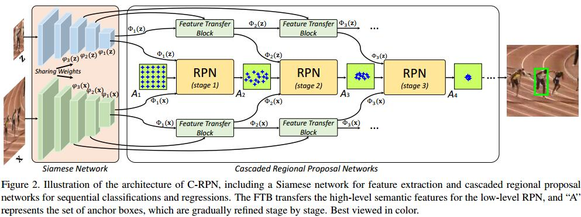

# Siamese Cascaded Region Proposal Networks for Real-Time Visual Tracking

[arXiv](https://arxiv.org/pdf/1812.06148.pdf)

## Introduction
1. SiamRPNC存在漂移问题
   1. 正负样本不平衡，且负样本太简单
   2. 低尺度特征没有开发
   3. 预定义的anchor难以精确回归

## Method

