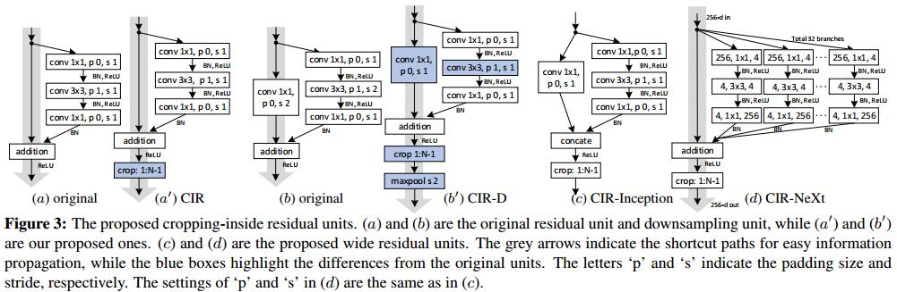

# Deeper and Wider Siamese Networks for Real-Time Visual Tracking
[arXiv](https://zhuanlan.zhihu.com/p/55843219)
[git](https://gitlab.com/MSRA_NLPR/deeper_wider_siamese_trackers)

## Introduction
1. ResNet和Inception作为backbone表现不好的原因
   1. 大的感受野减小了feature discriminability和定位精度
   2. padding导致了positional bias
2. receptive field、stride、
   1. 大感受野提供跟多图像内容，小感受野可能抓不到目标的结构
   2. stride影响定位精度，特别是小目标。同时影响feature discriminability
   3. padding导致训练时期的position bias，即对接近边缘的位置总是低概率输出
3. 用AlexNet的工作 [2, 12, 13, 20, 40, 42]

## Analysis of Performance Degradation
1. Analysis
    1. Alex的stride从4 or 8增加到16, 性能明显下降，所以中间层的feature比上层feature能更好地定位
    2. 最优感受野的范围不大，cover 60%~80%的输入exemplar。大的感受野对空间位置不敏感，小的感受野不太有判别力
    3. padding有较大的不良影响，特别是目标移动到图像边缘
    4. 训练数据中目标总是在中间，导致position bias
2. Guidelines
    1. 相对小的stride
    2. 合适的感受野
    3. 综合考虑stride、感受野、输出size
    4. 移除padding

## Deeper and Wider Siamese Networks
1. Cropping-Inside Residual (CIR) Units
相加操作之后再加一个crop

