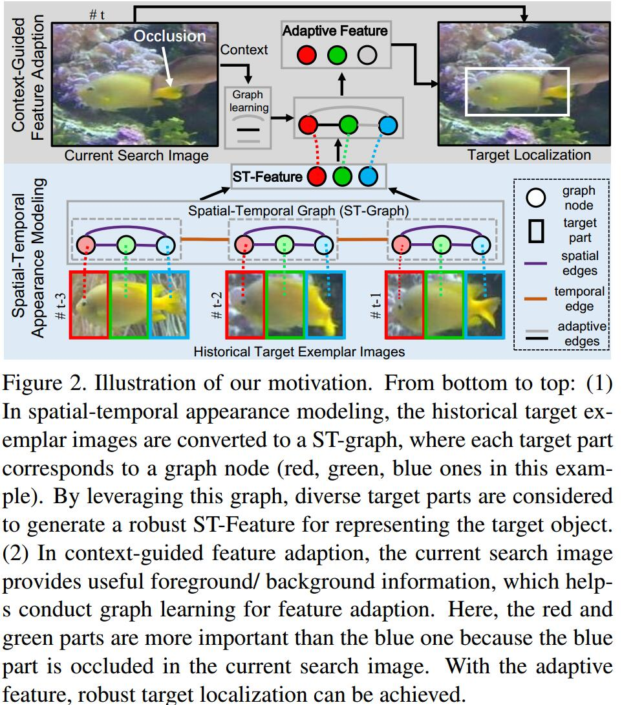
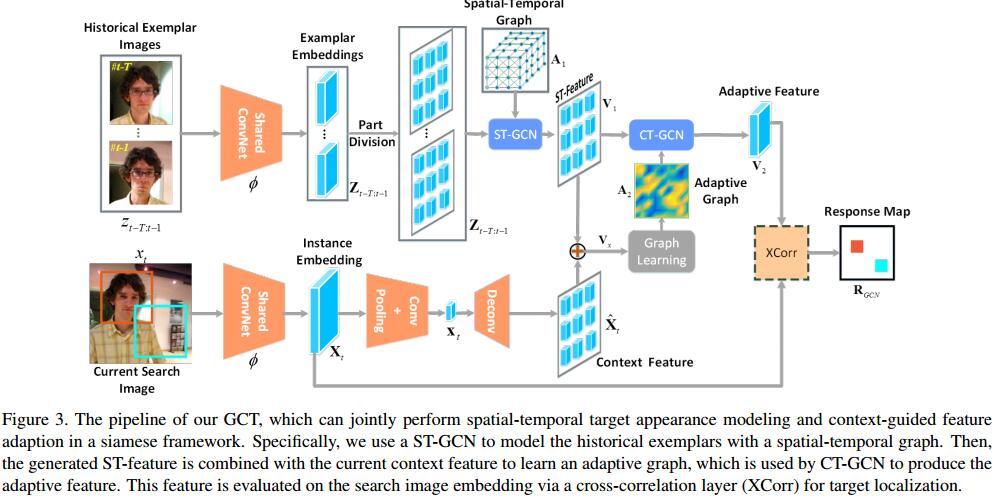

# Graph Convolutional Tracking

## Introduction
1. Siamese方法没有利用spatial-temporal target appearance
   1. 仅利用初始模板去match。但是时空信息很重要，e.g., 不同的parts、视角、运动、形变、光照。为了描述**target的旋转、平移不变性**，image patch可以被建模为grid graph
   2. target的surrounding context对跟踪有重要的影响。虽然之前的工作也有在线自适应的方法，但它们仅关注target，而没有从search area出发
   
   3. target序列可被看作是3D时空graph，每一个target part为一个node
   4. 本文提出ST-GCN和CT-GCN同时考虑时空结构和当前的语义
   5. FlowTrack [87] 利用光流找到运动信息
   6. spectral tracking method [8] operate on localized surrounding regions of each pixel via graph filters
   7. [84] CRF + Siamese
   8. [56] GCN for ReID

## Graph Convolutional Tracking

1. $$f(z_{t-T:t-1},x_t)=\psi_{GCN}(Z_{t-T:t-1},X_t)\star X_t+b$$
$\psi$**在$X_t$的指导下**，学习$t-T$到$t-1$的时空特征
2. 为了简化计算，演化出ST-GCN和CT-GCN
$$ f(z_{t-T:t-1},x_t)=\psi_2(\psi_1(Z_{t-T:t-1}),X_t)\star X_t+b $$
$\psi_1(Z_{t-T:t-1})$为ST-GCN，产生时空聚合的特征$V_1$。$\psi_2$利用$V_1,X_t$学习一个自适应的特征$V_2$
3. 损失函数
$$L(z_{t-T,t-1},x_t,Y)=\frac{1}{|\nabla|}\sum_{u\in\nabla}\log(1+\exp(Y[u]R[u]))$$
$\nabla$是search image中所有的位置，$u$是一个和target size 相同的sample。$Y[u]\in\{1,-1\}$为gt标签，$R[u]=V_2[u]\cdot X_t[u]$为相应score

### Preliminary: Graph Convolutional Networks
1. $\mathcal G=(\mathcal V, \mathcal E)$有$M$个节点
   1. 邻接矩阵$A\in R^{M\times M}$
   2. degree矩阵$\Lambda_{ii}=\sum_jA_{i,j}$
   3. graph signal $X\in R^{D\times M}$ (每一列$X_i\in R^D$是第$i$个node的特征表达) 的线性变换为乘以一个滤波器$W\in R^{D\times C}$
   $$ V=\hat\Lambda^{-1/2}\hat A\hat\Lambda^{1/2}X^TW $$
   $\hat A=A+I,\hat\Lambda=\sum_j\hat A_{i,j}$。输出$V\in R^{C\times M}$
### Target Appearance Modeling via ST-GCN
1. $\phi: \{z_i\}_{i=t-1}^{t-T}\to\{Z_i\}_{i=t-1}^{t-T}, Z_i\in R^{D_1\times M_z}$
2. 考虑$D_1\times 1\times 1$的grid为target part
3. $\mathcal G_1=(\mathcal V_1, \mathcal E_1),\mathcal V_1=\{v_i,j|i=t-1,...,t-T,j=1,...,M_z\}$
4. $\mathcal E_1$
   1. 空间边$\mathcal E^S_1=\{v_{i,j}v_{i,k}|1\le j,k\le M_z,j\neq k\}$表达intra-exemplar connection, 采用fully-connected graph形式
   2. 时间边$\mathcal E^T_1=\{v_{i,j}v_{i+1,j}\}$
5. 总共$M_ZT$个node，每个node至多连接$M_z+1$个node，这种稀疏性减少了计算量
6. ST-GCN输出改良的时空特征$\{\hat Z_i\in R^{D_2\times M_z}\}_{i=t-1}^{t-T}$
7. 聚合
$$V_1\in R^{D_2\times M_z}=MaxPooling_T(\{\hat Z_i\}_{i=t-1}^{t-T})$$

### Target Feature Adaption via CT-GCN
1. $\phi: x_t\to X_t\in R^{D_1\times M_x}$
2. global feature $x_t\in R^{D_z\times 1}$, 操作是$3\times 3$的conv stride=1 + 全局pooling
3. 反卷积得到enlarge feature $\hat X_t$ 与$V$大小相同
4. 整合时空信息和context信息
$$V_x=V_1+\hat X_t$$
5. 产生自适应的graph $\mathcal G_2=(\mathcal V_2, \mathcal E_2)$
$$A_2^{ji}=\frac{\exp(g(V_{x,i})^Th(V_{x,j}))}{\sum_{i=1}^{M_z}\exp(g(V_{x,i})^Th(V_{x,j}))}$$
$V_{x,i}$为$V_{x}$的第$i$列，$g,h$为$1\times 1$的卷积

## Tracking
1. $T=10$
2. $\tau=7$更新模板，比例为0.4的平滑更新
```

```
