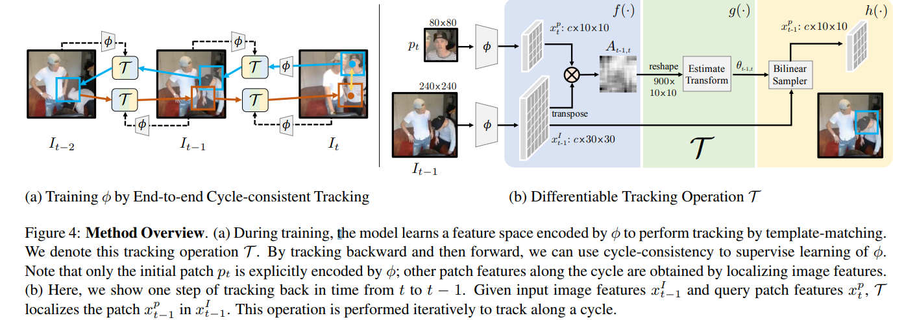

# Learning Correspondence from the Cycle-Consistency of Time
[arXiv](https://arxiv.org/abs/1903.07593)

## Introduction
1. 学习视觉一致性，从pixel到object，需要大量的数据，限制了真实场景中的泛化能力
2. 本文提出一种无监督的方法来学习时间上的cycle一致性，可以用于tracking、pose keypoint、segmentation propagation (of objects and parts)、optical flow.

## Approach

学习一个特征表达$\phi$，通过反向+前向tracking

### Cycle-Consistency Losses
1. long-term loss：跟踪i步，回到$t$时算距离
2. skip loss: 跟踪$t$和$t-i$两帧
3. Dense Similarity: 促进$t$时刻的patch（初始值）和$t-i$时刻的patch（tracking result）在特征上相似

### Architecture for Mid-level Correspondence
1. 特征encoder $\phi$
   1. ResNet50 without layer5，取消layer4的stride
   2. 跟踪模板z: $80\times 80\to 10\times 10$
      搜索区域x: $240\times 240\to 30 \times 30$
2. tracker
   1. Affinity function：点乘+softmax归一化
   2. Localizer：two convolutional layers + one linear layer，输出3为了采样参数
3. Bilinear Sampler：利用搜索区域的feature和采样参数生成新的templete

## Thoughts
1. 无监督的方法必然要寻找一些约束来训练，而时间上的一致性是可以作为这种约束
2. Future: Spatio-temporal Cycle-Consistency?
