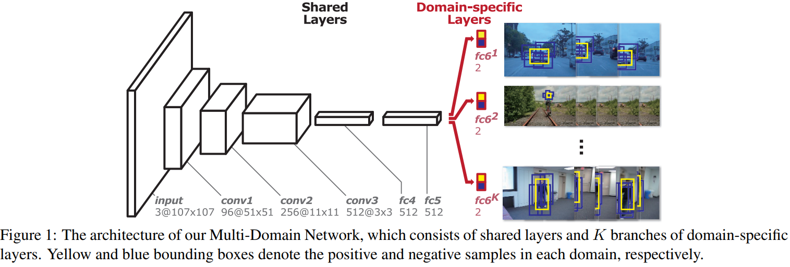

# Learning Multi-Domain Convolutional Neural Networks for Visual Tracking

[arXiv](https://arxiv.org/pdf/1510.07945.pdf)
## Introduction
1. 序列中目标的类别、运动模式、appreace不同，跟踪算法会受到遮挡、变形、光照、运动模糊的影响。
2. 训练CNN的困难在于同个目标在不同序列中可能被看作是target，也可以被看作是背景
3. Multi-Domain Learning：训练数据来自multiple domains，domain information被整合进学习过程

## Multi-Domain Network (MDNet)
### Network

1. 整个结构由shared layers和6个domain-specific layer学习一个序列s组成，每个domain-specific layer学习一个序列
2. 这种小网络更适合tracking
   1. 只需要二分类
   2. 太深的网络不利于精确定位
   3. tracking的目标都较小，可以缩小input size来减小网络深度
   4. 小网络更高效，训练和测试都可以online

### Learning Algorithm
1. 每一个iter只有一个分支work
2. domian共享的信息可以被shared layers学习到

## Online Tracking using MDNet
1. 多个domain-specific layer减少成一个
2. fine-tune新的domainspecific layer和shared layers里的fully connected layers

### Tracking Control and Network Update
1. long-term更新：100个pos sample，定期更新
2. short-term更新：20个pos sample，检测到tracking failure时更新
3. 用short-time的负样本
4. 前一帧target周围采N个candidate，网络输出N个pos score和neg score

### Hard Minibatch Mining
1. 负样本冗余，只有少部分neg sample在训练中有效
2. 目前的方法对distractors考虑不足
3. 利用pos score选择困难的负样本

### Bounding Box Regression
1. 利用conv3学习一个回归

## Thoughts
采用多分支的结构学习，使shared layers更可能学到一些通用的知识，而domian相关的特征可以被建模到不同分支中。测试的时候在线finetune虽然费时，但可以结合已学到的通用知识和domian知识。
