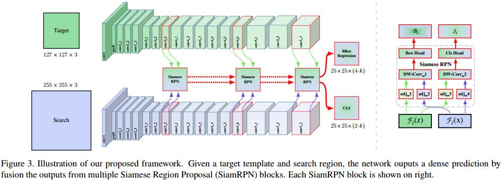
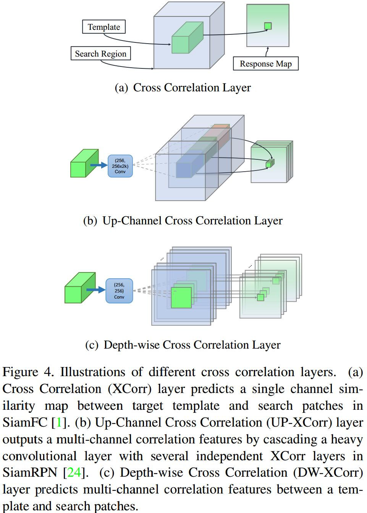

# SiamRPN++: Evolution of Siamese Visual Tracking with Very Deep Networks
[arXiv](https://arxiv.org/abs/1812.11703)
[zhihu](https://zhuanlan.zhihu.com/p/56254712)

## Contribution
1. 分析了Siamese trackers在deep backbone不work的原因是strict translation invariance被破坏
> translation/spatial invariance的理解：这个算法本质上还是求一个target patch和搜索图像上一个滑动框的相似度。转换到特征空间，也应该是位置对应的。但是padding打破了这种不变性，导致了图像边缘与特征边缘无法对齐

2. 打破spatial invariance约束，可以用ResNet
3. feature aggregation，多level结果融合
4. depth-wise separable correlation

## Analysis on Siamese Networks for Tracking
1. 严格的平移不变性约束
$$ f(z,x[\Delta\tau_j])=f(z,x)[\Delta\tau_j] $$
2. 结构对称
$$ f(z,x')=f(x',z) $$
3. SiamNet不能用deep net的原因
   1. padding会破坏平移不变性
   2. RPN需要一个不对称的feature来分类和回归

## ResNet-driven Siamese Tracking

## Layer-wise Aggregation
Conv3~5 分别预测一次加权相加

## Depthwise Cross Correlation

