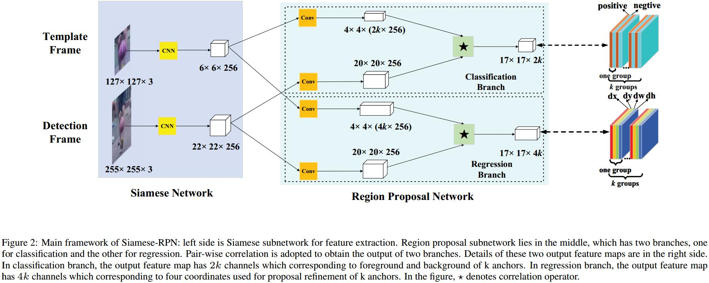
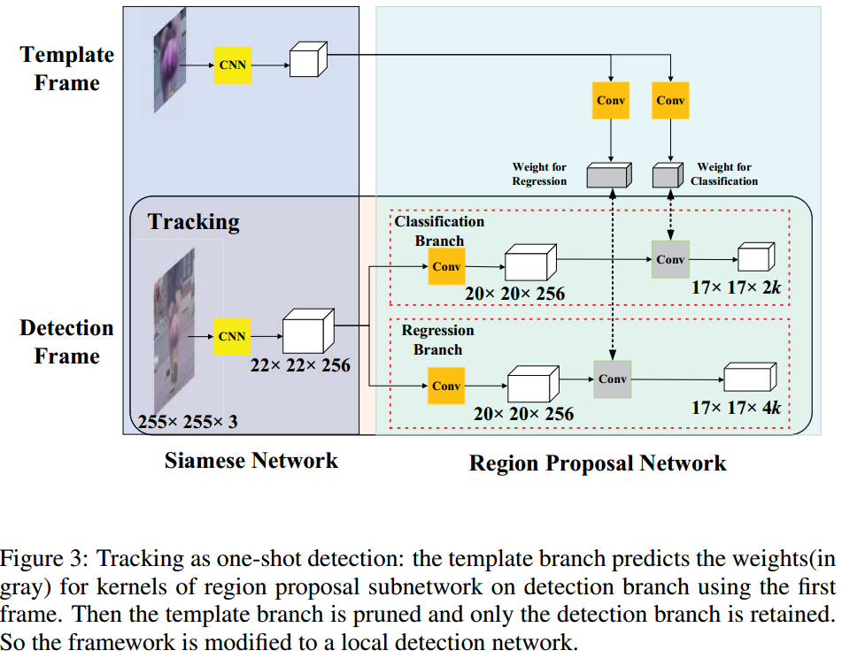

# High Performance Visual Tracking with Siamese Region Proposal Network
[cvpr](http://openaccess.thecvf.com/content_cvpr_2018/papers/Li_High_Performance_Visual_CVPR_2018_paper.pdf)
[zhihu](https://zhuanlan.zhihu.com/p/37856765)
[pytorch](https://github.com/songdejia/Siamese-RPN-pytorch)

## Introduction
1. tracker分类
   1. 基于correlation filter
      1. 同时online跟踪并更新filter的参数
      2. 可以基于传统feature或deep feature
      3. model更新影响跟踪速度
   2. 基于很强的deep feature
      1. 不需要 model更新
      2. 精度受到data domain影响
2. This paper：把跟踪看做one-shot detection

## Framework

1. 一个空间位置上有$k$个anchor
2. 分类输出size为$w*h*2k$
3. 回归输出size为$w*h*4k$

## Tracking as one-shot detection
one-shot detection：仅仅根据初始信息来定位
Because the local detection task is based on the category information only given by the template on initial frame, it can be
viewed as one-shot detection

Anchor选择
1. 排除太远的框
2. 用 cosine window 和从尺度变化来re-rank the proposals’ score
