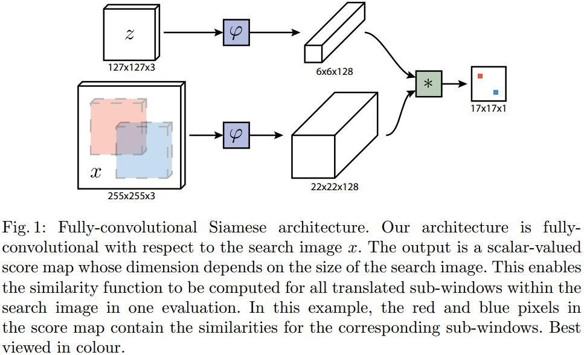

# Fully-Convolutional Siamese Networks for Object Tracking
[arXiv](https://arxiv.org/abs/1606.09549)
[Pytorch](https://github.com/rafellerc/Pytorch-SiamFC)
[SiamRPN系列文章](https://zhuanlan.zhihu.com/p/55843219)

## Introduction
1. 利用CNN来跟踪
   1. shallow methods：利用CNN特征 + correlation filters，无法end-to-end学习
   2. 利用SGD微调网络参数，无法实时

## Network

最后的$* $表示让$22*22*128$的feature被$6*6*128$的卷积核卷积，得到一个$17*17$的score map
## Loss
$$\begin{array}l
l(y,v)=\log(1+\exp(-yv)) \\[10pt]
L(y,v)=\frac{1}{D}\sum_{u\in D}l(y[u],y[v])
\end{array}$$
