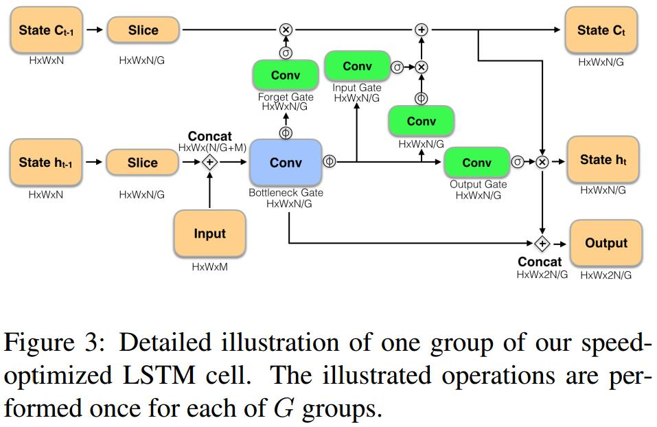

# Looking Fast and Slow: Memory-Guided Mobile Video Object Detection

## Method
1. 特征提取：
   1. Slow net：MobileNetV2，$320\times 320$
   2. Fast net: MobileNetV2，$160\times 160$，取消最后一个stride
2. Memory Module

   1. bottlenecking
   2. 增加一个skip连接，把bottleneck也作为输出的一部分
   3. LSTM的缺点：不能完全保存其状态，input和forget门很少饱和，导致state慢慢衰减，从而失去了long-term dependencies。文中解决办法是小网络运行是不更新LSTM的状态
3. Adaptive Interleaving Policy
   1. 利用DDQN学习一个update策略
   2. state：$S=(c_t,h_t,c_t-c_{t-1},h_t-h_{t-1},\eta_t)$，$\eta$为动作历史
   3. reward：
      1. 小网络运行的时候奖励1
      2. 两个网络都运行一次计算loss，奖励为所选的网络的loss与最小loss的差

## Thoughts
个人认为利用LSTM产生视觉Memory不是一个很好的方法，它并不能处理好视频中的motion，并且在没有额外操作的情况下，long-term信息可能对detection不利。用DQN来学习一个策略值得借鉴，比如也可以用于tracking和flow网络。
