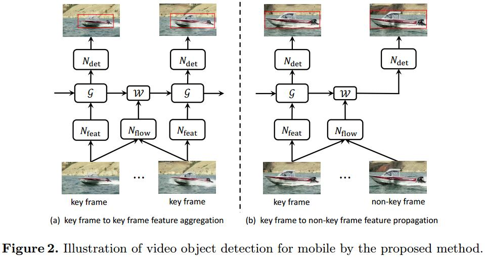
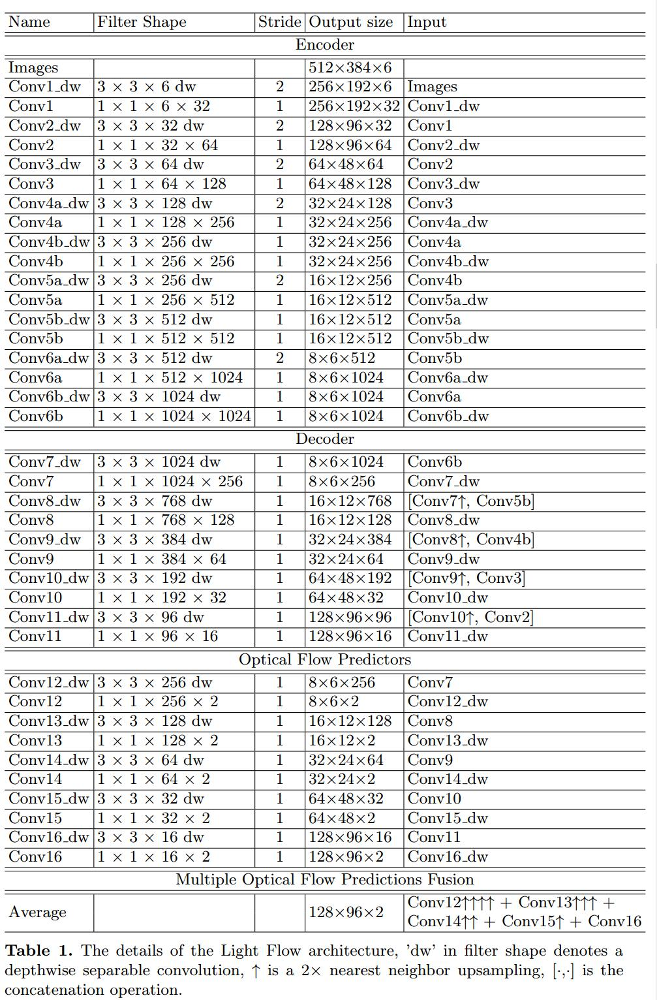

# Towards High Performance Video Object Detection for Mobiles
[arXiv](https://arxiv.org/abs/1804.05830)

## Introduction
1. low latency models 低延迟模型
SqueezeNet [12], MobileNet [13], and ShuffleNet [14].
2. recognition accuracy suffers from deteriorated appearances in videos that are seldom observed in still images, such as motion blur, video defocus, rare poses, etc.
> 遭遇了恶化的vido appearances

3. two principles：
   1. propagating features on majority non-key frames while computing and aggregating features on sparse key frames
   2. computing and aggregating features on sparse key frames

4. Sparse Feature Propagation
对于关键帧$k$和非关键帧$i$
$$ F_{k\to i}=\mathcal W(F_k,M_{i\to k}) $$
> $F_k=N_{feat}(I_k)$是特征。$M_{i\to k }$是二维的运动场，可以由光流网络$N_{flow}(I_k,I_i)=M_{i\to k}$估计

5. Multi-frame Feature Aggregation
$$ \hat{F}_i=\sum_{k\in[i-r,i+r]}W_{k\to i}\odot F_{k\to i}$$
> $\odot$是element-wise multiplication, $F_{k\to i}$是propagated feature maps, $W_{k\to i}$是$F_{k\to i}$和$F_{i}$之间的相似度

6. sparsely recursive feature aggregation
aggregate only on sparse key frames $k,k'$
$$\hat{F}_{k'}=W_{k\to k'}\odot \hat{F}_{k\to k'} + W_{k'\to k'}\odot \hat{F}_{k'}$$

## Model Architecture for Mobiles

1. key frames $k,k'$
$$ \hat F_{k'}=\mathcal G(F_{k'},\hat F_k,M_{k'\to k}) $$
> $\mathcal G$ is a flow-guided aggregation function

2. non-key frame
$$ \hat F_{k\to i} = \mathcal W(\hat F_k,M_{i\to k})$$

### Light Flow

1. encoder
   1. replace all convolutions to $3\times 3$ depthwise separable convolutions (each $3\times 3$ depthwise convolution followed by a 1×1 pointwise convolution).
   2. Compared with standard 3×3 convolution, the computation cost of 3×3 depthwise separable convolution is reduced by 8∼9 times with a slight drop in accuracy
>[深度可分离卷积](https://www.cnblogs.com/adong7639/p/7918527.html)

2. decoder
deconvolution operation is replaced by a nearestneighbor upsampling followed by a depthwise separable convolution.
3. Predictors
   1. multi-resolution predictions are up-sampled to the same spatial resolution with the finest prediction, and then are averaged as the final prediction
   2. during training, only a single loss function is applied on the averaged optical flow prediction instead of multiple loss functions after each prediction.

### Flow-guided GRU based Feature Aggregation
1. [39] has showed that Gated Recurrent Unit (GRU) [40] is more powerful in modeling long-term dependencies than LSTM [41] and RNN [42]
2. aggregation function
$$
\begin{array}l
\hat F_{k'}=\mathcal G(F_{k'},\hat F_k,M_{k'\to k}) \\
=(1-z_t)\odot\hat F_{k\to k'}+z_t\odot\phi(W_h\star F_{k'}+U_h\star(r_t\odot\hat F_{k\to k'})+b_h) \\
z_t = \sigma(W_z\star F_{k'}+U_z\hat F_{k\to k'}+b_z) \\
r_t = \sigma(W_r\star F_{k'}+U_r\hat F_{k\to k'}+b_r)
\end{array}
$$
> $\hat F_{k\to k'}=\mathcal W(F_{k'},M_{k'\to k})$, $\star$ is convolution

### Lightweight Key-frame Object Detector
1. MobileNet [13] as the backbone network
2. RPN [5] and the recently presented Light-Head R-CNN are adopted,

## Reference
[12]. Iandola, F.N., Han, S., Moskewicz, M.W., Ashraf, K., Dally, W.J., Keutzer, K.: Squeezenet: Alexnet-level accuracy with 50x fewer parameters and< 0.5 mb model size. arXiv preprint arXiv:1602.07360 (2016)

[13]. Howard, A.G., Zhu, M., Chen, B., Kalenichenko, D., Wang, W., Weyand, T., Andreetto, M., Adam, H.: Mobilenets: Efficient convolutional neural networks for mobile vision applications. arXiv preprint arXiv:1704.04861 (2017)

[14]. Zhang, X., Zhou, X., Lin, M., Sun, J.: Shufflenet: An extremely efficient convolutional neural network for mobile devices. arXiv preprint arXiv:1707.01083 (2017)

[39]. Chung, J., Gulcehre, C., Cho, K., Bengio, Y.: Empirical evaluation of gated recurrent neural networks on sequence modeling. arXiv preprint arXiv:1412.3555 (2014)

[40]. Cho, K., Van Merri¨enboer, B., Gulcehre, C., Bahdanau, D., Bougares, F., Schwenk, H., Bengio, Y.: Learning phrase representations using rnn encoder-decoder for statistical machine translation. In: EMNLP. (2014)

[41]. Hochreiter, S., Schmidhuber, J.: Long short-term memory. Neural computation
9(8) (1997) 1735-1780

[42]. Elman, J.L.: Finding structure in time. Cognitive science 14(2) (1990) 179-211
